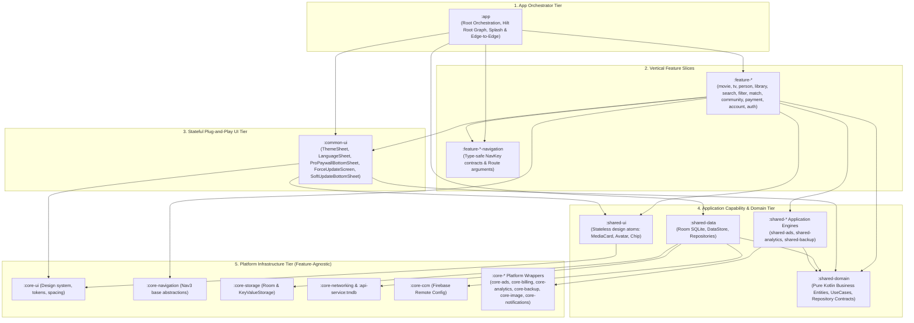

# (work-in-progress 👷🔧️👷‍♀️⛏)

<div align="center">

# 🎬 ShowTime 2.0

### *The Ultimate Cinephile Companion & Movie Discovery App for Android*

Built with **Jetpack Compose**, **Material 3 Expressive Theming**, **Navigation 3**, and modern multi-module Android Architecture.

[](https://kotlinlang.org)
[](https://developer.android.com/jetpack/compose)
[](docs/MODULAR_ARCHITECTURE_AND_CAPABILITY_TAXONOMY.md)
[](LICENSE)

</div>

---

## 🌟 Overview

**ShowTime** is a movie and TV show exploration application designed for film lovers, cinephiles, and TV enthusiasts. It demonstrates modern Android engineering practices, including 100% Jetpack Compose UI, type-safe multi-module navigation, local-first offline storage, cloud backup synchronization, and in-app subscriptions.

ShowTime consumes the [TMDB (The Movie Database)](https://www.themoviedb.org/) API.

---

## 📸 Screenshots & Visuals

<div align="center">

### Light & Dark Themes

| Movie Home | Movie Details | Search & Filter | Library & Diary |
| :---: | :---: | :---: | :---: |
|  |  |  |  |
|  |  |  |  |

</div>

---

## ✨ Feature Highlights

### 🎞️ The Cinephile Suite
* **Personal Cinema Diary**: Chronological timeline log for watched films and shows, star ratings, custom written reviews, rewatch tracking, and viewing velocity analytics.
* **Cinephile Taste Profile**: On-device taste analysis, viewing archetype detection, decade affinities, and personalized recommendations.
* **Annual Cinema Wrapped & Milestones**: Interactive year-in-review visual story with achievement badges and shareable graphics.
* **Vintage Cinema Receipt**: Generates aesthetic retro thermal-style receipts summarizing watch sessions and viewing stats.
* **Backlog & Blindspot Challenges**: 52-Film challenge, Criterion collection quests, and automated watchlist resurfacing.

### 🔍 Discovery & Social
* **Universal Discover & Filter Hub**: Multi-faceted discovery engine with mood vibes, streaming providers, release decades, boutique studio hubs, and Cinema Roulette surprise picker.
* **Interactive Movie Match**: Real-time room-based movie swiping with friends to decide what to watch together.
* **Deep Linking & Rich Sharing**: Universal App Links (`https://showtime.ssverma.in/...`) with rich OpenGraph sharing preview cards.

### 🛡️ Reliability & Cloud
* **Smart Cloud Backup & Sync**: Optional end-to-end encrypted Firestore backup linked via Google Sign-In with complete offline-first Room SQLite fallback.
* **Centralized Config & In-App Updates**: Firebase Remote Config-driven feature flags, dynamic maintenance mode, and non-intrusive soft/force app update prompts.
* **Pro Subscriptions & Dynamic Theming**: Google Play In-App Billing integration, custom dynamic Material You color extraction, and OLED Midnight theme.

---

## 🏛️ Modular Architecture & Capability Taxonomy

ShowTime is architected into **5 strictly decoupled tiers** with unidirectional dependency rules to guarantee build scalability, sub-second incremental builds, and zero circular dependencies. For the complete specification, read the [Modular Architecture & Capability Taxonomy Guide](docs/MODULAR_ARCHITECTURE_AND_CAPABILITY_TAXONOMY.md).


```mermaid
flowchart TD
    subgraph AppTier ["1. App Orchestrator Tier"]
        App[":app<br/>(Root Orchestration, Hilt Root Graph, Splash & Edge-to-Edge)"]
    end

    subgraph FeatureTier ["2. Vertical Feature Slices"]
        FeatureImpl[":feature-*<br/>(movie, tv, person, library, search, filter, match, community, payment, account, auth)"]
        FeatureNav[":feature-*-navigation<br/>(Type-safe NavKey contracts & Route arguments)"]
    end

    subgraph CommonUITier ["3. Stateful Plug-and-Play UI Tier"]
        CommonUI[":common-ui<br/>(ThemeSheet, LanguageSheet, ProPaywallBottomSheet, ForceUpdateScreen, SoftUpdateBottomSheet)"]
    end

    subgraph SharedTier ["4. Application Capability & Domain Tier"]
        SharedUI[":shared-ui<br/>(Stateless design atoms: MediaCard, Avatar, Chip)"]
        SharedDomain[":shared-domain<br/>(Pure Kotlin Business Entities, UseCases, Repository Contracts)"]
        SharedData[":shared-data<br/>(Room SQLite, DataStore, Repositories)"]
        SharedTwins[":shared-* Application Engines<br/>(shared-ads, shared-analytics, shared-backup)"]
    end

    subgraph CoreTier ["5. Platform Infrastructure Tier (Feature-Agnostic)"]
        CoreUI[":core-ui (Design system, tokens, spacing)"]
        CoreNav[":core-navigation (Nav3 base abstractions)"]
        CoreStorage[":core-storage (Room & KeyValueStorage)"]
        CoreNet[":core-networking & :api-service:tmdb"]
        CoreCCM[":core-ccm (Firebase Remote Config)"]
        CoreTwins[":core-* Platform Wrappers<br/>(core-ads, core-billing, core-analytics, core-backup, core-image, core-notifications)"]
    end

    %% Dependency flow
    App --> FeatureImpl
    App --> FeatureNav
    App --> CommonUI
    App --> SharedData

    FeatureImpl --> FeatureNav
    FeatureImpl --> CommonUI
    FeatureImpl --> SharedUI
    FeatureImpl --> SharedDomain
    FeatureImpl --> SharedTwins
    FeatureImpl --> CoreNav

    CommonUI --> SharedDomain
    CommonUI --> SharedUI
    CommonUI --> CoreUI

    SharedData --> SharedDomain
    SharedData --> CoreStorage
    SharedData --> CoreNet
    SharedData --> CoreCCM

    SharedTwins --> CoreTwins
    SharedTwins --> SharedDomain

    SharedUI --> CoreUI
```

### Module Tier Summary & Boundaries

| Tier | Role | Allowed Dependencies | Strictly Forbidden Dependencies |
| :--- | :--- | :--- | :--- |
| **`core-*`** | Platform SDK wrappers (Billing, AdMob, Firebase, Storage, Network) with **zero ShowTime domain logic**. | External SDKs, Android OS | ❌ `shared-domain`, `shared-data`, `feature-*` |
| **`shared-domain`** | Pure Kotlin domain models, repository interfaces, and use cases. | Standard Kotlin libraries | ❌ Android framework, UI, Ad SDKs |
| **`shared-data`** | Room SQLite databases, DataStore preferences, and repository implementations. | `shared-domain`, `core-*` | ❌ UI modules, `feature-*` |
| **`shared-ui`** | Stateless, reusable Compose building blocks (`MediaCard`, `Avatar`, `Chip`). | `core-ui`, Compose | ❌ Repositories, `core-ads`, ViewModels |
| **`common-ui`** | Self-contained, stateful plug-and-play overlays (`ThemeSelectionBottomSheet`, `ForceUpdateScreen`). | `core-ui`, `shared-ui`, `shared-domain` | ❌ `shared-data`, `feature-*` implementation modules |
| **`feature-*-navigation`** | Type-safe `NavKey` definitions and route parameters. | `core-navigation` | ❌ Screens, ViewModels, business logic |
| **`feature-*`** | Full-screen destinations, ViewModels, and user journeys. | `*-navigation`, `common-ui`, `shared-*`, `core-*` | ❌ Direct dependencies on other `feature-*` modules |

### Core Tenets
1. **Type-Safe Navigation 3**: Navigation routes are strictly modeled as compile-time checked `NavKey` objects isolated in `feature-*-navigation` modules.
2. **Deterministic UI State**: All UI state models are annotated with `@Immutable` for skip-safe Jetpack Compose recomposition.
3. **Dumb UI Principle**: Composables are purely declarative renderers; all sorting, filtering, and data transformations execute on `Dispatchers.Default` within ViewModels and UseCases.
4. **Local-First & Zero PII**: All user data resides locally in Room SQLite by default. Cloud backup is opt-in, strictly authenticated, and user-isolated.
5. **BYOK (Bring Your Own Keys)**: Zero secrets or API keys are committed to version control.

---

## 🧰 Tech Stack

| Layer | Technologies |
| :--- | :--- |
| **Language** | [Kotlin 2.1](https://kotlinlang.org/) (Coroutines, Flow, Serialization) |
| **UI & Design System** | [Jetpack Compose](https://developer.android.com/jetpack/compose), [Material 3](https://m3.material.io/), Glance App Widgets |
| **Navigation** | [Navigation 3 (Nav3)](https://developer.android.com/guide/navigation) (Type-safe multi-module `NavKey`) |
| **Dependency Injection** | [Dagger Hilt](https://dagger.dev/hilt/) |
| **Local Persistence** | [Room SQLite](https://developer.android.com/training/data-storage/room), [DataStore](https://developer.android.com/topic/libraries/architecture/datastore) |
| **Networking & Images** | [Retrofit](https://square.github.io/retrofit/), [OkHttp](https://square.github.io/okhttp/), [Coil](https://coil-kt.github.io/coil/) |
| **Cloud & Monetization** | Firebase (Auth, Firestore, Remote Config, Crashlytics), Google Play Billing |
| **Paging & Concurrency** | AndroidX Paging 3, Kotlinx Coroutines StateFlow |

---

## 🚀 Getting Started (BYOK Setup)

### 1. Prerequisites
- **Android Studio Ladybug (or newer)**
- **JDK 21**
- Android SDK 35 (`compileSdk = 35`, `minSdk = 26`)

### 2. Clone & Configure Secrets
```bash
git clone https://github.com/SSVerma/ShowTime2.git
cd ShowTime2
```

Create `core.properties` in the project root by copying the template:
```bash
cp core.properties.example core.properties
```

Edit `core.properties` with your free [TMDB API Read Access Token](https://www.themoviedb.org/settings/api):
```properties
tmdbApiReadAccessToken="YOUR_TMDB_READ_ACCESS_TOKEN_HERE"
traktClientId="YOUR_TRAKT_CLIENT_ID_HERE"
```

Create `debug.properties` in the project root:
```properties
baseUrl="https://api.themoviedb.org/"
```

### 3. Build & Run
```bash
./gradlew assembleDebug
```

Run unit tests across all modules:
```bash
./gradlew testDebugUnitTest
```

---

## 🌿 Branching & Release Cycle

ShowTime utilizes a structured GitFlow model:
* **`main`**: Golden branch representing code **live in Production on Google Play**.
* **`development`**: Main integration branch for active feature development.
* **`release/*`**: Hardening branches for QA and Google Play testing tracks.
* **`hotfix/*`**: Emergency production patches branched directly off `main`.

For the full specification, read the [Branching & Release Strategy Guide](docs/BRANCHING_AND_RELEASE_STRATEGY.md).

---

## 📚 Architectural Guides & Specifications

* **System Design & Governance**:
  * [Modular Architecture & Capability Taxonomy](docs/MODULAR_ARCHITECTURE_AND_CAPABILITY_TAXONOMY.md)
  * [Compose Performance & Stability Guide](docs/COMPOSE_PERFORMANCE_AND_STABILITY_GUIDE.md)
  * [Code Quality, Design System & Security Guide](docs/CODE_QUALITY_AND_SECURITY_GUIDE.md)
  * [Branching & Release Strategy](docs/BRANCHING_AND_RELEASE_STRATEGY.md)
  * [Centralized Config Management (CCM)](docs/CENTRALIZED_CONFIG_MANAGEMENT_CCM.md)
  * [Telemetry & Observability Guide](docs/TELEMETRY_AND_OBSERVABILITY_GUIDE.md)
* **Feature Architecture Deep Dives**:
  * [Cinephile Suite Master Architecture](docs/CINEPHILE_SUITE_AND_DISCOVERY_ARCHITECTURE.md)
  * [Personal Cinema Diary & Review Log](docs/features/CINEMA_DIARY_AND_REVIEW_LOG_ARCHITECTURE.md)
  * [Cinephile Taste Profile & Recommendations](docs/features/CINEPHILE_TASTE_PROFILE_AND_RECOMMENDATIONS_ARCHITECTURE.md)
  * [Annual Cinema Wrapped & Milestones](docs/features/CINEMA_WRAPPED_AND_MILESTONES_ARCHITECTURE.md)
  * [Vintage Cinema Receipt](docs/features/VINTAGE_CINEMA_RECEIPT_ARCHITECTURE.md)
  * [Backlog & Blindspot Challenges](docs/features/CINEPHILE_BACKLOG_AND_BLINDSPOT_CHALLENGES_ARCHITECTURE.md)
  * [Universal Discover & Browse Engine](docs/features/UNIVERSAL_DISCOVER_AND_BROWSE_ARCHITECTURE.md)
  * [Cloud Backup, Auth & Pro Gating](docs/features/CLOUD_BACKUP_AUTH_AND_PRO_GATING_ARCHITECTURE.md)
  * [Google Play Billing & Subscriptions](docs/GOOGLE_PLAY_BILLING_AND_SUBSCRIPTIONS_GUIDE.md)

---

## 📄 License

ShowTime is source-available software provided for personal, educational, and non-commercial evaluation. Commercial use, redistribution, and publishing to application stores (such as Google Play or Apple App Store) are strictly prohibited without written authorization.

See the full [LICENSE](LICENSE) file for terms and conditions.
