# (work-in-progress 👷🔧️👷‍♀️⛏)

# ShowTime

A Movie / TV Show information provider application built to demonstrate the use of Jetpack Compose
with other Jetpack libraries and Architecture Components. ShowTime
consumes [TMDB](https://www.themoviedb.org/documentation/api) API.

## Visuals

<table>
  <tr>
    <td>Home</td>
    <td>People</td>
    <td>Search</td>
    <td>Library</td>
  </tr>
  <tr>
    <td>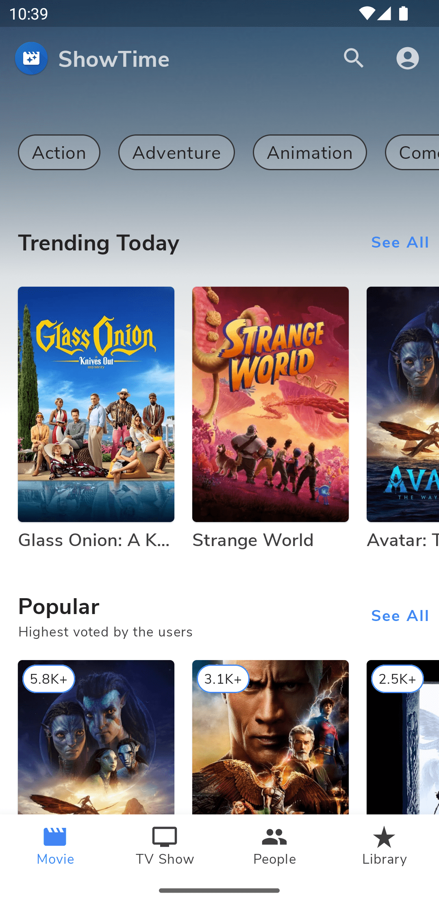</td>
    <td>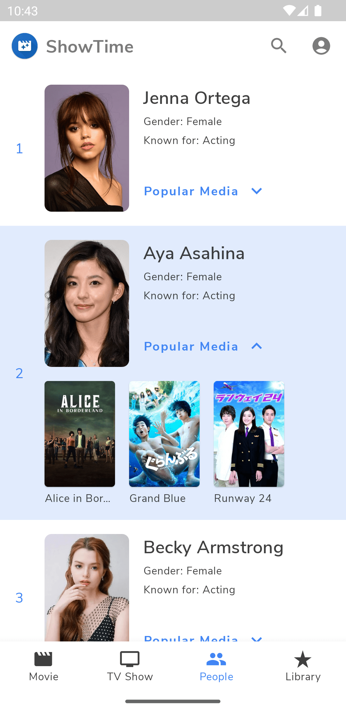</td>
    <td>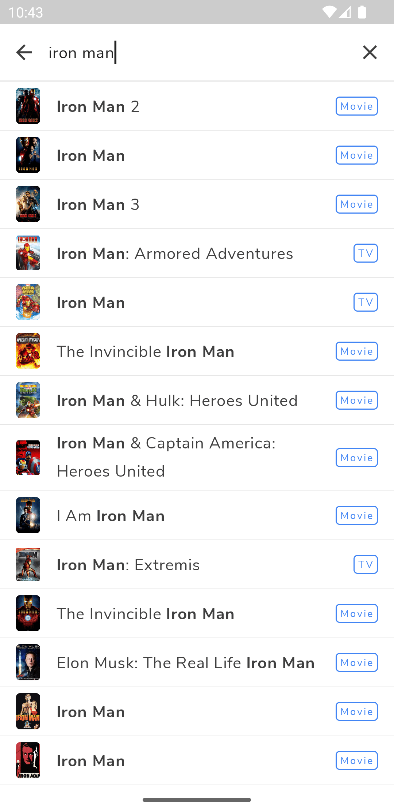</td>
    <td>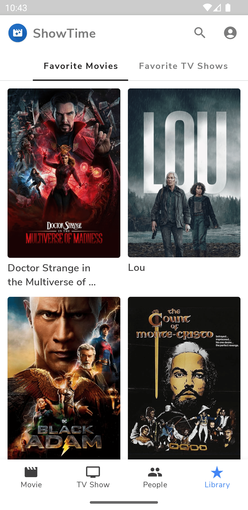</td>
  </tr>
 </table>

<table>
  <tr>
    <td>Movie Details</td>
    <td>Movie Details</td>
    <td>Movie Details</td>
    <td>Movie Details</td>
  </tr>
  <tr>
    <td>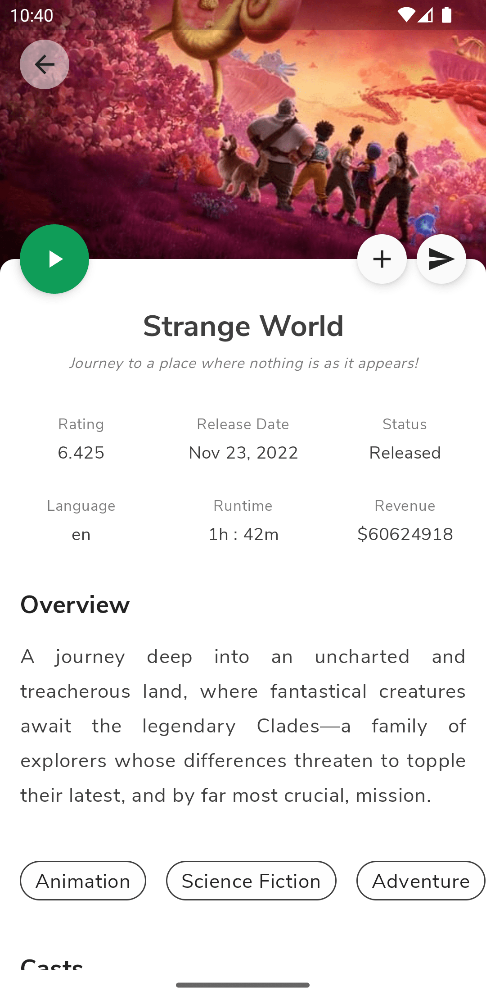</td>
    <td>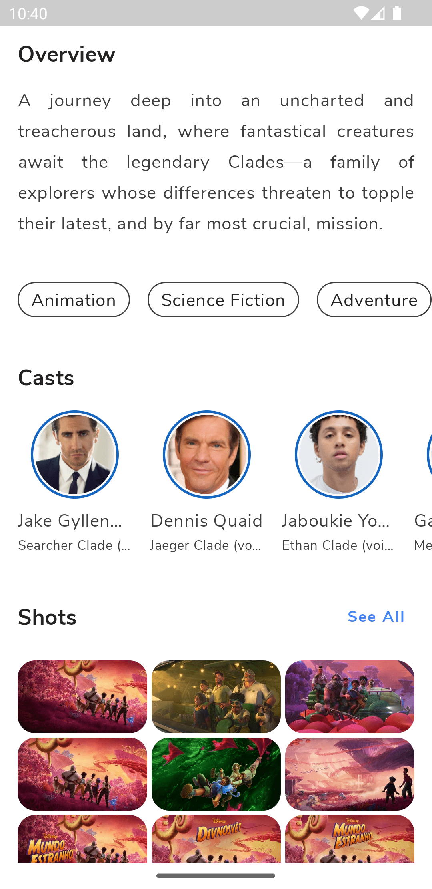</td>
    <td>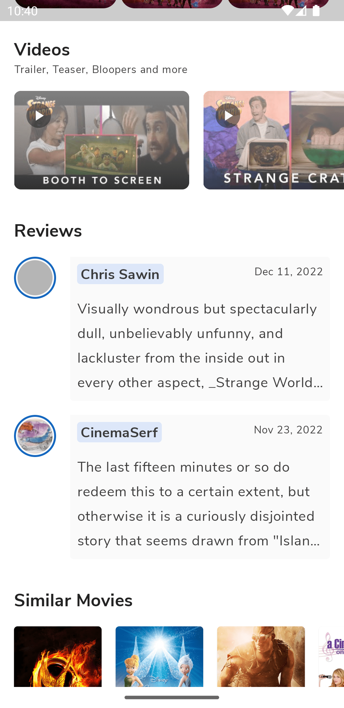</td>
    <td>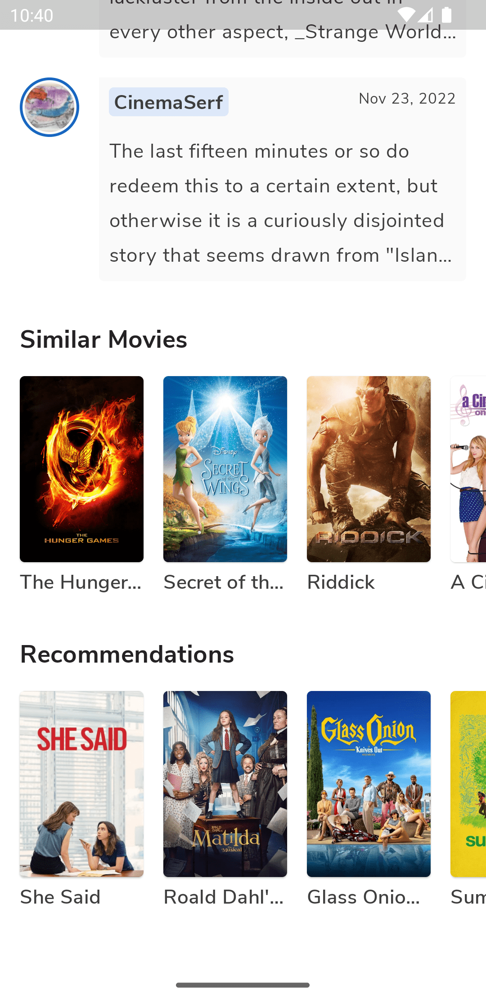</td>
  </tr>
</table>

<table>
  <tr>
    <td>Movie Details</td>
    <td>Home</td>
    <td>People</td>
  </tr>
  <tr>
    <td>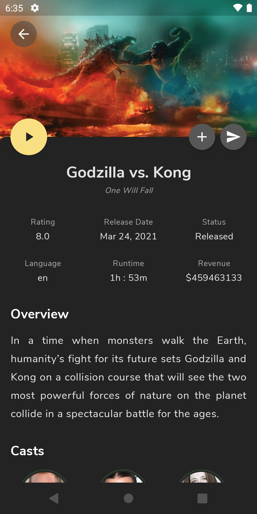</td>
    <td>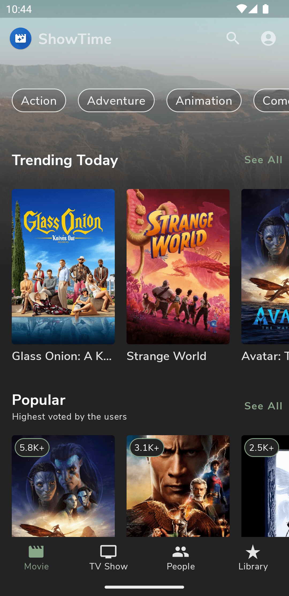</td>
    <td>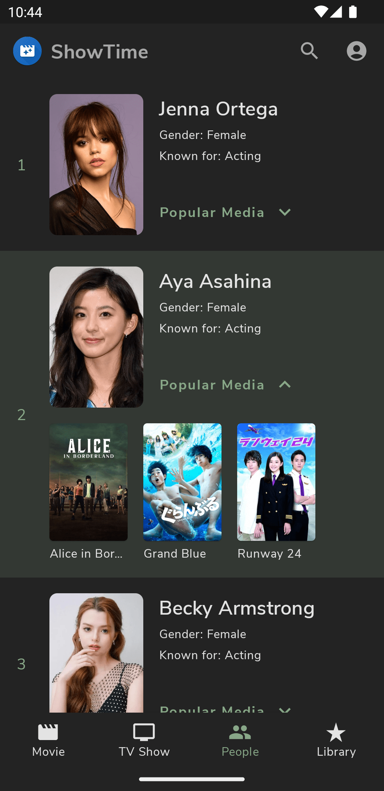</td>
  </tr>
</table>

## Features & Cinephile Suite

- **Universal Discover & Browse Hub**: Faceted discovery with mood vibes, streaming providers,
  decades, boutique studio hubs, and Cinema Roulette surprise picker.
- **Personal Cinema Diary**: Chronological timeline log for watched films/shows, star ratings,
  custom written reviews, and viewing velocity.
- **Cinephile Taste Profile**: On-device taste analysis, viewing archetype identification, and
  personalized recommendation engine.
- **Cinema Wrapped & Milestones**: Annual year-in-review visual story with achievement badges and
  shareable graphics.
- **Backlog & Blindspot Challenges**: 52-Film challenge, Criterion quests, and automated watchlist
  resurfacing.
- **Cloud Backup & Restore**: Optional encrypted Firestore backup linked via Google Sign-In with
  full local-first offline support.
- **Deep Linking & Sharing**: Universal App Links (`https://showtime.ssverma.in/...`) with rich
  OpenGraph sharing.

## Documentation & Architecture Guides

- **Core Suite Overview
  **: [Cinephile Suite & Discovery Master Architecture](docs/CINEPHILE_SUITE_AND_DISCOVERY_ARCHITECTURE.md)
- **Feature Guides (What, Why, How & Security)**:
    - [Universal Discover & Browse Hub](docs/features/UNIVERSAL_DISCOVER_AND_BROWSE_ARCHITECTURE.md)
    - [Personal Cinema Diary & Review Log](docs/features/CINEMA_DIARY_AND_REVIEW_LOG_ARCHITECTURE.md)
    - [Cinephile Taste Profile & Recommendations](docs/features/CINEPHILE_TASTE_PROFILE_AND_RECOMMENDATIONS_ARCHITECTURE.md)
    - [Annual Cinema Wrapped & Milestones](docs/features/CINEMA_WRAPPED_AND_MILESTONES_ARCHITECTURE.md)
    - [Cinephile Backlog & Blindspot Challenges](docs/features/CINEPHILE_BACKLOG_AND_BLINDSPOT_CHALLENGES_ARCHITECTURE.md)
    - [Cloud Backup, Auth & Pro Gating](docs/features/CLOUD_BACKUP_AUTH_AND_PRO_GATING_ARCHITECTURE.md)
- **Standards & Guides**:
    - [Code Quality, Design System & Security Standards](docs/CODE_QUALITY_AND_SECURITY_GUIDE.md)
    - [Deep Linking & Social Sharing Guide](docs/DEEP_LINKING_AND_SHARING_GUIDE.md)
    - [Firebase Anonymous Auth & Google Linking](docs/FIREBASE_ANONYMOUS_AUTH_AND_GOOGLE_LINKING_ARCHITECTURE.md)

## Tech Stack

- [Kotlin](https://kotlinlang.org/) - Modern programming language for Android.
- [Jetpack Compose & Material 3](https://developer.android.com/jetpack/compose) - Modern declarative
  UI with dynamic theming and expressive components.
- [Navigation 3 (Nav3)](https://developer.android.com/guide/navigation) - Type-safe multi-module
  navigation with compile-time checked NavKeys.
- [Coroutines & Flow](https://kotlinlang.org/docs/reference/coroutines-overview.html) - Reactive,
  asynchronous concurrency and StateFlow.
- [Android Architecture Components](https://developer.android.com/topic/libraries/architecture) -
  ViewModel, Room SQLite database, Lifecycle, and Paging 3.
- [Coil](https://coil-kt.github.io/coil/compose/) - Asynchronous image loading with placeholder and
  memory caching.
- [Dagger Hilt](https://developer.android.com/training/dependency-injection/hilt-android) -
  Dependency injection.
- [Retrofit & OkHttp](https://square.github.io/retrofit/) - Resilient REST networking with client
  rate-limiting.

## Security & Open-Source Principles

- **Local-First & Zero PII**: All personal data is stored on-device in Room SQLite. No tracking or
  telemetry.
- **Secret Isolation**: No API keys or private tokens in git. Build configurations injected via
  `local.properties`.
- **Open-Source Reproducibility**: Builds in offline/mock mode without requiring private Firebase or
  Trakt credentials.
- **Strict Firestore Rules**: All cloud backup documents are locked strictly to the authenticated
  user UID (`request.auth.uid == userId`).

