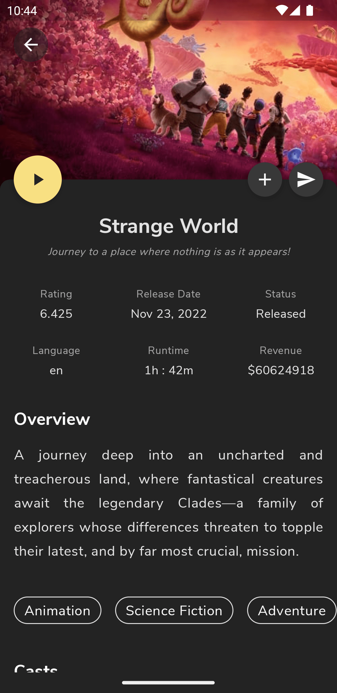

# (work-in-progress 👷🔧️👷‍♀️⛏)

# ShowTime

A Movie / TV Show information provider application built to demonstrate the use of Jetpack Compose
with other Jetpack libraries and Architecture Components. ShowTime
consumes [TMDB](https://www.themoviedb.org/documentation/api) API.

## Visuals

<table>
  <tr>
    <td>Home</td>
    <td>Home</td>
    <td>Movie List</td>
    <td>Movie List</td>
  </tr>
  <tr>
    <td></td>
    <td></td>
    <td></td>
    <td></td>
  </tr>
 </table>

<table>
  <tr>
    <td>Filter</td>
    <td>Filter</td>
    <td>Filter</td>
  </tr>
  <tr>
    <td></td>
    <td></td>
    <td></td>
  </tr>
</table>

<table>
  <tr>
    <td>Movie Details</td>
    <td>Movie Details</td>
    <td>Movie Details</td>
  </tr>
  <tr>
    <td></td>
    <td></td>
    <td></td>
  </tr>
</table>

## Tech Stack

- [Kotlin](https://kotlinlang.org/) - Modern programming language for Android development.
- [Jetpack Compose](https://developer.android.com/jetpack/compose) - Android’s modern UI toolkit.
- [Coroutines](https://kotlinlang.org/docs/reference/coroutines-overview.html) - A concurrency
  design pattern that you can use on Android to simplify code that executes asynchronously.
- [Android Architecture Components](https://developer.android.com/topic/libraries/architecture) -
  Collection of libraries that help you design robust, testable, and maintainable apps.
    - [LiveData](https://developer.android.com/topic/libraries/architecture/livedata) - Lifecycle
      aware observable data holder.
    - [ViewModel](https://developer.android.com/topic/libraries/architecture/viewmodel) - Stores
      UI-related data that isn"t destroyed on UI changes.
    - [Navigation](https://developer.android.com/jetpack/compose/navigation) - The Navigation
      component provides support for Jetpack Compose applications.
    - [Paging](https://developer.android.com/jetpack/androidx/releases/paging) - The Paging Library
      makes it easier for you to load data gradually and gracefully.

- [Coil](https://coil-kt.github.io/coil/compose/) - This library provides easy-to-use Painter which
  can fetch and display images from external sources, such as network.
- [Insets](https://google.github.io/accompanist/insets/) - Allows easy handling
  of [WindowInsets](https://developer.android.com/reference/android/view/WindowInsets.html).
- [Pager](https://google.github.io/accompanist/pager/) - Paging layouts for Jetpack Compose similar
  to [ViewPager](https://developer.android.com/reference/kotlin/androidx/viewpager/widget/ViewPager)
  .
- [Dagger Hilt](https://developer.android.com/training/dependency-injection/hilt-android) - For
  Dependency Injection.
- [Retrofit](https://square.github.io/retrofit/) - For Networking.
- [De-Sugaring](https://developer.android.com/studio/write/java8-support) - To use Java 8 features,
  Uses Java 8 [Date/Time](https://www.baeldung.com/java-8-date-time-intro) api in the project.
- [Material Design Components](https://material.io/develop/android) - To build modern beautiful UIs.

## Architecture

ShowTime demonstrates uses of [MVVM](https://developer.android.com/jetpack/docs/guide#recommended-app-arch) architecture.

## API Key

You need to supply API key for [TMDB](https://www.themoviedb.org/documentation/api) to build the project.