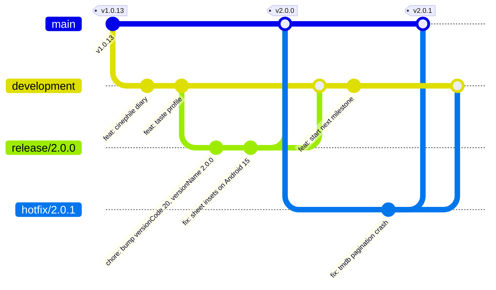

# ShowTime Branching & Release Strategy

This document defines the official Git branching model, versioning policy, release lifecycle, and hotfix protocols for ShowTime.

---

## 1. Core Branch Taxonomy

ShowTime follows a modified **GitFlow** model tailored for mobile continuous delivery:



### Branch Summary

| Branch | Lifecycle | Protection Level | Purpose |
| :--- | :--- | :--- | :--- |
| `main` | Permanent | **Strict (Golden)** | Represents **exact code currently live on Google Play Store**. Only receives merges from `release/*` or `hotfix/*`. Every commit is tagged. |
| `development` | Permanent | **Protected** | Main integration branch for new features and improvements. |
| `release/X.Y.Z` | Permanent | Protected | Release preparation, QA hardening, Play Store testing, and archived release history. |
| `hotfix/X.Y.Z` | Ephemeral | Protected | Critical emergency patches for live production bugs. Branched directly from `main`. |
| `feat/*` / `fix/*` | Ephemeral | Unprotected | Feature and task branches cut from and merged into `development`. |

---

## 2. Versioning Specification

ShowTime follows **Semantic Versioning** alongside Android's monotonically increasing integer `versionCode`.

In `app/build.gradle.kts`:
```kotlin
defaultConfig {
    versionCode = 20         // Monotonically increasing positive integer
    versionName = "2.0.0"    // MAJOR.MINOR.PATCH
}
```

* **MAJOR (`X.0.0`)**: Monumental redesigns, paradigm shifts, breaking database migrations, or major architectural overhauls (e.g. ShowTime 2.0 Cinephile Suite).
* **MINOR (`2.X.0`)**: New features, new bottom sheets, new integrations, or feature expansions (e.g. 2.1.0 adding Admin tools or new challenge modes).
* **PATCH (`2.0.X`)**: Bug fixes, performance optimizations, or UI polish without new feature scopes.
* **`versionCode`**: Must ALWAYS be incremented by at least `+1` with every release uploaded to Google Play Console.

---

## 3. End-to-End Release Lifecycle

### Phase 1: Feature Freeze & Branch Cut
1. Ensure all targeted PRs are merged into `development` and CI is passing.
2. Cut a new release branch from `development`:
   ```bash
   git checkout development
   git pull origin development
   git checkout -b release/2.0.0
   ```

### Phase 2: Version Bumping & Hardening
1. In `app/build.gradle.kts`, bump `versionCode` and `versionName`:
   ```kotlin
   versionCode = 20
   versionName = "2.0.0"
   ```
2. Run local quality verification:
   ```bash
   git add -A && ./.githooks/pre-commit
   ./gradlew testDebugUnitTest
   ```
3. Commit version bump:
   ```bash
   git commit -m "chore(release): bump version to 2.0.0 (code 20)"
   git push -u origin release/2.0.0
   ```

### Phase 3: Build & Testing Track Verification
1. Build the production Android App Bundle:
   ```bash
   ./gradlew bundleRelease
   ```
2. Upload `app/build/outputs/bundle/release/app-release.aab` to **Google Play Console -> Internal Testing Track**.
3. **Archive the ProGuard mapping file**:
   Save `app/build/outputs/mapping/release/mapping.txt` (used to de-obfuscate crash reports on Crashlytics and Play Console).
4. Verify on physical test devices:
   - Google Play Billing purchases / restore.
   - Google Sign-In & Firestore backup/restore.
   - Remote Config in-app update checks.

### Phase 4: Production Deployment & Merging
Once the build is promoted to **Production on Google Play Store**:
1. **Merge to `main` and Tag**:
   ```bash
   git checkout main
   git pull origin main
   git merge --no-ff release/2.0.0 -m "release: 2.0.0"
   git tag -a v2.0.0 -m "Release version 2.0.0 (versionCode 20)"
   git push origin main --tags
   ```
2. **Back-merge to `development`** (to preserve any stabilization fixes):
   ```bash
   git checkout development
   git pull origin development
   git merge --no-ff release/2.0.0 -m "chore: sync release 2.0.0 into development"
   git push origin development
   ```
3. **Retain Release Branch**:
   Keep `release/2.0.0` as an immutable snapshot of the release cycle (matching existing conventions like `release/1.0.12`).

---

## 4. Production Hotfix Protocol

When a critical production bug is detected (e.g. third-party API break or fatal crash in live release):

1. **Branch directly off `main`**:
   ```bash
   git checkout main
   git pull origin main
   git checkout -b hotfix/2.0.1
   ```
2. **Apply Minimal Fix & Bump Patch Version**:
   - In `app/build.gradle.kts`: `versionCode = 21`, `versionName = "2.0.1"`.
   - Apply only the emergency fix (no unreleased feature code).
3. **Verify & Test**:
   ```bash
   git add -A && ./.githooks/pre-commit
   ./gradlew testDebugUnitTest
   ./gradlew bundleRelease
   ```
4. **Deploy & Tag**:
   - Upload `.aab` to Google Play Console and publish.
   - Merge `hotfix/2.0.1` into `main` and tag `v2.0.1`:
     ```bash
     git checkout main
     git merge --no-ff hotfix/2.0.1 -m "hotfix: 2.0.1"
     git tag -a v2.0.1 -m "Hotfix version 2.0.1 (versionCode 21)"
     git push origin main --tags
     ```
   - Merge `hotfix/2.0.1` into `development`:
     ```bash
     git checkout development
     git merge --no-ff hotfix/2.0.1 -m "chore: sync hotfix 2.0.1 into development"
     git push origin development
     ```
   - Retain or delete `hotfix/2.0.1`.

---

## 5. Build Preservation & Open-Source Release Checklist

To guarantee 100% build reproducibility and debuggability:

- [ ] **Git Tag**: Every Play Store upload must have an immutable tag on `main` matching `v<versionName>`.
- [ ] **Open-Source Direct Sideloading**: Publish a standalone universal release APK (`app-release.apk`) on GitHub Releases (Play Store gets the `.aab`).
- [ ] **De-obfuscation Mapping**: Archive `mapping.txt` associated with the exact Git commit SHA.
- [ ] **Remote Config Consistency**: Ensure Firebase Remote Config defaults match the version codes defined in the release.
