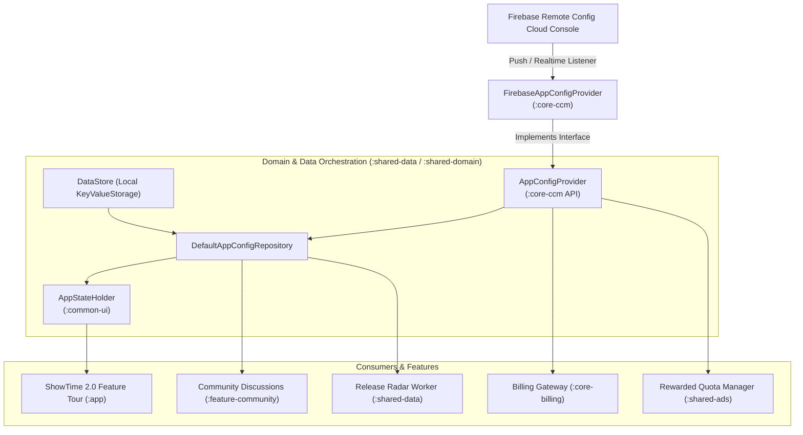

# ShowTime: Centralized Configuration Management (CCM) & Remote Config Architecture

## 1. Executive Summary & Purpose

The **Centralized Configuration Management (`core-ccm`)** module provides a type-safe, reactive, and modular infrastructure for dynamic remote feature flags, operational kill-switches, and A/B parameters across ShowTime. 

By abstracting Firebase Remote Config behind the pure Kotlin interface `AppConfigProvider`, ShowTime ensures:
1. **Decoupled Architecture**: Feature modules and UI layers never depend directly on the Firebase SDK.
2. **Safe Fallbacks**: Zero crashes or silent zeros when offline, uninitialized, or missing keys.
3. **Reactive Real-Time Updates**: Immediate UI and domain reactions to configuration changes via Kotlin `Flow` and Firebase Realtime Listeners.
4. **Resilience Against Binary Patch Jitter**: Campaigns (such as "What's New in 2.0") are decoupled from app build numbers (`versionCode`), preventing minor bug fixes (e.g. 2.0.1) from breaking user onboarding states.

---

## 2. Architecture & Data Flow



---

## 3. Core Engine: `AppConfigProvider` & Implementation

### A. Interface Definition (`com.ssverma.core.ccm.AppConfigProvider`)

Located in [`core-ccm/src/main/java/com/ssverma/core/ccm/AppConfigProvider.kt`](file:///Users/ss/Projects/ShowTime/core-ccm/src/main/java/com/ssverma/core/ccm/AppConfigProvider.kt):

```kotlin
interface AppConfigProvider {
    // One-shot synchronous reads
    fun getBoolean(key: String, defaultValue: Boolean = false): Boolean
    fun getString(key: String, defaultValue: String = ""): String
    fun getLong(key: String, defaultValue: Long = 0L): Long
    fun getDouble(key: String, defaultValue: Double = 0.0): Double

    // Reactive streams for dynamic parameters and kill-switches
    fun observeBoolean(key: String, defaultValue: Boolean = false): Flow<Boolean>
    fun observeString(key: String, defaultValue: String = ""): Flow<String>
    fun observeLong(key: String, defaultValue: Long = 0L): Flow<Long>
    fun observeDouble(key: String, defaultValue: Double = 0.0): Flow<Double>

    // Lifecycle fetch trigger
    fun fetchAndActivate()
}
```

### B. Implementation Details (`FirebaseAppConfigProvider`)

- **Cache Expiration**:
  - **Debug Builds**: `0L` seconds minimum fetch interval (instant updates for rapid development and testing).
  - **Release Builds**: `43200L` seconds (12 hours) to respect Google API quotas while ensuring freshness.
- **Firebase Static Fallback Defense**:
  - Firebase Remote Config silently defaults missing keys to `false`, `0`, or `""`.
  - `FirebaseAppConfigProvider` inspects `remoteValue.source`. If `VALUE_SOURCE_STATIC`, it automatically falls back to the developer's declared Kotlin default value.
- **Realtime Config Listener**:
  - Leverages `remoteConfig.addOnConfigUpdateListener` inside a `callbackFlow`.
  - Emits initial values immediately, then listens for server-side parameter changes and emits distinct new values down the stream.

---

## 4. Master Parameter Catalog

The following table documents the centralized remote configuration keys used across ShowTime:

| Category | Remote Config Key | Type | Default Value | Purpose & Operational Impact |
|:---|:---|:---:|:---:|:---|
| **What's New / Tour** | `whats_new_enabled` | `Boolean` | `true` | **Kill-Switch**: Instantly disables the What's New showcase globally without releasing an app update. |
| **What's New / Tour** | `whats_new_campaign_id` | `String` | `"2.0.0"` | **Campaign Gate**: Prevents minor bugfix releases (e.g. 2.0.1, 2.0.2) from re-triggering the tour for existing users. |
| **What's New / Tour** | `whats_new_feature_filter` | `String` | `""` | **Feature Gating**: Comma-separated list of feature IDs (e.g. `"movie_match,daily_game"`). Empty string activates all 6 core features. |
| **Release Radar** | `release_radar_enabled` | `Boolean` | `true` | Remote master switch for background release notification scheduling. |
| **Telemetry** | `remote_analytics_enabled` | `Boolean` | `true` | Global kill-switch for Firebase Analytics and user telemetry. |
| **Notifications** | `remote_notifications_enabled` | `Boolean` | `true` | Global switch to pause push notification dispatch. |
| **Discussions** | `discussion_trending_participant_weight` | `Double` | `3.0` | Tuning multiplier for community discussion ranking algorithm. |
| **Discussions** | `discussion_trending_upvote_weight` | `Double` | `2.0` | Upvote multiplier in discussion ranking decay calculation. |
| **Discussions** | `discussion_trending_comment_weight` | `Double` | `1.0` | Comment count multiplier in discussion ranking decay calculation. |
| **Discussions** | `discussion_trending_decay_hours` | `Double` | `24.0` | Half-life decay duration in hours for community discussion velocity. |
| **Cloud & Pro** | `cloud_backup_enabled` | `Boolean` | `true` | Gates Google Drive / Firestore user watch history synchronization. |
| **Cloud & Pro** | `pro_features_enabled` | `Boolean` | `true` | Gates Pro paywall triggers and premium feature locks. |
| **Rewarded Ads** | `config_pass_duration_<key>_hours` | `Long` | `2 / 6` | Over-the-air pass duration override in hours for specific `PassKey` (e.g. `config_pass_duration_watermark_free_receipt_hours`). |
| **Rewarded Ads** | `config_free_reminders_limit` | `Long` | `3` | Free quota limit for active release reminders before requiring ad tokens or Pro. |

---

## 5. Integration Patterns & Best Practices

### Pattern 1: Combined Local User Preference + Remote Kill-Switch
When a feature can be toggled by the user in Settings but must also support an emergency remote kill-switch, combine both in `DefaultAppConfigRepository`:

```kotlin
override val isAnalyticsEnabled: Flow<Boolean>
    get() = combine(
        keyValueStorage.observe(AnalyticsEnabledKey, true),
        appConfigProvider.observeBoolean(REMOTE_KEY_ANALYTICS_ENABLED, true)
    ) { isLocallyEnabled, isRemotelyEnabled ->
        isLocallyEnabled && isRemotelyEnabled
    }
```

### Pattern 2: Decoupled Campaign Progression
Avoid coupling onboarding or showcase triggers directly to Android's `BuildConfig.VERSION_CODE`. Instead, persist the last seen campaign ID:

```kotlin
// In DefaultAppConfigRepository.kt
override val lastSeenWhatsNewCampaign: Flow<String>
    get() = keyValueStorage.observe(LastSeenWhatsNewCampaignKey, "")

override suspend fun updateLastSeenWhatsNewCampaign(campaignId: String) {
    keyValueStorage.write(LastSeenWhatsNewCampaignKey, campaignId)
}

// In ShowTime.kt navigation evaluation
val shouldShowTour = isAppInfoDismissed && isWhatsNewEnabled && (lastSeenCampaign != currentCampaignId)
```

---

## 6. Testing & Quality Assurance

- **Unit Testing**: Use `FakeAppConfigProvider` from `:core-testing` in repository unit tests.
- **Verification**: Run `./gradlew :shared-data:testDebugUnitTest` to validate remote key observation and fallback handling.
