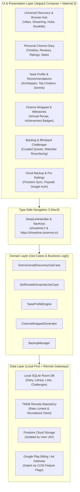

# ShowTime: Cinephile Suite & Universal Discovery Architecture Guide

## 1. Executive Summary & Core Principles

This document specifies the **What, Why, How, and Security** architecture for all recently
introduced cinephile, discovery, and cloud synchronization features in **ShowTime**.

ShowTime is an open-source, privacy-first cinema companion application built with modern Android
standards (**Jetpack Compose**, **Material 3 Expressive**, **Unidirectional Data Flow**, **Clean
Architecture**, and **Navigation 3**).

### Core Architectural Principles

1. **Local-First & Offline-First**: All user data (watch history, diary entries, custom lists,
   ratings, challenge progress) is stored locally on-device in Room SQLite. The application is 100%
   functional without an active network connection or account.
2. **Zero PII & Data Sovereignty**: ShowTime does not collect, track, or sell user identity, device
   telemetry, or browsing history. Cloud backup and synchronization are strictly opt-in and
   authenticated.
3. **Open-Source Reproducibility**: The codebase is engineered to compile and run out-of-the-box in
   mock / offline mode without requiring private Firebase, TMDB, or billing credentials.
4. **Design System & M3 Purity**: Zero hardcoded hex colors, zero arbitrary magic paddings, native
   component-level interaction sources, expressive loading indicators, and enter-always nested
   scrolling.

---

## 2. System Architecture Overview



---

## 3. Detailed Feature Breakdown: What, Why, How & Security

---

### Feature 1: Universal Discovery & Browse Hub (`feature-filter`)

#### **WHAT (Functional Overview)**

A Letterboxd-grade exploratory discovery hub with full Movie and TV Show parity.

- **Mood Vibes**: Curated algorithmic filters (e.g. *Mind-Bending*, *Pure Fun*, *Dark & Gritty*,
  *Comfort Binge*, *Masterpieces*).
- **Streaming Provider Filter**: Live region-aware OTT provider filtering (Netflix, Prime, Disney+,
  Apple TV+, etc.).
- **Decade & Studio Hubs**: Filter by cinematic era (*80s Neon*, *90s Classics*, *Golden Age*) and
  boutique cinephile studios (*A24*, *HBO*, *NEON*, *Studio Ghibli*, *Pixar*, *Marvel*).
- **Cinema Roulette**: Floating action button that picks an instant personalized recommendation with
  16:9 backdrop preview, rating, and dynamic re-rolls.
- **Continuous Navigation**: Accepts deep-links and home shelf navigation parameters without losing
  filter selections.

#### **WHY (Motivation)**

Eliminates decision fatigue and analysis paralysis for movie lovers by replacing static keyword
search with multi-faceted, vibe-based browsing.

#### **HOW (Technical Implementation)**

- **ViewModel & State**: `UniversalDiscoveryViewModel.kt` manages `UniversalDiscoveryUiState` via
  unidirectional `StateFlow`.
- **Top Bar Nested Scroll**: `TopAppBarDefaults.enterAlwaysScrollBehavior()` coupled with
  `Modifier.nestedScroll(scrollBehavior.nestedScrollConnection)` smoothly collapses the top bar on
  grid scroll down to maximize poster real estate.
- **Expressive Loading & Flat Placeholders**: Uses `ShowTimeLoadingIndicator()` and flat
  `surfaceContainerHighest` placeholders with movie/TV icons.
- **Component Click Interactions**: Uses `Card(onClick = ...)` and `Surface(onClick = ...)` for
  hardware-accelerated ripples and native M3 elevation hoist.
- **URL Normalization**: Image paths normalized in `TmdbDefaults.kt` to eliminate double-slash (
  `//`) defects.

#### **SECURITY & PRIVACY**

- **Sanitized Parameter Mapping**: All filter parameters (genre IDs, provider IDs, dates) are parsed
  and validated through strong domain enums and integer sets, preventing query injection.
- **Zero Query Logging**: Filter combinations and browsing sessions are never logged or transmitted
  to telemetry endpoints.

---

### Feature 2: Personal Cinema Diary & Review Log (`feature-library`)

#### **WHAT (Functional Overview)**

A personal logging journal for film and TV enthusiasts:

- Chronological timeline of watched titles with custom watch dates.
- Granular ratings (0.5 to 5.0 stars with half-star precision).
- Personal written reviews, notes, and tags.
- Rewatch tracking and viewing velocity metrics (titles per month/year).

#### **WHY (Motivation)**

Gives cinephiles a private, permanent record of their film journey without locking them into
proprietary third-party social networks.

#### **HOW (Technical Implementation)**

- **Entity**: `DiaryEntryEntity` in Room database with composite indices on
  `(mediaId, mediaType, watchDate)`.
- **Repository**: `DiaryRepository` exposes cold flows (`Flow<List<DiaryEntry>>`) for reactive UI
  updates.
- **Presentation**: `CinemaDiaryScreen` with expandable review cards, rating bar selector, and
  month-grouped timeline sections.

#### **SECURITY & PRIVACY**

- **Encrypted at Rest**: Stored locally in Android app-private SQLite database storage (
  `/data/data/com.ssverma.showtime/databases/`).
- **Zero Social Scraping**: Diary entries are completely private to the user unless explicitly
  shared via system share sheet.

---

### Feature 3: Cinephile Taste Profile & Smart Recommendations (`feature-library`)

#### **WHAT (Functional Overview)**

An automated aesthetic analysis of the user's taste:

- Identifies top genres, favorite cinematic decades, and most-watched directors/actors.
- Assigns a personalized Cinephile Archetype (e.g. *The Auteur Aficionado*, *The Nostalgia Seeker*,
  *The Genre Explorer*).
- Surfaces algorithmic recommendations based on watch history patterns.

#### **WHY (Motivation)**

Provides personalized recommendations without invasive algorithmic tracking or corporate ad-network
profiling.

#### **HOW (Technical Implementation)**

- **Engine**: On-device statistical engine `TasteProfileEngine.kt` computes genre weights, decade
  distributions, and director frequencies directly from the local Room database.
- **Similarity Matching**: Queries TMDB discover endpoints using weighted genre vectors computed
  entirely on-device.

#### **SECURITY & PRIVACY**

- **100% On-Device Processing**: No taste profiles, viewing habits, or rating distributions are sent
  to remote servers for profiling or ad targeting.

---

### Feature 4: Annual Cinema Wrapped & Milestones (`feature-library`)

#### **WHAT (Functional Overview)**

Year-in-review visual celebration of viewing habits:

- Total watch time (hours & days), total films & episodes logged.
- Top genres, top directors, era distribution chart.
- Unlockable achievement badges (e.g. *Century Club*, *Midnight Screamer*, *Decade Hopper*).
- Clean, shareable card exporter.

#### **WHY (Motivation)**

Celebrates user viewing milestones and drives viral, organic sharing of the open-source app.

#### **HOW (Technical Implementation)**

- **Aggregator**: `CinemaWrappedGenerator.kt` queries Room for log entries filtered by calendar
  year.
- **UI & Share**: `CinephileWrappedScreen.kt` renders styled carousel slides with canvas bitmap
  capture for high-resolution sharing.

#### **SECURITY & PRIVACY**

- **Clean Image Export**: Canvas bitmap exporter strips all device identifiers, account emails, or
  location metadata before passing the image to the Android system share sheet.

---

### Feature 5: Cinephile Backlog & Blindspot Challenges (`feature-library`)

#### **WHAT (Functional Overview)**

Gamified cinematic exploration:

- **Curated Challenges**: *52 Films a Year*, *Criterion Classics*, *Sci-Fi Odyssey*, *Golden Age of
  Cinema*.
- **Blindspots**: Algorithmically surfaces oldest un-watched items from the user's watchlist that
  match high critical acclaim.
- Dynamic progress bars, completion certificates, and milestone badges.

#### **WHY (Motivation)**

Helps movie lovers conquer their ever-growing watchlist backlog and discover essential cinema
systematically.

#### **HOW (Technical Implementation)**

- **Data Model**: `ChallengeEntity` tracks quest milestones, progress counts, and completion
  timestamps.
- **UI**: `BacklogChallengeScreen.kt` featuring Material 3 progress indicators, challenge cards, and
  filter shortcuts into Discover.

#### **SECURITY & PRIVACY**

- Progress state is maintained locally with zero external network dependencies.

---

### Feature 6: Pro Gating, Cloud Backup & Auth Architecture (`core-backup`, `core-billing`,

`feature-auth`)

#### **WHAT (Functional Overview)**

- **Cloud Backup**: Automated cloud backup for Pro users with manual one-click backup and restore.
- **Identity Unification**: Anonymous Firebase guest accounts that seamlessly link with Google
  Sign-In, preserving all local and cloud data.
- **Monetization & Pro Paywall**: Premium features (e.g., unlimited custom lists, auto-cloud sync)
  gated behind Pro subscriptions / lifetime unlock or rewarded video ads.

#### **WHY (Motivation)**

Offers data safety across device migrations and sustainable open-source project monetization while
keeping the core experience free and unrestricted.

#### **HOW (Technical Implementation)**

- **Backup Architecture**: `BackupManager.kt` serializes Room database tables into JSON payloads and
  writes to Cloud Firestore under `/users/{uid}/backups/latest`.
- **CCM Feature Gating**: Cloud features are gated by `ConfigManager` (`core-ccm`) so builds without
  Firebase credentials gracefully fallback to local-only mode.

#### **SECURITY & OPEN SOURCE SAFETY**

- **Firestore Security Rules**:
  ```javascript
  rules_version = '2';
  service cloud.firestore {
    match /databases/{database}/documents {
      match /users/{userId}/{document=**} {
        allow read, write: if request.auth != null && request.auth.uid == userId;
      }
    }
  }
  ```
- **Strict Data Isolation**: No user can read or overwrite another user's backup archive.
- **No Hardcoded Secrets**: All API keys, Google Web Client IDs, and Firebase configurations are
  injected at build time from `local.properties` or GitHub Secrets.

---

## 4. Open-Source Security & Safe Contributing Checklist

| Security Area                | Standard & Implementation in ShowTime                                                                                                              |
|:-----------------------------|:---------------------------------------------------------------------------------------------------------------------------------------------------|
| **API Keys & Secrets**       | Zero secrets in git. TMDB API keys, Firebase google-services.json, and Trakt credentials are in `.gitignore`.                                      |
| **Build Reproducibility**    | The app builds and runs unit tests in offline/mock mode even with dummy keys.                                                                      |
| **SQL Injection Prevention** | All database queries use Room DAO parameterized queries with type-safe parameters.                                                                 |
| **Deep Link Sanitization**   | `ShowTimeDeepLinkHandler` whitelists schemes (`https`, `showtime`) and host domains (`showtime.ssverma.in`), safely parsing integer IDs and enums. |
| **Data Privacy & GDPR**      | Local-first design ensures user data never leaves the device unless the user explicitly triggers Google Auth & Cloud Backup.                       |
| **Code Quality Hook**        | Pre-commit hook (`./.githooks/pre-commit`) enforces zero hardcoded colors, token purity, string localization, and test execution before commit.    |

---

## 5. Canonical Deep Link Routing Reference

| Destination                 | Universal URL                                 | In-App `NavKey` Target                          |
|:----------------------------|:----------------------------------------------|:------------------------------------------------|
| **Universal Discover**      | `https://showtime.ssverma.in/discover`        | `UniversalDiscoveryNavKey(initialVibe = "ALL")` |
| **Discover by Vibe**        | `https://showtime.ssverma.in/discover/{VIBE}` | `UniversalDiscoveryNavKey(initialVibe = VIBE)`  |
| **Cinema Diary**            | `https://showtime.ssverma.in/diary`           | `CinemaDiaryNavKey`                             |
| **Taste Profile**           | `https://showtime.ssverma.in/taste`           | `TasteProfileNavKey`                            |
| **Cinema Wrapped**          | `https://showtime.ssverma.in/wrapped`         | `CinephileWrappedNavKey`                        |
| **Blindspots & Challenges** | `https://showtime.ssverma.in/challenges`      | `BacklogChallengeNavKey`                        |
| **Movie Details**           | `https://showtime.ssverma.in/movie/{id}`      | `MovieDetailNavKey(id)`                         |
| **TV Details**              | `https://showtime.ssverma.in/tv/{id}`         | `TvShowDetailNavKey(id)`                        |
