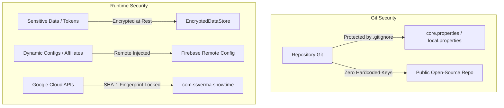

# ShowTime: Code Quality, Design System & Security Guide

## 1. Objective & Scope

This document defines the **Mandatory Code Quality, Design System, Architecture, and Security
Standards** for ShowTime. Every pull request, feature commit, and refactor must be validated against
the checklist in this guide before being merged into development or release branches.

---

## 2. Design System & Token Purity

### A. Colors (Zero Hardcoded Hex Codes)

* **Rule**: Never use `Color(0xFF...)` or `android.graphics.Color` directly in UI composables or
  custom modifiers.
* **Standard**: Strictly reference the semantic palette from `MaterialTheme.colorScheme`:
  ```kotlin
  // ❌ FORBIDDEN
  Modifier.background(Color(0xFF1E1E1E))
  Text(text = title, color = Color.White)

  // ✅ CORRECT
  Modifier.background(MaterialTheme.colorScheme.surface)
  Text(text = title, color = MaterialTheme.colorScheme.onSurface)
  ```
* **Tokens Reference**:
    - Backgrounds: `surface`, `surfaceVariant`, `background`, `surfaceContainer`
    - Content / Text: `onSurface`, `onSurfaceVariant`, `onPrimary`, `onBackground`
    - Accents & Highlights: `primary`, `secondary`, `tertiary`, `primaryContainer`
    - Dividers & Outlines: `outline`, `outlineVariant`

---

### B. Spacing & Padding (Zero Arbitrary Magic Numbers)

* **Rule**: Do not use ad-hoc raw numbers (e.g. `7.dp`, `13.dp`, `23.dp`) for standard component
  layouts.
* **Standard**: Use `MaterialTheme.spacing.*` tokens or standardized section spacing constants:
  ```kotlin
  // ❌ FORBIDDEN
  Modifier.padding(horizontal = 14.dp, vertical = 22.dp)

  // ✅ CORRECT
  Modifier.padding(
      horizontal = MaterialTheme.spacing.medium, // 16.dp
      vertical = MaterialTheme.spacing.large      // 24.dp
  )
  ```
* **Spacing Scale Reference (`core-ui/theme/Spacing.kt`)**:
    - `spacing.extraSmall`: `4.dp`
    - `spacing.small`: `8.dp`
    - `spacing.medium`: `16.dp`
    - `spacing.large`: `24.dp`
    - `spacing.extraLarge`: `32.dp`
    - Section Spacing: `SectionDefaults.SectionVerticalSpacing` (`24.dp`)

---

### C. Typography (Zero Ad-Hoc TextStyles)

* **Rule**: Do not declare manual `TextStyle(fontSize = 17.sp, ...)` in individual screens.
* **Standard**: Use `MaterialTheme.typography` hierarchy with `.copy()` only for small modifiers (
  e.g. `fontWeight = FontWeight.Bold`):
  ```kotlin
  // ❌ FORBIDDEN
  Text(text = "Overview", fontSize = 19.sp, fontWeight = FontWeight.W600)

  // ✅ CORRECT
  Text(
      text = stringResource(R.string.overview),
      style = MaterialTheme.typography.titleMedium,
      fontWeight = FontWeight.SemiBold
  )
  ```

---

### D. Ripple & Click Handling (Surface / Card `onClick` vs `Modifier.clickable`)

* **Rule**: Never use `Modifier.clickable { ... }` on container components like `Surface`, `Card`, `ElevatedCard`, or `OutlinedCard`.
* **Standard**: Always use the container's first-class `onClick = { ... }` parameter.
  ```kotlin
  // ❌ FORBIDDEN: Modifier.clickable suppresses or misclips container ripples and breaks M3 elevation/tint interaction
  Surface(
      shape = RoundedCornerShape(12.dp),
      modifier = Modifier.fillMaxWidth().clickable { onItemClick() }
  ) { ... }

  Card(
      shape = RoundedCornerShape(16.dp),
      modifier = Modifier.clickable { onOpen() }
  ) { ... }

  // ✅ CORRECT: Surface/Card onClick guarantees bounded ripple animation, correct Role.Button semantics, and stateful interaction
  Surface(
      onClick = { onItemClick() },
      shape = RoundedCornerShape(12.dp),
      modifier = Modifier.fillMaxWidth()
  ) { ... }

  Card(
      onClick = { onOpen() },
      shape = RoundedCornerShape(16.dp)
  ) { ... }
  ```
* **Rationale**: `Surface(onClick = ...)` and `Card(onClick = ...)` automatically attach the Material 3 `LocalIndication` / ripple cleanly bounded inside the container's `Shape`, provide accessible button semantics, and properly propagate interaction states without touch conflicts.

---

## 3. Localization & Accessibility

### A. Zero Hardcoded English Strings

* **Rule**: Every user-facing label, button title, dialog text, error message, and placeholder must
  reside in `res/values/strings.xml`.
* **Standard**:
  ```kotlin
  // ❌ FORBIDDEN
  Text(text = "Watch Trailer")
  Button(onClick = { ... }) { Text("Add to Watchlist") }

  // ✅ CORRECT
  Text(text = stringResource(R.string.watch_trailer))
  Button(onClick = { ... }) { Text(stringResource(R.string.add_to_watchlist)) }
  ```

### B. Accessibility & Touch Targets

* **Content Descriptions**: Every icon, clickable graphic, and poster MUST have a descriptive
  `contentDescription` (or `null` if purely decorative):
  ```kotlin
  Icon(
      imageVector = Icons.Rounded.Favorite,
      contentDescription = stringResource(R.string.cd_favorite_button)
  )
  ```
* **Minimum Touch Target**: Interactive components (buttons, chips, icons) must satisfy minimum
  touch target bounds of **at least 48dp x 48dp** (or use
  `Modifier.minimumInteractiveComponentSize()`).

---

## 4. Code Hygiene & Linting Standards

### A. Import Hygiene (Zero Wildcards & Zero Inline Classes)

* **No Wildcard Imports**: Never use `import foo.bar.*`.
* **No Inline Fully Qualified Names**:
  ```kotlin
  // ❌ FORBIDDEN
  val shape = androidx.compose.foundation.shape.CircleShape
  val alignment = androidx.compose.ui.Alignment.Center

  // ✅ CORRECT
  import androidx.compose.foundation.shape.CircleShape
  import androidx.compose.ui.Alignment

  val shape = CircleShape
  val alignment = Alignment.Center
  ```
* **Zero Dead Imports**: Unused imports must be stripped before committing.

### B. Named Arguments Standard

* **Strict Rule**: Wherever possible, always use named arguments when invoking composables, domain
  use-cases,
  repository methods, data class constructors, and functions (especially those with more than 1
  argument,
  or with boolean/numeric/nullable parameters).
* **Rationale**: Named arguments make call sites self-documenting, eliminate parameter transposition
  bugs
  (such as accidentally swapping flags, dimensions, or IDs), and guarantee resilience against
  signature changes.
* **Standard**:
  ```kotlin
  // ❌ FORBIDDEN / DISCOURAGED
  PlanOptionCard(product, true, false, { onSelect() })
  Modifier.padding(16.dp, 8.dp)

  // ✅ CORRECT
  PlanOptionCard(
      product = product,
      isSelected = true,
      isBestValue = false,
      onClick = { onSelect() }
  )
  Modifier.padding(horizontal = 16.dp, vertical = 8.dp)
  ```

### C. Parameter Encapsulation (`*Args` Standard)

* **Rule**: When function signatures, navigation callbacks, or lambdas require large parameter
  lists (typically 3 or more related parameters), encapsulate them into a strongly-typed data
  class (e.g. `*Args` pattern).
* **Rationale**: Prevents unwieldy callback types (such as
  `((mediaType, id, title, poster, backdrop) -> Unit)`), eliminates positional parameter
  transposition errors, improves binary and API compatibility when adding optional parameters, and
  simplifies call site readability.
* **Standard**:
  ```kotlin
  // ❌ DISCOURAGED: Unwieldy callback signatures
  openDiscussions: ((mediaType: MediaType, id: Int, title: String, posterImageUrl: String?, backdropImageUrl: String?) -> Unit)? = null

  // ✅ CORRECT: Encapsulate into a dedicated Args data class
  data class DiscussionNavArgs(
      val mediaType: MediaType,
      val mediaId: Int,
      val title: String,
      val posterImageUrl: String? = null,
      val backdropImageUrl: String? = null,
      val seasonNumber: Int? = null,
      val episodeNumber: Int? = null
  )

  openDiscussions: ((DiscussionNavArgs) -> Unit)? = null
  ```

---

## 5. Jetpack Compose Performance Guidelines

### A. Stable Keys in Lazy Layouts

* **Rule**: Every `items(...)` block in `LazyColumn`, `LazyRow`, or `LazyVerticalGrid` must supply
  an explicit `key` and `contentType`:
  ```kotlin
  LazyColumn {
      items(
          items = movies,
          key = { it.id },
          contentType = { "movie_card" }
      ) { movie ->
          MovieCard(movie = movie)
      }
  }
  ```

### B. Modifier Convention & Parameter Ordering

* **Rule**: In reusable composables, `modifier: Modifier = Modifier` must be the **first optional
  parameter**:
  ```kotlin
  @Composable
  fun MoviePosterCard(
      movie: MoviePreview,
      onMovieClick: (MoviePreview) -> Unit,
      modifier: Modifier = Modifier,
      enableAnimation: Boolean = true
  ) { ... }
  ```

### C. Image Memory Optimization (Coil)

* **Rule**: Always downsample images to the target container size to avoid loading full-resolution
  4K bitmaps into RAM:
  ```kotlin
  SubcomposeAsyncImage(
      model = ImageRequest.Builder(LocalContext.current)
          .data(posterUrl)
          .size(width = 300, height = 450) // Downsample to viewport size
          .crossfade(true)
          .build(),
      contentDescription = movie.title
  )
  ```

### D. Separation of Concerns: Zero Calculations in UI / Composables (Dumb UI Principle)

* **Strict Invariant**: Composables and UI-layer functions must **never** perform data
  transformations, business logic, date arithmetic, string slicing (`.take(...)`), regex parsing,
  mathematical operations, list filtering (`.filter`), or list sorting (`.sortedBy`, `.sortedWith`).
* **Rule**: All state displayed in the UI must be pre-calculated, formatted, sorted, filtered, and
  exposed by upper layers (Domain UseCases, Data Mappers, or ViewModels) using background
  dispatchers
  (e.g. `Dispatchers.Default`).
* **Standard**:
  ```kotlin
  // ❌ FORBIDDEN IN COMPOSABLES
  val year = item.releaseDate.take(4)
  val parsedDate = SimpleDateFormat(...).parse(...)
  val formattedRating = "${(item.voteAvg * 10).toInt()}%"
  val sortedComments = remember(comments, filter) {
      comments.filter { !it.isSpoiler }.sortedByDescending { it.createdAt }
  }

  // ✅ CORRECT
  // Formatted in Mapper / ViewModel / Domain Model:
  Text(text = item.displayYear)
  Text(text = item.displayRating)

  // Handled in ViewModel / UseCase on Dispatchers.Default:
  val uiComments: StateFlow<List<CommentUiModel>> = combine(commentsFlow, filterFlow) { comments, filter ->
      filterAndSortCommentsUseCase(comments, filter).map { it.toUiModel(...) }
  }.flowOn(Dispatchers.Default).stateIn(...)
  ```

### E. Lambda Parameter Encapsulation (`*Args` Data Classes)

* **Rule**: Kotlin lambdas **do not support named arguments** at call sites. Whenever a callback or lambda parameter accepts more than 1 argument (or has an expanding parameter set), wrap the parameters into a dedicated `*Args` data class (e.g. `PostCommentArgs`, `EditCommentArgs`, `ReportCommentArgs`).
* **Why**:
  - **Zero Transposition Bugs**: Positional lambdas allow callers to accidentally swap same-typed arguments (e.g., swapping `(commentId, reason)` or `(content, isSpoiler)`) without any compiler warning.
  - **Refactor Resilient**: Adding, removing, or providing defaults for arguments does not break callback signatures across nested composable trees.
  - **Idiomatic Method References**: Enables clean method references (e.g., `onEditComment = viewModel::editComment`, `onReportComment = viewModel::reportComment`).
* **Standard**:
  ```kotlin
  // ❌ FORBIDDEN: Raw multiple positional parameters in callbacks
  onEditComment: (commentId: String, newContent: String, isSpoiler: Boolean) -> Unit = { _, _, _ -> }
  onReportComment: (commentId: String, reason: String) -> Unit = { _, _ -> }

  // ✅ CORRECT: Encapsulated into dedicated *Args data class
  data class EditCommentArgs(val commentId: String, val newContent: String, val isSpoiler: Boolean = false)
  data class ReportCommentArgs(val commentId: String, val reason: String)

  onEditComment: (EditCommentArgs) -> Unit = {}
  onReportComment: (ReportCommentArgs) -> Unit = {}
  ```

---

## 6. Modular Architecture & Platform Decoupling Standards

### A. Feature-Agnostic Core Modules (Zero Domain Bloat)

* **Rule**: Infrastructure and platform modules (`core-*`) must remain strictly feature-agnostic. They must **never** reference domain entities, feature models, or feature-specific enum/string keys.
* **Standard**:
  - `core-backup` must not define individual feature counts (`favoritesCount`, `challengesCount`, etc.) in its primary constructors or drive clients. It uses generic `featureCounts: Map<String, Int>`.
  - `core-notifications`, `core-storage`, `core-analytics`, and `core-networking` must never import from `shared-domain`, `shared-data`, or `feature-*`.

### B. Contributor Plugin Pattern for Cross-Cutting Platform Services

* **Rule**: Services orchestrating cross-cutting application capabilities (such as Cloud Backup & Restore, Push Notification Dispatchers, Analytics Dispatchers) must **never** become monolithic "god classes" that directly inject every DAO or repository in the app.
* **Standard**:
  - Platform services define a pluggable Contributor interface (e.g., `BackupContributor`) in `core-*`.
  - Domain features in `shared-data` or `feature-*` provide their own isolated contributor implementations and bind them via Dagger Multibindings (`@IntoSet` / `@Multibinds`).
  - The orchestrator injects `Set<@JvmSuppressWildcards BackupContributor>`, allowing new features to be added with zero changes to existing repository or orchestrator classes.
  - Snapshot serialization must support isolated feature payloads (`"features": { ... }`) while maintaining backward compatibility for legacy snapshots via `fullSnapshot: JsonObject`.

### C. Module Taxonomy & Responsibility Boundaries

* **Strict Invariant**: Every module in the project belongs to a well-defined tier in the architectural hierarchy:
  1. **`core-*` (Platform Infrastructure Tier)**:
     - Pure platform-level, infrastructure-only, and **100% feature-agnostic**.
     - Examples: `core-networking`, `core-storage`, `core-billing`, `core-backup`, `core-navigation`.
     - Rule: Must NEVER know about feature concepts, feature models, or feature pass enums.
  2. **`common-ui` (Stateful Plug-and-Play UI Tier)**:
     - Contains **stateful, plug-and-play UI components** that can be injected and rendered anywhere across the app.
     - Examples: `LanguageSelectionBottomSheet`, `ThemeSelectionBottomSheet`, `RegionSelectionBottomSheet`, `AppInfoBottomSheet`.
     - Rule: Self-contained interactive UI blocks with their own internal state/viewmodel coordination.
  3. **`shared-*` (Stateless Cross-Cutting Building Blocks Tier)**:
     - Contains **stateless, thin, reusable components** shared across N features.
     - Examples: `shared-domain` (shared base models like `Movie`, `TvShow`), `shared-ui` (stateless composables: `MediaCard`, `Carousel`, `Avatar`, `Button`, formatting utils).
     - Rule: **MUST NOT BE POLLUTED**. Never dump full feature data layers, Firestore repositories, DAOs, or domain business rules into `shared-*`.
  4. **`feature-*` (Vertical Feature Slice Tier)**:
      - Self-contained feature slices owning their own presentation, domain, and data layers (e.g. `feature-movie`, `feature-tv`, `feature-library`, `feature-community`, `feature-match`, `feature-account`, `feature-auth`, `feature-search`, `feature-person`, `feature-payment`, `feature-filter`).
      - Rule: **Zero cross-feature implementation dependencies**. `feature-A` must NEVER depend on `feature-B`. Cross-feature navigation is achieved exclusively through `feature-*-navigation` contracts.
   5. **`feature-*-navigation` (Navigation Contract Tier)**:
      - Pure, lightweight API contracts exposing only `NavKey` and destination arguments so feature modules never depend directly on each other.
      - Rule: Must contain ONLY `NavKey` data classes and serialization. No screens, ViewModels, repositories, or business logic.

### D. Strict Dependency Inversion (Zero UI-to-Data Coupling)

* **Rule**: Presentation and UI modules (`shared-ui`, `common-ui`, `feature-*-ui`) must **NEVER declare dependencies on `shared-data` or any data module**.
* **Standard**:
  - UI depends strictly on Domain (`shared-domain`) and Navigation contracts (`feature-*-navigation`).
  - Data implements Domain interfaces (Dependency Inversion: `Presentation -> Domain <- Data`).
  - Direct UI-to-Data dependencies pull database, SQLite, and network runtimes transitively into the UI classpath, corrupting incremental build cache and destroying architectural boundaries.

---

### E. Feature UI Modularity & `component/` Subpackage Standard

* **Rule**: Screen and sheet composables (`*Screen.kt`, `*BottomSheet.kt`) must remain clean, declarative, high-level orchestrators and should not exceed **~300–400 lines of code**. Monolithic "god-composables" are strictly forbidden.
* **Component Subpackage Convention**:
  - Complex screens or feature packages must organize modular presentation elements into a dedicated `component/` subpackage (e.g. `feature-library/.../ui/share/component/`, `feature-community/.../ui/detail/component/`).
  - Single-responsibility UI parts (dialogs, custom cards, action bars, selector carousels/chips, empty/error state layouts, header banners) MUST be extracted into dedicated component files inside `component/`.
* **Standard Structure**:
  ```
  ui/share/
  ├── SecretSharedListScreen.kt         # Lean orchestrator (~150-200 lines)
  ├── SecretSharedListViewModel.kt      # State management
  ├── ListShareExportBottomSheet.kt    # Lean bottom sheet container
  └── component/                        # Modular, testable, reusable UI pieces
      ├── SharedMediaGridCard.kt        # Item card presentation
      ├── SecretSharedListHeader.kt     # Header, curator info & primary action rows
      ├── SecretSharedListTopAppBar.kt  # App bar, title animation & overflow menu
      ├── SecretSharedListDialogs.kt    # Alert and confirmation dialogs
      ├── SecretSharedListStates.kt     # Empty, revoked, and not-found states
      ├── SecretShareControls.kt        # Format & theme selectors, toggle cards
      ├── SecretShareActionRows.kt      # Primary CTAs and action bars
      └── SecretShareDialogs.kt         # Sheet confirmation & gate dialogs
  ```
* **Why**:
  - **Readability & Maintainability**: Eliminates bloated 1000+ line monoliths that conflate layout, dialog orchestration, and animation state.
  - **Component Reusability**: Dialogs, cards, and action bars can be shared cleanly across screens and bottom sheets without code duplication.
  - **Isolated Compose Previews**: Granular composables can be independently previewed and styled without spinning up heavy screen-level ViewModels.

---

## 7. Security, Secrets & Privacy Standards



1. **Zero Hardcoded Secrets in Source Code**:
    - API keys, OAuth client secrets, and dynamic partner tags must never be committed to Git.
    - Inject secrets via `core.properties` (gitignored) or GitHub Actions Secrets.
2. **Encrypted Storage for Auth & Tokens**:
    - Store OAuth tokens (Trakt, Google Tokens) using `EncryptedDataStore` or `MasterKeys` Keystore
      encryption.
3. **Google Cloud SHA-1 Fingerprint Restriction**:
    - All Google APIs (AdMob, Google Sign-In, Firebase) are strictly locked to the release SHA-1
      certificate fingerprint and package name (`com.ssverma.showtime`).
4. **Secure External Intent Handling**:
    - Validate all outbound URLs before launching browser intents to prevent malicious URI
      hijacking.

---

## 8. Zero Hardcoded Data for Production Builds & End Users

* **Strict Invariant**: No synthetic, mock, or hardcoded dummy data may ever be served to end-users
  or included in production code paths.
* **Core Principles**:
    1. **Real-Data Exclusivity**: Production and release builds must exclusively fetch, display, and
       persist authentic live data from TMDB APIs, Trakt.tv sync, and local Room user databases.
    2. **Debug Sandbox Quarantine**: All mock data generators, synthetic lists, fake network delays,
       and sandbox testing utilities must reside exclusively in debug tooling (e.g.
       `DebugConfigManager`, developer settings panel) and be strictly disabled by default.
    3. **Zero Fallback Stubs in Release UI**: Composables and ViewModels must never hardcode sample
       titles, fake season numbers, dummy episode lists, or mock images as fallbacks in user-facing
       flows. Use proper loading skeletons, empty state illustrations, or error states instead.
    4. **Clean Reset & Sync Guarantee**: Local database wiping tools (e.g. in Dev Sandbox) must
       perform complete, synchronized resets across all tables (`show_watch_progress`,
       `episode_watch_history`, `library_item`, etc.) without leaving orphaned mock entries.

---

## 9. Pre-Commit / Post-Change Verification Checklist

Before pushing any commit or opening a PR, run through this validation gate:

```bash
# 1. Run Unit Tests across all modules
./gradlew testDebugUnitTest

# 2. Verify Kotlin Compilation across all modules
./gradlew compileDebugKotlin

# 3. Verify Android Lint and static analysis
./gradlew lintDebug

# 4. Assemble and build the full debug APK
./gradlew :app:assembleDebug

# 5. Run the automated pre-commit quality gate (auto-reformat + code quality checklist)
git add -A && ./.githooks/pre-commit

# 6. (If firestore.rules modified) Validate Firestore security rules compilation
npx firebase-tools deploy --only firestore:rules --dry-run
```

> **Note**: The `.githooks/pre-commit` hook automatically runs on every `git commit`. It performs:
> 1. **Auto-reformatting** of staged files (Android Studio Cmd+Option+L equivalent).
> 2. **Code Quality Checklist** validation (zero wildcard imports, zero inline FQCNs, zero hardcoded hex colors outside `*Color.kt`, zero debug logs).

### Manual Review Checklist:

- [ ] **Firestore Security Rules**: If changes touch `firestore.rules`, were they tested with `npx firebase-tools deploy --only firestore:rules --dry-run` before release, and are dev and prod collections strictly isolated?

- [ ] **Architecture Boundaries & Module Taxonomy**:
  - Are `core-*` modules 100% feature-agnostic and free of domain concepts or feature pass enums?
  - Does any UI module (`shared-ui`, `common-ui`, `feature-*-ui`) declare a dependency on `shared-data`? (Strictly forbidden: UI must never depend on Data).
  - Is `common-ui` reserved for stateful, plug-and-play components?
  - Are `shared-*` modules stateless, thin, and unpolluted by feature-specific DAOs, repositories, or Firestore implementations?
  - Are there zero cross-feature implementation dependencies (`feature-A` → `feature-B`)? Cross-feature wiring must go through `feature-*-navigation` contracts only.
  - Do `feature-*-navigation` modules contain ONLY `NavKey` data classes with zero screens, ViewModels, or business logic?
- [ ] **Feature-Agnostic Core Modules & Contributor Plugin Pattern**: Are `core-*` and `shared-*` modules completely free of feature-specific domain bloat? Do platform services (backup, notifications, analytics) use decoupled Dagger multibinding contributors (`@IntoSet`) rather than injecting domain DAOs/repositories into a god-class?
- [ ] **Component Modularity & `component/` Subpackage**: Are screen and sheet files kept lean (~300–400 lines max) with complex UI parts, dialogs, card variants, state views, and control bars extracted into a dedicated `component/` subpackage?
- [ ] **Zero UI Calculations**: Are all dates, strings, numbers, and business logic pre-calculated
  in upper layers (Domain/ViewModel/Mapper) with zero parsing, regex, or slicing in Composables?
- [ ] **Dumb UI & Passive Presentation**: Are all list filterings, sortings, and domain-to-UI data
  mappings performed in the ViewModel/Domain layer on background dispatchers (e.g.
  `Dispatchers.Default`) rather than via `remember { ... }` in composables?
- [ ] **No Hardcoded Data**: Are all mock data, stubs, and sandbox tools strictly quarantined to
  debug-only modes with zero mock data leakage to production/end users?
- [ ] **Strings**: Are all new user-facing texts extracted to `strings.xml`?
- [ ] **Colors & Spacing**: Are there zero hardcoded `Color(0x...)` or raw un-tokenized `dp` values?
- [ ] **Imports**: Are there zero wildcard imports (`*`) and zero unused imports?
- [ ] **Lazy Lists**: Do all Lazy lists have explicit `key = { ... }` defined?
- [ ] **Named Arguments**: Are named arguments used wherever possible across composable calls,
  function invocations, and constructor instantiations to maximize readability and eliminate
  parameter transposition bugs?
- [ ] **Parameter Encapsulation (`*Args`)**: Are callback and lambda signatures with more than 1
  parameter encapsulated into dedicated `*Args` data classes (e.g. `PostCommentArgs`, `EditCommentArgs`,
  `ReportCommentArgs`) to prevent transposition bugs since Kotlin lambdas lack named arguments?
- [ ] **Secrets**: Did any sensitive key or token leak into the commit diff?
- [ ] **Device Test**: Did the APK install and run smoothly without UI jank or crash on device?
