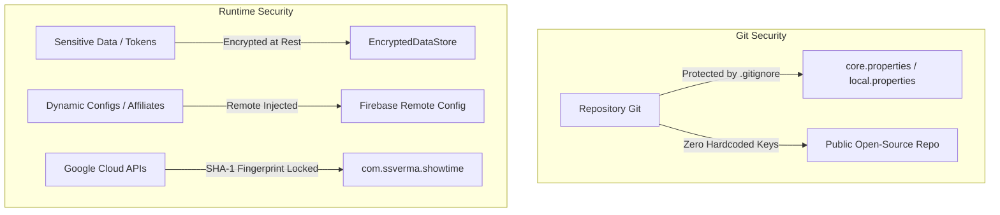

# ShowTime: Code Quality, Design System & Security Guide

## 1. Objective & Scope

This document defines the **Mandatory Code Quality, Design System, Architecture, and Security
Standards** for ShowTime. Every pull request, feature commit, and refactor must be validated against
the checklist in this guide before being merged into development or release branches.

---

## 2. Design System & Token Purity

### A. Colors (Zero Hardcoded Hex Codes)

* **Rule**: Never use `Color(0xFF...)` or `android.graphics.Color` directly in UI composables or
  custom modifiers.
* **Standard**: Strictly reference the semantic palette from `MaterialTheme.colorScheme`:
  ```kotlin
  // ❌ FORBIDDEN
  Modifier.background(Color(0xFF1E1E1E))
  Text(text = title, color = Color.White)

  // ✅ CORRECT
  Modifier.background(MaterialTheme.colorScheme.surface)
  Text(text = title, color = MaterialTheme.colorScheme.onSurface)
  ```
* **Tokens Reference**:
    - Backgrounds: `surface`, `surfaceVariant`, `background`, `surfaceContainer`
    - Content / Text: `onSurface`, `onSurfaceVariant`, `onPrimary`, `onBackground`
    - Accents & Highlights: `primary`, `secondary`, `tertiary`, `primaryContainer`
    - Dividers & Outlines: `outline`, `outlineVariant`

---

### B. Spacing & Padding (Zero Arbitrary Magic Numbers)

* **Rule**: Do not use ad-hoc raw numbers (e.g. `7.dp`, `13.dp`, `23.dp`) for standard component
  layouts.
* **Standard**: Use `MaterialTheme.spacing.*` tokens or standardized section spacing constants:
  ```kotlin
  // ❌ FORBIDDEN
  Modifier.padding(horizontal = 14.dp, vertical = 22.dp)

  // ✅ CORRECT
  Modifier.padding(
      horizontal = MaterialTheme.spacing.medium, // 16.dp
      vertical = MaterialTheme.spacing.large      // 24.dp
  )
  ```
* **Spacing Scale Reference (`core-ui/theme/Spacing.kt`)**:
    - `spacing.extraSmall`: `4.dp`
    - `spacing.small`: `8.dp`
    - `spacing.medium`: `16.dp`
    - `spacing.large`: `24.dp`
    - `spacing.extraLarge`: `32.dp`
    - Section Spacing: `SectionDefaults.SectionVerticalSpacing` (`24.dp`)

---

### C. Typography (Zero Ad-Hoc TextStyles)

* **Rule**: Do not declare manual `TextStyle(fontSize = 17.sp, ...)` in individual screens.
* **Standard**: Use `MaterialTheme.typography` hierarchy with `.copy()` only for small modifiers (
  e.g. `fontWeight = FontWeight.Bold`):
  ```kotlin
  // ❌ FORBIDDEN
  Text(text = "Overview", fontSize = 19.sp, fontWeight = FontWeight.W600)

  // ✅ CORRECT
  Text(
      text = stringResource(R.string.overview),
      style = MaterialTheme.typography.titleMedium,
      fontWeight = FontWeight.SemiBold
  )
  ```

---

## 3. Localization & Accessibility

### A. Zero Hardcoded English Strings

* **Rule**: Every user-facing label, button title, dialog text, error message, and placeholder must
  reside in `res/values/strings.xml`.
* **Standard**:
  ```kotlin
  // ❌ FORBIDDEN
  Text(text = "Watch Trailer")
  Button(onClick = { ... }) { Text("Add to Watchlist") }

  // ✅ CORRECT
  Text(text = stringResource(R.string.watch_trailer))
  Button(onClick = { ... }) { Text(stringResource(R.string.add_to_watchlist)) }
  ```

### B. Accessibility & Touch Targets

* **Content Descriptions**: Every icon, clickable graphic, and poster MUST have a descriptive
  `contentDescription` (or `null` if purely decorative):
  ```kotlin
  Icon(
      imageVector = Icons.Rounded.Favorite,
      contentDescription = stringResource(R.string.cd_favorite_button)
  )
  ```
* **Minimum Touch Target**: Interactive components (buttons, chips, icons) must satisfy minimum
  touch target bounds of **at least 48dp x 48dp** (or use
  `Modifier.minimumInteractiveComponentSize()`).

---

## 4. Code Hygiene & Linting Standards

### A. Import Hygiene (Zero Wildcards & Zero Inline Classes)

* **No Wildcard Imports**: Never use `import foo.bar.*`.
* **No Inline Fully Qualified Names**:
  ```kotlin
  // ❌ FORBIDDEN
  val shape = androidx.compose.foundation.shape.CircleShape
  val alignment = androidx.compose.ui.Alignment.Center

  // ✅ CORRECT
  import androidx.compose.foundation.shape.CircleShape
  import androidx.compose.ui.Alignment

  val shape = CircleShape
  val alignment = Alignment.Center
  ```
* **Zero Dead Imports**: Unused imports must be stripped before committing.

### B. Named Arguments Standard

* **Rule**: Always use named arguments when invoking composables, domain use-cases, repository
  methods, and public functions with more than 1 argument.
* **Standard**:
  ```kotlin
  // ❌ FORBIDDEN / DISCOURAGED
  PlanOptionCard(product, true, false, { onSelect() })

  // ✅ CORRECT
  PlanOptionCard(
      product = product,
      isSelected = true,
      isBestValue = false,
      onClick = { onSelect() }
  )
  ```

---

## 5. Jetpack Compose Performance Guidelines

### A. Stable Keys in Lazy Layouts

* **Rule**: Every `items(...)` block in `LazyColumn`, `LazyRow`, or `LazyVerticalGrid` must supply
  an explicit `key` and `contentType`:
  ```kotlin
  LazyColumn {
      items(
          items = movies,
          key = { it.id },
          contentType = { "movie_card" }
      ) { movie ->
          MovieCard(movie = movie)
      }
  }
  ```

### B. Modifier Convention & Parameter Ordering

* **Rule**: In reusable composables, `modifier: Modifier = Modifier` must be the **first optional
  parameter**:
  ```kotlin
  @Composable
  fun MoviePosterCard(
      movie: MoviePreview,
      onMovieClick: (MoviePreview) -> Unit,
      modifier: Modifier = Modifier,
      enableAnimation: Boolean = true
  ) { ... }
  ```

### C. Image Memory Optimization (Coil)

* **Rule**: Always downsample images to the target container size to avoid loading full-resolution
  4K bitmaps into RAM:
  ```kotlin
  SubcomposeAsyncImage(
      model = ImageRequest.Builder(LocalContext.current)
          .data(posterUrl)
          .size(width = 300, height = 450) // Downsample to viewport size
          .crossfade(true)
          .build(),
      contentDescription = movie.title
  )
  ```

---

## 6. Security, Secrets & Privacy Standards



1. **Zero Hardcoded Secrets in Source Code**:
    - API keys, OAuth client secrets, and dynamic partner tags must never be committed to Git.
    - Inject secrets via `core.properties` (gitignored) or GitHub Actions Secrets.
2. **Encrypted Storage for Auth & Tokens**:
    - Store OAuth tokens (Trakt, Google Tokens) using `EncryptedDataStore` or `MasterKeys` Keystore
      encryption.
3. **Google Cloud SHA-1 Fingerprint Restriction**:
    - All Google APIs (AdMob, Google Sign-In, Firebase) are strictly locked to the release SHA-1
      certificate fingerprint and package name (`com.ssverma.showtime`).
4. **Secure External Intent Handling**:
    - Validate all outbound URLs before launching browser intents to prevent malicious URI
      hijacking.

---

## 7. Zero Hardcoded Data for Production Builds & End Users

* **Strict Invariant**: No synthetic, mock, or hardcoded dummy data may ever be served to end-users
  or included in production code paths.
* **Core Principles**:
    1. **Real-Data Exclusivity**: Production and release builds must exclusively fetch, display, and
       persist authentic live data from TMDB APIs, Trakt.tv sync, and local Room user databases.
    2. **Debug Sandbox Quarantine**: All mock data generators, synthetic lists, fake network delays,
       and sandbox testing utilities must reside exclusively in debug tooling (e.g.
       `DebugConfigManager`, developer settings panel) and be strictly disabled by default.
    3. **Zero Fallback Stubs in Release UI**: Composables and ViewModels must never hardcode sample
       titles, fake season numbers, dummy episode lists, or mock images as fallbacks in user-facing
       flows. Use proper loading skeletons, empty state illustrations, or error states instead.
    4. **Clean Reset & Sync Guarantee**: Local database wiping tools (e.g. in Dev Sandbox) must
       perform complete, synchronized resets across all tables (`show_watch_progress`,
       `episode_watch_history`, `library_item`, etc.) without leaving orphaned mock entries.

---

## 8. Pre-Commit / Post-Change Verification Checklist

Before pushing any commit or opening a PR, run through this validation gate:

```bash
# 1. Run Unit Tests across all modules
./gradlew testDebugUnitTest

# 2. Verify Kotlin Compilation across all modules
./gradlew compileDebugKotlin

# 3. Verify Android Lint and static analysis
./gradlew lintDebug

# 4. Assemble and build the full debug APK
./gradlew :app:assembleDebug
```

### Manual Review Checklist:

- [ ] **No Hardcoded Data**: Are all mock data, stubs, and sandbox tools strictly quarantined to
  debug-only modes with zero mock data leakage to production/end users?
- [ ] **Strings**: Are all new user-facing texts extracted to `strings.xml`?
- [ ] **Colors & Spacing**: Are there zero hardcoded `Color(0x...)` or raw un-tokenized `dp` values?
- [ ] **Imports**: Are there zero wildcard imports (`*`) and zero unused imports?
- [ ] **Lazy Lists**: Do all Lazy lists have explicit `key = { ... }` defined?
- [ ] **Secrets**: Did any sensitive key or token leak into the commit diff?
- [ ] **Device Test**: Did the APK install and run smoothly without UI jank or crash on device?
