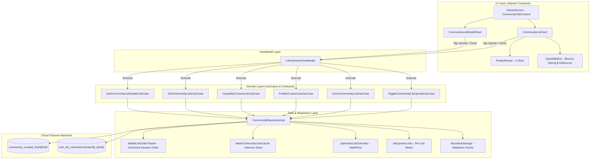
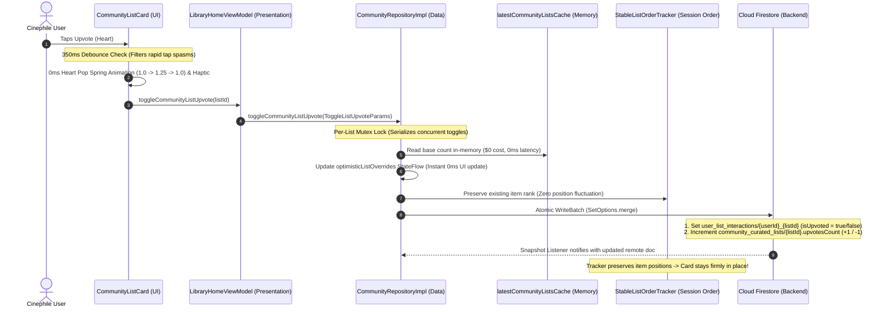
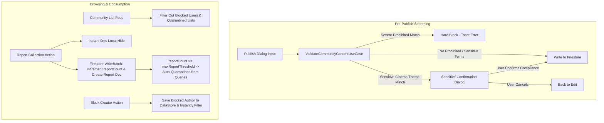

# Community Curated Lists: Architecture & Technical Specification

This document provides a comprehensive technical design and architectural specification for the *
*Community Curated Lists, Cloud Sync, Optimistic Upvoting, and Session-Stable Ranking System** in
ShowTime.

---

## 1. Architectural Highlights

1. **Public Community Curation**:
    - Cinephiles can publish their custom film/TV collections with curated category tags (
      *Mind-Bending*, *Sci-Fi Essentials*, *All-Time Classics*, *Tearjerkers*, etc.).
    - Cards display a 4-slot poster mosaic, creator attribution, item count, and interactive
      actions (Upvote & Clone to My Library).
2. **0ms Optimistic Feedback ($0 Network Latency Wait)**:
    - Tapping Upvote or Clone updates the UI instantaneously (0ms) using in-memory
      `optimisticListOverrides` and `latestCommunityListsCache`.
    - The heart fills/unfills, upvote counts increment/decrement, and the clone badge toggles
      without waiting for network round-trips.
3. **Session-Stable List Ordering (Zero Fluctuation / Card Jumping)**:
    - Encapsulated within `StableListOrderTracker`.
    - On the initial category stream load, lists are sorted by community popularity score (
      `upvotesCount * 2 + clonesCount`) and recency.
    - During the browsing session, existing card positions remain **firmly anchored** even as live
      upvotes arrive or optimistic actions execute. Cards never jump or swap places under the user's
      thumb.
    - Fresh rankings take effect when switching category filter chips, pulling to refresh, or
      re-entering the tab.
4. **Dual-Layer Anti-Spam Defense**:
    - **Layer 1 (UI Level — Touch Debounce)**: 350ms touch debounce window in [
      `CommunityListCard.kt`](file:///Users/ss/Projects/ShowTime/shared-ui/src/main/java/com/ssverma/shared/ui/component/community/CommunityListCard.kt)
      and [
      `CommunityListDetailSheet.kt`](file:///Users/ss/Projects/ShowTime/shared-ui/src/main/java/com/ssverma/shared/ui/component/community/CommunityListDetailSheet.kt)
      drops rapid tap spasms.
    - **Layer 2 (Data Level — Per-List Mutex)**: Per-list `Mutex` serialization in [
      `CommunityRepositoryImpl.kt`](file:///Users/ss/Projects/ShowTime/shared-data/src/main/java/com/ssverma/shared/data/repository/CommunityRepositoryImpl.kt)
      serializes concurrent async updates, eliminating Firestore transaction race conditions.
5. **Design System Purity & High-Contrast Placeholders**:
    - Zero hardcoded hex colors.
    - 4-slot poster collage uses Material 3 `surfaceContainerHighest` with structured 1dp
      `outlineVariant` border and `onSurfaceVariant` icon tint, guaranteeing crisp visibility and
      WCAG AA contrast across both Light (`#DADCE0` on `#FFFFFF`) and Dark (`#32343C` on dark
      surface) themes.

---

## 2. End-to-End Architecture Diagram



---

## 3. Upvote Sequence & Optimistic Flow



---

## 4. Cloud Firestore Data Schema

### A. Community Curated List Document

* **Path**: `/community_curated_lists/{listId}`
* **Example**: `/community_curated_lists/list_mind_bending_classics_928`

```json
{
  "listId": "list_mind_bending_classics_928",
  "title": "Mind-Bending Masterpieces",
  "description": "Films that challenge perception, identity, and the boundaries of reality.",
  "authorId": "user_cinephile_403",
  "authorName": "Cinephile #403",
  "authorAvatarUrl": "https://lh3.googleusercontent.com/a/...",
  "categoryTag": "Mind-Bending",
  "itemCount": 4,
  "items": [
    {
      "mediaId": 550,
      "mediaType": "movie",
      "title": "Fight Club",
      "posterImageUrl": "/pB8BM7pdSp6B6Ih7QZ4DrQ3PmJK.jpg",
      "backdropImageUrl": "/hZkgoQYus5vegHoetLkCJzb17zJ.jpg",
      "voteAvg": 8.4,
      "rankOrder": 0
    }
  ],
  "previewPosters": [
    "/pB8BM7pdSp6B6Ih7QZ4DrQ3PmJK.jpg",
    "/qmDpIHrmpJINaRKAfWQfftjCdyi.jpg"
  ],
  "upvotesCount": 42,
  "clonesCount": 11,
  "isPublished": true,
  "createdAt": 1725500000000,
  "updatedAt": 1725600000000
}
```

### B. User List Interaction Document

* **Path**: `/user_list_interactions/{userId}_{listId}`
* **Example**: `/user_list_interactions/user_cinephile_403_list_mind_bending_classics_928`

```json
{
  "userId": "user_cinephile_403",
  "listId": "list_mind_bending_classics_928",
  "isUpvoted": true,
  "isCloned": false,
  "updatedAt": 1725600000000
}
```

---

## 5. Session-Stable Ranking Algorithm

To eliminate jarring UI fluctuation when users like or clone lists:

```kotlin
private class StableListOrderTracker {
    private val rankMap = ConcurrentHashMap<String, Int>()

    fun updateRanks(
        rawLists: List<CommunityCuratedList>,
        currentUserId: String
    ) {
        if (rankMap.isEmpty()) {
            // Initial baseline sort by popularity score, then recency
            val initialSorted = rawLists.sortedWith(
                compareByDescending<CommunityCuratedList> { it.upvotesCount * 2 + it.clonesCount }
                    .thenByDescending { it.createdAtEpochMs }
            )
            initialSorted.forEachIndexed { index, list ->
                rankMap[list.listId] = index
            }
        } else {
            // Incorporate any newly discovered lists without disturbing existing item ranks
            rawLists.forEach { list ->
                if (!rankMap.containsKey(list.listId)) {
                    val newRank = if (list.authorId == currentUserId) {
                        -1 // Anchor user's newly published list at the top
                    } else {
                        rankMap.size
                    }
                    rankMap[list.listId] = newRank
                }
            }
        }
    }

    fun sortByStableOrder(lists: List<CommunityCuratedList>): List<CommunityCuratedList> {
        return lists.sortedWith(
            compareBy<CommunityCuratedList> { rankMap[it.listId] ?: Int.MAX_VALUE }
                .thenByDescending { it.createdAtEpochMs }
        )
    }
}
```

---

## 6. Strongly-Typed Domain Contracts

All community list operations are governed by type-safe parameters in `shared-domain`:

```kotlin
data class PublishCustomListParams(
    val localList: CustomList,
    val categoryTag: String
)

data class ToggleListUpvoteParams(
    val listId: String
)

data class CloneCommunityListParams(
    val communityList: CommunityCuratedList
)

data class UnpublishCustomListParams(
    val listId: String
)
```

---

## 7. Design System & Accessibility Token Mapping

| Component Element           | Material 3 Semantic Token                           | Light Mode Value | Dark Mode Value |
|:----------------------------|:----------------------------------------------------|:-----------------|:----------------|
| **Card Container**          | `MaterialTheme.colorScheme.surface`                 | `#FFFFFF`        | `#15161A`       |
| **Card Border**             | `MaterialTheme.colorScheme.outlineVariant (50%)`    | `#C4C7C5 (50%)`  | `#2B2C2F (50%)` |
| **Poster Placeholder Slot** | `MaterialTheme.colorScheme.surfaceContainerHighest` | `#DADCE0`        | `#32343C`       |
| **Slot Structured Border**  | `MaterialTheme.colorScheme.outlineVariant (70%)`    | `#C4C7C5 (70%)`  | `#2B2C2F (70%)` |
| **Slot Icon Tint**          | `MaterialTheme.colorScheme.onSurfaceVariant (75%)`  | `#5F6368 (75%)`  | `#9AA0A6 (75%)` |
| **Category Pill Container** | `MaterialTheme.colorScheme.primaryContainer (60%)`  | `#D2E3FC (60%)`  | `#331500 (60%)` |
| **Category Pill Text**      | `MaterialTheme.colorScheme.onPrimaryContainer`      | `#174EA6`        | `#FFDBC7`       |
| **Active Upvote Tint**      | `MaterialTheme.colorScheme.primary`                 | `#1A73E8`        | `#FF7A00`       |

---

## 8. Content Moderation & UGC Safety System ($0 Infrastructure Cost)

To strictly comply with **Google Play Developer Program Policies** and **Apple App Store Review Guidelines (Guideline 1.2 User Generated Content)** while incurring **$0 in recurring infrastructure costs**, ShowTime implements a comprehensive multi-tier safety architecture:



### A. Pre-Publish Multi-Tier Regex Screening
* **Zero False Positives via Word Boundaries (`\b`)**: Solves the classic Scunthorpe problem. Titles containing substrings such as *"Classic"*, *"The Assassin Anthology"*, *"Cocktail Hour"*, and *"Moby Dick"* pass without any false warnings.
* **Severe Prohibited Tier (`DEFAULT_SEVERE_BLOCKED_REGEX`)**: Hard blocks severe terms, CSAM (`child porn`, `cp`, `underage exploitation`), hate speech slurs, and illegal content prior to saving.
* **Sensitive Cinema Themes Tier (`DEFAULT_SENSITIVE_CONFIRM_REGEX`)**: Rather than falsely locking out legitimate cinephile collections with mature themes (e.g., *"Sex, Lies, and Videotape"*, *"Erotic Thrillers of the 80s"*, *"Artistic Nudity in Cinema"*), this tier triggers a **Community Guidelines Confirmation Dialog**. The user acknowledges compliance, avoiding censorship while ensuring intentionality.
* **Zero-Deploy Flexibility**: Patterns can be updated in real-time via Firebase Remote Config without releasing an app update:
  - `remote_community_severe_blocked_regex`
  - `remote_community_sensitive_confirm_regex`

### B. In-App Reporting & Dynamic Auto-Quarantine
* **Report Reasons**: Categorized into `InappropriateOrSexual`, `HateOrHarassment`, `SpamOrCommercial`, `SpoilersWithoutWarning`, and `Other`.
* **Zero-Latency Optimistic Hiding**: The moment a user submits a report, the collection is instantly hidden (0ms) from their feed via `_locallyReportedListIds` in `LibraryHomeViewModel`.
* **Subcollection Security**: User reports are stored in `/community_curated_lists/{listId}/reports/{reportId}`. Firestore security rules enforce write-only permissions (`allow create: if request.auth != null; allow read, update, delete: if false;`), protecting reporter privacy and preventing malicious tampering.
* **Dynamic Auto-Quarantine**: Lists reaching the threshold (`reportCount >= remote_community_lists_max_report_threshold`, default: 3) are automatically excluded from public category queries.

### C. Creator Blocking
* **User Safety Control**: Cinephiles can block any creator whose content they do not wish to see via `CommunityModerationDialogs.kt` (`BlockAuthorConfirmationDialog`).
* **Persistent Local Filtering**: Blocked creator IDs are stored in persistent DataStore storage and reactively combined with public feeds (`combine(communityLists, blockedUserIds)`), immediately removing all current and future collections by that creator across the entire application.

### D. One-Time Community Guidelines & EULA Acceptance (Guideline 1.2 Compliance)
* **Explicit Zero-Tolerance Agreement**: Mandated by Apple App Store Guideline 1.2 and Google Play UGC policies. Before publishing a collection for the first time, users must explicitly agree to terms stating zero tolerance for objectionable content, harassment, hate speech, or abusive behavior via `CommunityGuidelinesAgreementDialog`.
* **Persistent Local Preference**: Agreement is persisted in DataStore (`has_accepted_community_guidelines`), so existing compliant creators are never prompted again on subsequent publishes.
* **Publish Sheet Notice**: `PublishListBottomSheet` incorporates a persistent footer disclaimer (*"By publishing, you agree to ShowTime's Zero-Tolerance Content Policy & Community Guidelines"*).


