# Community Discussions & Cinephile Buzz Architecture

This document provides a comprehensive technical design and architectural specification for the *
*Community Discussions, Cinephile Buzz, and Trending Ranking System** in ShowTime.

---

## 1. Architectural Highlights

1. **Strongly-Typed Domain Contracts**:
    - Zero parameter drift or error-prone default arguments.
    - Operations are governed by type-safe data classes (`DiscussionTarget`, `PostCommentParams`,
      `EditCommentParams`, `ToggleCommentUpvoteParams`, `DeleteCommentParams`,
      `ReportCommentParams`).
2. **Single-Place Config-Driven Tuning (CCM)**:
    - All trending thresholds, participant multipliers, upvote weights, and decay windows are backed
      by a single central configuration provider (`AppConfigProvider` / `FirebaseRemoteConfig`).
    - Tunable on the fly via Firebase Console without shipping new app releases.
3. **Anti-Spam & Organic Trending Ranking**:
    - Multi-factor score combining unique participants (`participantIds`), organic upvotes,
      conversation volume, and recency decay.
    - Prevents artificial inflation from single-user comment spam or self-likes.
4. **0ms Optimistic UI with Resilient Firestore Merge**:
    - Local `optimisticCommentOverrides` and `optimisticDiscussionsCache` update the UI
      instantaneously on tap (0ms) across Movie Details, TV Details, Episode Details, and
      Discussions feeds.
    - Resilient `SetOptions.merge()` and atomic `FieldValue.arrayUnion`/`arrayRemove` guarantee
      schema flexibility and zero failed updates.
5. **Contextual UI Display Rules**:
    - **Details Page**: Compact preview limited to root thoughts, with replies collapsed by
      default (`[ 💬 X replies ]`) and limited to 2 preview replies on expand.
    - **Discussions Page**: Full conversation mode with expanded threads, keyboard auto-focus on
      reply, and Dynamic Smart Sorting (chronological ASC for conversation flow vs likes DESC for
      top upvoted).

---

## 2. End-to-End Architecture Diagram

```mermaid
graph TD
    subgraph UI Layer
        HD[DashboardScreen - Home] --> TDS[TrendingDiscussionsShelf]
        MD[MovieDetailsScreen] --> MDS[MediaDiscussionsSection]
        TD[TvShowDetailsScreen] --> TDSec[MediaDiscussionsSection]
        ED[TvEpisodeDetailsScreen] --> EDSec[MediaDiscussionsSection]
        
        MDF[MovieDiscussionsScreen] --> DSC[DiscussionsScreenContent]
        TDF[TvDiscussionsScreen] --> DSC
        
        MDS --> CC[CommentCard - Blur & Spoiler Shield]
        MDS --> PBS[PostCommentBottomSheet]
        TDS --> TDC[TrendingDiscussionCard]
        DSC --> CC
    end

    subgraph ViewModel Layer
        DVM[DashboardViewModel]
        MVM[MovieDetailsViewModel]
        MDVM[MovieDiscussionsViewModel]
        TVM[TvShowDetailsViewModel]
        TDVM[TvShowDiscussionsViewModel]
        EVM[TvEpisodeDetailsViewModel]
        EDVM[TvEpisodeDiscussionsViewModel]
    end

    subgraph Domain Layer - UseCases & Typed Contracts
        DT["DiscussionTarget (movie | tvShow | tvEpisode)"]
        
        GTDU[GetTrendingDiscussionsUseCase]
        GDU[GetDiscussionsUseCase]
        FSCU[FilterAndSortCommentsUseCase - Off-Thread Filtering & Sorting]
        PCU[PostCommentUseCase - PostCommentParams]
        ECU[EditCommentUseCase - EditCommentParams]
        TCU[ToggleCommentUpvoteUseCase - ToggleCommentUpvoteParams]
        DCU[DeleteCommentUseCase - DeleteCommentParams]
        RCU[ReportCommentUseCase - ReportCommentParams]
    end

    subgraph Centralized CCM & Configuration Layer
        FRC[Firebase Remote Config Server] --> CCM[AppConfigProvider / FirebaseAppConfigProvider]
        CCM --> CDC["CommunityDiscussionsConfig<br/>(trending_limit, min_participants, weights, decay)"]
    end

    subgraph Data & Repository Layer
        CR[CommunityRepositoryImpl]
        OCO[optimisticCommentOverrides - 0ms Flow]
        ODC[optimisticDiscussionsCache - 0ms Flow]
        GAC[GoogleAuthClient / Anon ID Generator]
    end

    subgraph Cloud Storage / Firebase
        FS[(Cloud Firestore)]
        COL_DISC["/media_discussions/{pathKey}"]
        SUB_COMMENTS["/comments/{commentId}"]
    end

    %% UI to ViewModel
    TDS --> DVM
    MDS --> MVM
    MDF --> MDVM
    TDSec --> TVM
    TDF --> TDVM
    EDSec --> EVM
    TDF --> EDVM

    %% ViewModel to UseCases
    DVM --> GTDU
    MVM & MDVM --> GDU & PCU & TCU & ECU & DCU & RCU
    TVM & TDVM --> GDU & PCU & TCU & ECU & DCU & RCU
    EVM & EDVM --> GDU & PCU & TCU & ECU & DCU & RCU

    %% UseCases to Repository
    GTDU & GDU & PCU & ECU & TCU & DCU & RCU --> CR

    %% Repository Dependencies
    CR --> CDC
    CR --> OCO
    CR --> ODC
    CR --> GAC
    CR --> FS

    FS --- COL_DISC
    COL_DISC --- SUB_COMMENTS
```



---

## 3. Strongly-Typed Domain Contracts

```kotlin
data class DiscussionTarget(
    val mediaType: MediaType,
    val mediaId: Int,
    val seasonNumber: Int? = null,
    val episodeNumber: Int? = null
) {
    companion object {
        fun movie(movieId: Int) = DiscussionTarget(MediaType.Movie, movieId)
        fun tvShow(tvShowId: Int) = DiscussionTarget(MediaType.Tv, tvShowId)
        fun tvEpisode(tvShowId: Int, seasonNumber: Int, episodeNumber: Int) =
            DiscussionTarget(MediaType.Tv, tvShowId, seasonNumber, episodeNumber)
    }
}

data class PostCommentParams(
    val target: DiscussionTarget,
    val content: String,
    val isSpoiler: Boolean,
    val parentId: String? = null,
    val replyToAuthorName: String? = null,
    val mediaTitle: String? = null,
    val posterImageUrl: String? = null,
    val backdropImageUrl: String? = null
)

data class EditCommentParams(
    val target: DiscussionTarget,
    val commentId: String,
    val newContent: String,
    val isSpoiler: Boolean
)

data class ToggleCommentUpvoteParams(
    val target: DiscussionTarget,
    val commentId: String
)

data class DeleteCommentParams(
    val target: DiscussionTarget,
    val commentId: String
)

data class ReportCommentParams(
    val target: DiscussionTarget,
    val commentId: String,
    val reason: String
)
```

---

## 4. Trending Score & Anti-Spam Formula

To prevent artificial inflation from single users spamming comments or repeatedly liking their own
thoughts, the trending rank score is computed as:

$$\text{Trending Score} = \left( (\text{Unique Authors} \times W_P) + (\text{Organic Upvotes} \times W_U) + (\text{Total Comments} \times W_C) \right) \times \text{Decay}(\Delta t)$$

Where:

- $\text{Unique Authors}$: Count of distinct `participantIds` in the thread (single user spam only
  gives $1\times$).
- $W_P$ (Participant Multiplier): Configured via CCM (default `3.0`).
- $W_U$ (Upvotes Multiplier): Configured via CCM (default `2.0`).
- $W_C$ (Comment Volume Multiplier): Configured via CCM (default `1.0`).
- $\text{Decay}(\Delta t) = \frac{1}{1 + \left(\frac{\text{hours since last comment}}{\text{half-life}}\right)^2}$:
  Prevents stale threads from permanently occupying Home.

---

## 5. Centralized CCM Parameters

All trending parameters are centralized in `core-ccm` and can be adjusted in Firebase Remote Config
anytime:

| Remote Config Key                              | Default | Description                                                          |
|:-----------------------------------------------|:--------|:---------------------------------------------------------------------|
| `remote_trending_discussions_limit`            | `5`     | Maximum cards on Home Trending shelf (tuned for Spark Free Tier)     |
| `remote_trending_discussions_cache_ttl_minutes`| `60`    | In-memory TTL cache duration before querying Firestore on Home       |
| `remote_discussion_comments_limit`             | `30`    | Initial comments fetched on Discussion screen (tuned from 50 to 30)  |
| `remote_discussion_session_cache_ttl_minutes`  | `5`     | In-memory TTL thread session cache to prevent rapid re-open read spam|
| `remote_discussion_page_size`                  | `25`    | Older comments fetched per page on "Load earlier thoughts" tap       |
| `trending_min_participants`                    | `1`     | Minimum distinct users before thread can trend                       |
| `trending_weight_participants`                 | `3.0`   | Multiplier for unique user debate                                    |
| `trending_weight_upvotes`                      | `2.0`   | Multiplier for community appreciation                                |
| `trending_weight_comments`                     | `1.0`   | Multiplier for raw conversation count                                |
| `trending_recency_hours`                       | `48`    | Active time decay half-life                                          |
| `config_free_comments_daily_limit`             | `3`     | Daily free comments allowed before requiring Pro or rewarded ad pass |

---

## 6. Community Discussions Monetization & Pro Cinephile Identity

To preserve conversation quality, prevent spam, and deliver a fair, value-driven freemium experience, discussions incorporate a seamless monetization and social proof layer:

### A. Daily Quota & Rewarded Ad Unlocks
1. **Free Allowance**: Free users are granted `config_free_comments_daily_limit` (default: 3 thoughts/day).
2. **Rewarded Video Pass**: Upon reaching the daily limit, users can watch a Rewarded Ad via `ShowTimeFeatureGate` (`PassKey("community_comments")`) to instantly receive **+3 consumable bonus comment slots**.
3. **Pending Action Replay**: The comment payload is preserved in memory and automatically submitted upon successful ad completion without requiring user re-entry.

### B. Pro Cinephile Social Proof & Verified Identity
1. **Unlimited Discussions**: Active ShowTime Pro subscribers bypass all comment limits unconditionally.
2. **Verified Pro Badge (⭐ `PRO`)**: Every thought posted by an active Pro member is stamped with `isProUser = true` in Firestore, rendering the elegant `ProBadge` (`tertiaryContainer` Material 3 badge) next to their author display name across all comment rows and preview cards.
3. **Paywall Integration**: `ProPaywallBottomSheet` highlights "Unlimited Community Debates & Pro Cinephile Badge" alongside custom lists, unlimited reminders, and ad-free browsing.

---

## 7. Firebase Free Spark Plan & Read Optimization

To guarantee that ShowTime stays strictly within the **Firebase Free Spark Plan** (50k reads/day) while supporting high daily active users (DAU):

1. **One-Shot Home Shelf Reads**: The Home screen's trending discussions shelf uses a one-shot `.get().await()` read rather than a continuous snapshot listener, preventing remote write events from churning reads across connected clients.
2. **60-Minute In-Memory TTL**: Governed by `CommunityOptimizationConfig.DEFAULT_TRENDING_DISCUSSIONS_CACHE_TTL_MS`, Home screen re-entries within 60 minutes resolve in 0ms from memory without initiating any network reads.
3. **Halved Item Limit (5 items)**: Reduced default query limit from 10 to 5, immediately cutting Dashboard Firestore read cost by 50%.
4. **Interactive Detail Streaming**: Real-time snapshot listeners are selectively reserved for the active Discussion screen where users participate in live debates.

---

## 8. Discussion Screen Session Caching & On-Demand Cursor Pagination

To prevent read surges when users rapidly switch screens or spam open discussions, and to keep initial load lightweight:

1. **5-Minute Thread Session Cache**:
   - When a discussion screen is first opened, it performs an initial query bounded by `remote_discussion_comments_limit` (30 comments) and records `threadSessionTimestamps[targetKey]`.
   - If the user closes and re-opens the screen within 5 minutes (`remote_discussion_session_cache_ttl_minutes`), the cached comments are emitted immediately at 0ms.
   - The snapshot listener uses a delta query `.whereGreaterThan("createdAtEpochMs", lastFetchTimestamp)`, incurring **0 reads** if no new comments were posted and only **1 read per newly arrived comment**.
2. **On-Demand Cursor Pagination ("Load earlier thoughts")**:
   - Initial read is capped at 30 comments (down from 50), saving 40% on every thread open.
   - If a thread has $\ge 30$ thoughts, a "Load earlier thoughts" button is rendered at the top of the conversation list.
   - Tapping it triggers `LoadMoreDiscussionsUseCase`, which fetches older comments via `.whereLessThan("createdAtEpochMs", oldestCommentEpochMs).limit(25)` without reloading already-cached comments.


