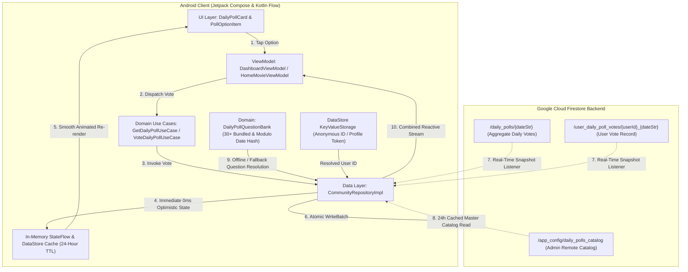
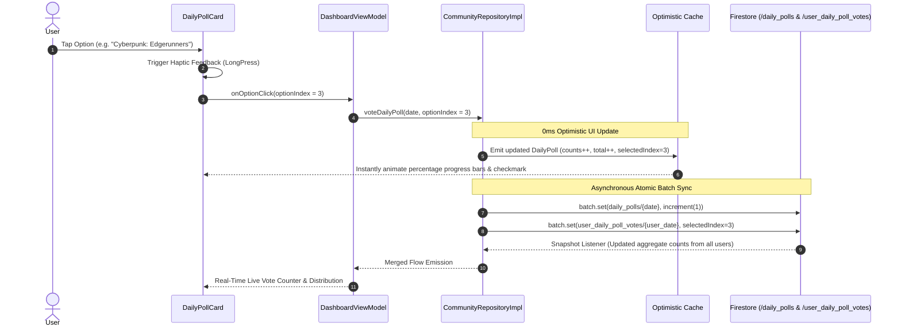

# Daily Community Cinema Poll & Debate: Architecture & Data Sync Spec

## 1. Overview & Vision

The **Daily Community Cinema Poll & Debate** feature powers daily cinephile discussions directly
within ShowTime's Home dashboard feed. Every 24 hours, users encounter a fresh cinema question (e.g.
*"Which cyberpunk universe has the most intoxicating aesthetic?"*, *"Best Sci-Fi of the 2010s"*),
allowing them to vote with **0ms optimistic UI latency**, see animated live percentage
distributions, and participate in real-time community engagement.

---

## 2. End-to-End System Architecture



---

## 3. Question Resolution & Rotation Hierarchy

The system ensures that a valid question is **always** available with zero runtime downtime or
network bottlenecks:

```mermaid
flowchart TD
    START["Request Question for Date (YYYY-MM-DD)"] --> FETCH_CACHE["Check 24h Cached Catalog in Local DataStore"]
    FETCH_CACHE --> HAS_SCHEDULED{"Match Scheduled Date?"}
    
    HAS_SCHEDULED -->|Yes (e.g. Oscars / Release Night)| USE_SCHEDULED["Return Date-Specific Override Question"]
    HAS_SCHEDULED -->|No| POOL_AVAILABLE{"Remote Custom Catalog Exists?"}
    
    POOL_AVAILABLE -->|Yes| MODULO_REMOTE["Resolve via Modulo Date Hashing on Remote Questions"]
    POOL_AVAILABLE -->|No / Offline| MODULO_BUNDLED["Resolve via Modulo Date Hashing on Bundled 30+ Bank"]
    
    USE_SCHEDULED --> RESULT["Active Daily Poll Question"]
    MODULO_REMOTE --> RESULT
    MODULO_BUNDLED --> RESULT
```

* **Deterministic Modulo Date Hashing**: `date.toEpochDay() % questions.size` guarantees that all
  users globally see the exact same rotating question on any given day without requiring a central
  server cron job.
* **Date-Specific Overrides**: Admins can specify a `scheduledDate` (e.g. `"2026-03-15"`) for
  marquee events (e.g. Academy Awards, Barbenheimer, Comic-Con).

---

## 4. Cloud Firestore Data Schema

### A. Remote Question Catalog & Master Control

* **Path**: `/app_config/daily_polls_catalog`
* **Purpose**: Allows non-developer content updates, version control, and remote kill-switch
  capability.

```json
{
  "catalogVersion": 2,
  "enabled": true,
  "questions": [
    {
      "id": 101,
      "question": "Which Christopher Nolan film is his magnum opus?",
      "options": ["Oppenheimer", "Interstellar", "Inception", "The Dark Knight"]
    },
    {
      "id": 102,
      "question": "Best Best-Picture Oscar Winner of the 2020s?",
      "options": ["Parasite", "Everything Everywhere All At Once", "Oppenheimer", "Nomadland"],
      "scheduledDate": "2026-03-15"
    }
  ],
  "updatedAt": "2026-08-28T00:00:00Z"
}
```

### B. Daily Global Aggregate Votes Document

* **Path**: `/daily_polls/{dateStr}`
* **Example**: `/daily_polls/2026-08-29`

```json
{
  "questionId": 24,
  "question": "Which cyberpunk universe has the most intoxicating aesthetic?",
  "options": [
    "Blade Runner",
    "The Matrix",
    "Akira",
    "Cyberpunk: Edgerunners"
  ],
  "totalVotes": 1420,
  "voteCounts": {
    "0": 610,
    "1": 390,
    "2": 180,
    "3": 240
  },
  "updatedAt": "2026-08-29T12:00:00Z"
}
```

### C. Per-User Daily Vote Record

* **Path**: `/user_daily_poll_votes/{userId}_{dateStr}`
* **Example**: `/user_daily_poll_votes/user_john_doe_2026-08-29`

```json
{
  "selectedOptionIndex": 3,
  "votedAt": "2026-08-29T12:45:00Z"
}
```

---

## 5. Sequence Diagram: Voting & Real-Time Sync



---

## 6. Cost, Performance & Security Specifications

1. **Zero-Cost Scaling ($0.00 read overhead)**:
    - The master catalog `/app_config/daily_polls_catalog` is cached in local `DataStore` for 24
      hours.
    - For an active user opening the app 10 times a day, Firestore reads for the catalog remain
      capped at exactly **1 read/day**.
2. **Deterministic Modulo Date Hashing**:
    - Zero cron maintenance required. If network is completely offline, users still receive a new
      daily question deterministically from the 30+ bundled offline bank.
3. **Atomic Writes (`FieldValue.increment`)**:
    - Voting uses Firestore `FieldValue.increment(1L)` and `FieldValue.increment(-1L)` during option
      switches, preventing race conditions or overwritten counts across concurrent users.
4. **Security & Validation Rules**:
    - Users can only mutate their own `user_daily_poll_votes` document (`request.auth.uid == userId`
      or client-scoped identifier).
    - Global vote increments on `/daily_polls` enforce bounded integer values `[-1, 1]`.
