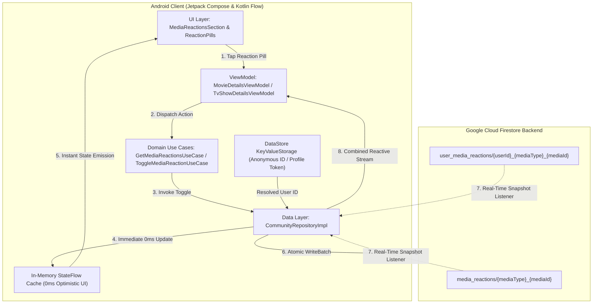
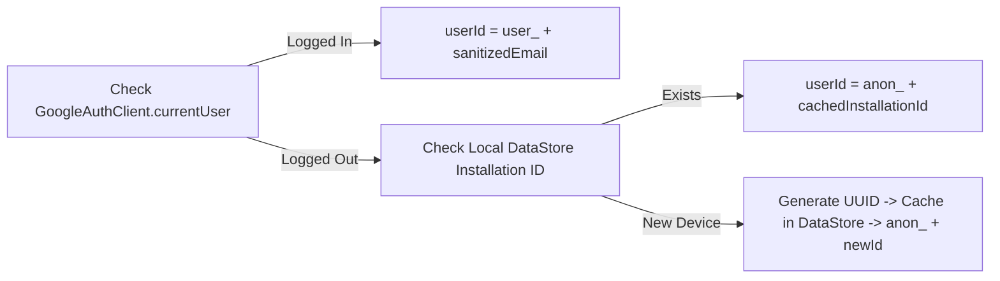
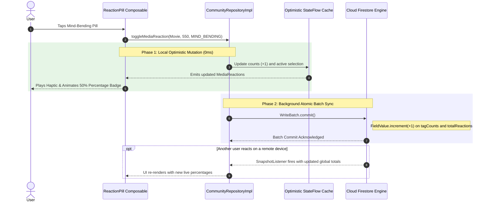

# Community Mood & Vibe Reactions: Real-Time Sync & Architecture Spec

## 1. Overview & Vision
ShowTime's **1-Tap Mood & Vibe Reactions** provides instant sentiment feedback for movies and TV shows. It enables users to vote on emotional resonance and viewing contexts (`Mind-Bending`, `Comfort Watch`, `Plot Twist King`, `Must Watch in IMAX`, `Cried My Eyes Out`, `Overrated`) with **0ms optimistic latency** and **real-time bidirectional cloud synchronization**.

---

## 2. End-to-End System Architecture



---

## 3. Cloud Firestore Data Schema

### A. Global Aggregate Document
* **Path**: `/media_reactions/{mediaType.lowercase()}_{mediaId}`
* **Example**: `/media_reactions/movie_550`

```json
{
  "totalReactions": 2660,
  "tagCounts": {
    "mind_bending": 1420,
    "plot_twist": 890,
    "comfort_watch": 350
  },
  "updatedAt": "2026-08-28T18:30:00Z"
}
```

### B. Per-User Reaction Document
* **Path**: `/user_media_reactions/{userId}_{mediaType.lowercase()}_{mediaId}`
* **Example**: `/user_media_reactions/user_john_doe_gmail_com_movie_550`

```json
{
  "selectedTags": [
    "mind_bending",
    "plot_twist"
  ],
  "updatedAt": "2026-08-28T18:30:00Z"
}
```

---

## 4. Frictionless Identity Management

To ensure zero barriers to community interaction:
1. **Authenticated Users**:
   - If signed in via Google Auth (`GoogleAuthClient.currentUser`), `userId = "user_" + sanitizedEmail`.
2. **Anonymous / Guest Users**:
   - If not signed in, ShowTime auto-generates a high-entropy UUID stored in local DataStore (`community_prefs.pb`), format: `anon_<uuid>`.
   - Users can react immediately without signing in or hitting permission roadblocks.



---

## 5. 0ms Optimistic UI & Atomic Batching

### Execution Flow Sequence



### Race Condition Prevention: `FieldValue.increment`
Rather than performing client-side Read-Modify-Write cycles (which fail under heavy concurrency), ShowTime leverages atomic database operations:
* `FieldValue.increment(1L)` on selection.
* `FieldValue.increment(-1L)` on deselection.
* `FieldValue.arrayUnion(tag.tagKey)` & `FieldValue.arrayRemove(tag.tagKey)` for set-based idempotency.

---

## 6. Dynamic Percentage & Total Calculations

In `MediaReactions.kt`, dynamic percentages and formatting are calculated on-the-fly:

$$\text{Percentage}(tag) = \begin{cases} \left( \frac{\text{tagCount}}{\text{totalReactions}} \right) \times 100 & \text{if } \text{totalReactions} > 0 \\ 0 & \text{if } \text{totalReactions} = 0 \end{cases}$$

* **Total Reaction Counter Badge**: Fades in with smooth animation (`fadeIn()` / `fadeOut()`) beside the section header when `totalReactions > 0`.
* **Percentage Badges**: Displayed inside active reaction pills to show the consensus breakdown across all users.

---

## 7. Offline Resilience & Persistence
* **Persistent Cache**: Firestore's `PersistentCacheSettings` is enabled in `CommunityModule`, ensuring all previously fetched reaction maps remain readable offline.
* **Network Reconnection**: Any pending writes made while offline are queued locally by Firestore SQLite engine and synced automatically once internet connectivity is restored.
