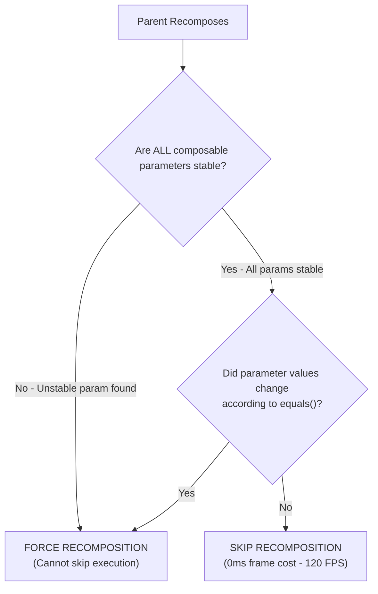

# ShowTime: Jetpack Compose Performance & Stability Guide

## 1. Objective & Compose Compiler Mental Model

This guide establishes the mandatory **Jetpack Compose Performance, Compiler Stability, and Recomposition Standards** for ShowTime.

### The Compose Compiler Stability Contract
In Jetpack Compose, a composable function can be either:
* **Skippable**: If all its arguments are **stable** and have not changed according to `equals()`, Compose skips executing the composable entirely.
* **Non-Skippable / Recomposable**: If **even a single argument is unstable**, Compose cannot guarantee the data hasn't mutated. It is forced to re-execute the composable on every single parent recomposition, causing dropped frames (jank) and battery drain.



---

## 2. The Stability Annotations: `@Immutable` and `@Stable`

### A. The Hidden Trap of Standard `List<T>`
In Kotlin, `List<T>` is a read-only interface, but its underlying JVM runtime object is often a mutable `java.util.ArrayList`. Because the Compose compiler cannot prove that an external actor won't mutate the list, **the Compose compiler treats all standard `List<T>`, `Set<T>`, and `Map<T>` collections as UNSTABLE by default.**

Passing a plain `List<T>` to a child composable makes that child **non-skippable**, even if the list contents never changed!

### B. The `@Immutable` Solution for UI State
Annotating your UI State data classes with `@Immutable` promises the Compose compiler that once constructed, the object and all its properties will never mutate. **This forces the compiler to treat nested `List<T>` collections as stable!**

```kotlin
// ❌ FORBIDDEN: Treated as unstable by Compose compiler because cast and genres are List<T>
data class MovieDetailsUiState(
    val title: String = "",
    val cast: List<CastMember> = emptyList(),
    val genres: List<Genre> = emptyList(),
    val isLoading: Boolean = false
)

// ✅ CORRECT: @Immutable guarantees full compiler stability and skippability
import androidx.compose.runtime.Immutable

@Immutable
data class MovieDetailsUiState(
    val title: String = "",
    val cast: List<CastMember> = emptyList(),
    val genres: List<Genre> = emptyList(),
    val isLoading: Boolean = false
)
```

### C. When to Use `@Immutable` vs. `@Stable`
* **`@Immutable` (Strict)**: Use on all UI state data classes, domain view models, preview data models, and payload classes. All fields must be `val`.
* **`@Stable` (Contractual)**: Use on custom state holders or objects that contain mutable state, provided that any mutations notify Compose (e.g. via `mutableStateOf`) and `equals()` is consistently deterministic.

---

## 3. Phased State Reads: Deferring Recomposition

Compose renders UI in **three distinct phases**:
1. **Composition**: What to show (runs composable functions).
2. **Layout**: Where to place it (measures and places components).
3. **Drawing**: How to render it (draws pixels to canvas).

### Rule: Defer State Reads to the Lowest Possible Phase
If a state value changes frequently (e.g., scroll offset, animation values, alpha, drag positions), **never read the state in the Composition phase**. Reading it in composition forces the entire composable tree to recompose on every animation tick or scroll pixel!

```kotlin
// ❌ FORBIDDEN: Recomposes on every single scroll pixel change!
val scrollOffset = scrollState.value
Box(
    modifier = Modifier.offset(y = (scrollOffset / 2).dp)
)

// ✅ CORRECT: Defer to Layout Phase using lambda modifier (Zero Recompositions!)
Box(
    modifier = Modifier.offset { 
        IntOffset(x = 0, y = (scrollState.value / 2).roundToInt()) 
    }
)

// ✅ CORRECT: Defer to Draw Phase using graphicsLayer (Zero Recompositions!)
Box(
    modifier = Modifier.graphicsLayer {
        alpha = if (isScrolled) 0.5f else 1.0f
        translationY = scrollState.value.toFloat()
    }
)
```

---

## 4. Derived State (`derivedStateOf`)

### Rule: Use `derivedStateOf` to Filter High-Frequency State Updates
When a state changes constantly (like scroll offset), but your UI only cares when it crosses a specific threshold, wrap the calculation in `derivedStateOf`. This prevents recomposition until the derived result actually changes.

```kotlin
val listState = rememberLazyListState()

// ❌ FORBIDDEN: Recomposes every time listState scrolls a single pixel
val showScrollToTop = listState.firstVisibleItemIndex > 0

// ✅ CORRECT: Recomposes ONLY when firstVisibleItemIndex crosses the 0 threshold
val showScrollToTop by remember {
    derivedStateOf { listState.firstVisibleItemIndex > 0 }
}
```

---

## 5. Lambda Stability & Method References

Every time a composable recomposes, standard inline lambdas that capture changing values can create new function object instances, potentially breaking child skippability.

### Standards:
1. **Use Method References**:
   ```kotlin
   // ❌ Creates new lambda instance on recomposition
   MovieCard(movie = movie, onClick = { viewModel.onMovieClicked(movie) })

   // ✅ Method reference avoids lambda creation when movie is part of the card
   MovieCard(movie = movie, onClick = viewModel::onMovieClicked)
   ```
2. **Encapsulate Multi-Parameter Callbacks (`*Args` Data Classes)**:
   Kotlin lambdas do not support named arguments. When passing multiple values, wrap them in a stable `@Immutable` data class to eliminate positional transposition bugs:
   ```kotlin
   @Immutable
   data class MovieClickArgs(val movieId: Int, val title: String, val posterUrl: String?)
   
   onClick: (MovieClickArgs) -> Unit
   ```

---

## 6. Lazy Layout Performance Invariants

For all `LazyColumn`, `LazyRow`, and `LazyVerticalGrid` implementations:

1. **Explicit Stable `key`**:
   Always provide a unique, stable key (such as an ID). Without a key, Compose matches items by index. Inserting an item at the top causes every item below it to lose state and recompose!
   ```kotlin
   LazyColumn {
       items(
           items = uiState.movies,
           key = { it.id },
           contentType = { "movie_card" }
       ) { movie ->
           MoviePosterCard(movie = movie)
       }
   }
   ```
2. **Explicit `contentType`**:
   Specifying `contentType` allows Compose to reuse UI component structures (item views) across identical card types instead of reconstructing the layout nodes.
3. **Image Downsampling with Coil**:
   Never load a 4K TMDB poster directly into RAM without container downsampling:
   ```kotlin
   SubcomposeAsyncImage(
       model = ImageRequest.Builder(LocalContext.current)
           .data(posterUrl)
           .size(width = 300, height = 450) // Viewport constraint
           .crossfade(true)
           .build(),
       contentDescription = movie.title
   )
   ```

---

## 7. The Dumb UI & Passive Presentation Invariant

Composables are **pure, dumb renderers**.
* **Zero Math, Sorting, or Filtering in UI**: No `.filter { ... }`, `.sortedBy { ... }`, or date parsing (`SimpleDateFormat`) in Composables.
* **ViewModel Pre-calculation**: All filtering, sorting, and display string formatting must be computed in ViewModels/UseCases on `Dispatchers.Default` before being exposed to UI state.

---

## 8. Summary Checklist for Compose Performance Reviews

- [ ] Are all UI State data classes annotated with `@Immutable`?
- [ ] Are high-frequency state updates (scroll, drag, alpha) deferred to layout/draw phases using lambda modifiers (`graphicsLayer { ... }` or `offset { ... }`)?
- [ ] Is `derivedStateOf` used when deriving state from rapidly changing observables (like `LazyListState`)?
- [ ] Do all `items(...)` blocks in Lazy layouts supply both an explicit `key` and `contentType`?
- [ ] Are all remote images downsampled with Coil (`.size(...)`) to match viewport size?
- [ ] Are composables 100% free of business logic, date parsing, calculations, and list sorting?
