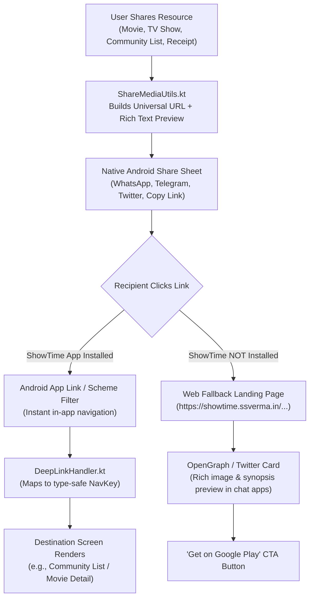

# ShowTime Deep Linking & Social Sharing Guide

This document outlines the architecture, canonical URL schemas, Android App Link verification, and social sharing mechanics in the **ShowTime** open-source project.

---

## 1. Overview & Architecture

ShowTime uses a unified, three-tier deep linking and sharing architecture designed for scalability, social rich-card previews, and open-source customizability.



---

## 2. Supported Schemes & Domains

| Type | Scheme / Host | Usage |
| :--- | :--- | :--- |
| **Primary Universal App Link** | `https://showtime.ssverma.in` | Default for all external sharing & web previews |
| **Custom URI Scheme** | `showtime://*` | Home widgets (`GlanceWidget`), notifications, app-to-app routing |
| **Legacy / Root Domains** | `https://www.ssverma.in/showtime/*`<br>`https://ssverma.in/showtime/*` | Backwards compatibility |

---

## 3. Canonical URL Hierarchy & Routing Table

| Destination | Universal URL | Custom Scheme | In-App `NavKey` Target |
| :--- | :--- | :--- | :--- |
| **Dashboard / Home** | `https://showtime.ssverma.in/home` | `showtime://showtime.ssverma.in/home` | `DashboardHomeNavKey` |
| **Movie Details** | `https://showtime.ssverma.in/movie/{id}` | `showtime://showtime.ssverma.in/movie/{id}` | `MovieDetailNavKey(id)` |
| **TV Show Details** | `https://showtime.ssverma.in/tv/{id}` | `showtime://showtime.ssverma.in/tv/{id}` | `TvShowDetailNavKey(id)` |
| **Person / Cast** | `https://showtime.ssverma.in/person/{id}` | `showtime://showtime.ssverma.in/person/{id}` | `PersonDetailNavKey(id)` |
| **Community List Detail** | `https://showtime.ssverma.in/lists/{listId}` | `showtime://showtime.ssverma.in/lists/{listId}` | `LibraryHomeNavKey(initialTab = CustomLists, targetCustomListId = listId)` |
| **Community Feed Tab** | `https://showtime.ssverma.in/community` | `showtime://showtime.ssverma.in/community` | `LibraryHomeNavKey(initialTab = Community)` |
| **Watchlist Tab** | `https://showtime.ssverma.in/library/watchlist` | `showtime://showtime.ssverma.in/library/watchlist` | `LibraryHomeNavKey(initialTab = Watchlist)` |
| **Favorites Tab** | `https://showtime.ssverma.in/library/favorites` | `showtime://showtime.ssverma.in/library/favorites` | `LibraryHomeNavKey(initialTab = Favorites)` |
| **History Tab** | `https://showtime.ssverma.in/library/history` | `showtime://showtime.ssverma.in/library/history` | `LibraryHomeNavKey(initialTab = History)` |
| **Daily Cinema Game** | `https://showtime.ssverma.in/challenge` | `showtime://showtime.ssverma.in/challenge` | `CinemaGameNavKey` |
| **Cinema Receipt** | `https://showtime.ssverma.in/receipt` | `showtime://showtime.ssverma.in/receipt` | `CinemaReceiptNavKey` |
| **Global Search** | `https://showtime.ssverma.in/search` | `showtime://showtime.ssverma.in/search` | `SearchNavKey` |

---

## 4. How Sharing Works (`ShareMediaUtils.kt`)

When a user taps **Share** on any screen (Movie details, TV details, or Community list), `ShareMediaUtils` constructs a formatted text payload with the canonical URL:

```kotlin
// Example: Sharing a Community List
val shareText = ShareMediaUtils.buildShareableListText(
    listTitle = "Best 90s Thrillers",
    listDescription = "Edge of your seat masterworks",
    authorName = "Cinephile Dave",
    itemTitles = listOf("Se7en", "The Silence of the Lambs", "Fight Club"),
    appPackageName = context.packageName,
    listId = "list_abc123"
)
```

**Resulting Share Payload**:
```text
🍿 Cinephile Collection: "Best 90s Thrillers"
Curated by Cinephile Dave • 3 Titles

"Edge of your seat masterworks"

Featuring:
1. Se7en
2. The Silence of the Lambs
3. Fight Club

Explore & Clone in ShowTime:
https://showtime.ssverma.in/lists/list_abc123
```

---

## 5. Open Source Contributor & Fork Setup

If you fork or self-host ShowTime under your own domain or branding:

### Step 1: Update Domain Constants
Change the domain constants in:
- `ShareMediaUtils.DeepLinkDomain` (`shared-domain/.../ShareMediaUtils.kt`)
- `ShowTimeDeepLinkHandler.PRIMARY_HOST` (`app/.../DeepLinkHandler.kt`)
- `AndroidManifest.xml` (`<data android:host="..." />`)

### Step 2: Configure Android App Link Auto-Verification
Host a `.well-known/assetlinks.json` file on your domain:

```json
[
  {
    "relation": ["delegate_permission/common.handle_all_urls"],
    "target": {
      "namespace": "android_app",
      "package_name": "com.ssverma.showtime",
      "sha256_cert_fingerprint_list": [
        "YOUR_RELEASE_KEYSTORE_SHA256_FINGERPRINT"
      ]
    }
  }
]
```

---

## 6. How to Test Deep Links with ADB

Use `adb` in your terminal to test deep link routing on a connected emulator or device.

### 1. Test Community List Deep Link
```bash
adb shell am start -W -a android.intent.action.VIEW -d "https://showtime.ssverma.in/lists/test_list_123" com.ssverma.showtime.debug
```

### 2. Test Movie Details Deep Link
```bash
adb shell am start -W -a android.intent.action.VIEW -d "https://showtime.ssverma.in/movie/550" com.ssverma.showtime.debug
```

### 3. Test TV Show Details Deep Link
```bash
adb shell am start -W -a android.intent.action.VIEW -d "https://showtime.ssverma.in/tv/1399" com.ssverma.showtime.debug
```

### 4. Test Custom Scheme (Widgets / Internal)
```bash
adb shell am start -W -a android.intent.action.VIEW -d "showtime://showtime.ssverma.in/receipt" com.ssverma.showtime.debug
```

---

## 7. Push Notifications (FCM Deep Link Payloads)

When sending targeted push campaigns from Firebase Console or the Admin SDK, provide the `deepLink` data key:

```json
{
  "message": {
    "token": "DEVICE_FCM_TOKEN",
    "notification": {
      "title": "New Community List Trending!",
      "body": "Check out 'Mind-Bending Sci-Fi' curated by the community."
    },
    "data": {
      "deepLink": "https://showtime.ssverma.in/lists/scifi_collection_99"
    }
  }
}
```
