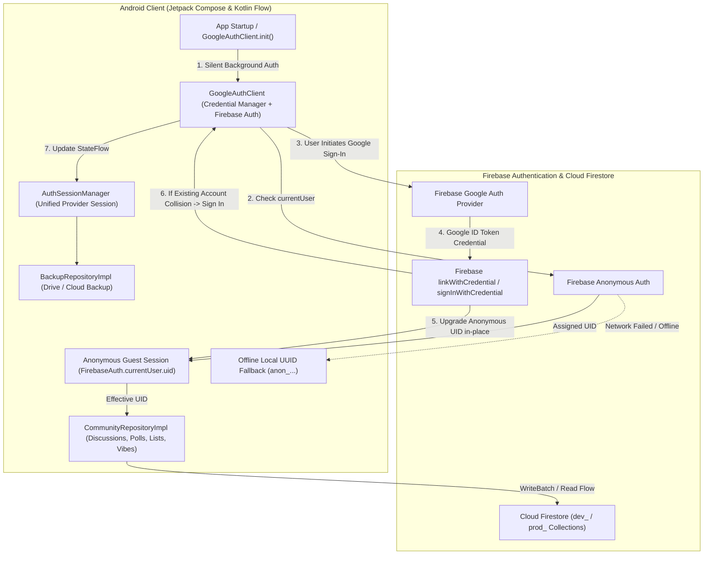

# Firebase Anonymous Authentication & Google Account Linking: Architecture Spec

## 1. Overview & Vision

ShowTime uses a **Zero-Friction Authentication Architecture** that balances instant user engagement with long-term identity persistence:
- **Instant Guest Onboarding (0-Clicks)**: On app launch, a fresh installation automatically and silently receives a persistent anonymous Firebase session (`signInAnonymously()`). Users can immediately vote in daily polls, express reactions (vibes), create custom lists, and interact with community content without seeing login blockers or sign-in prompts.
- **Lossless Google Account Linking (`linkWithCredential`)**: When a guest user decides to sign in with Google (from Account settings, Backup/Sync, or inside Community), their existing anonymous Firebase account is upgraded in-place. All previously authored comments, daily poll votes, curated lists, and reactions retain the exact same `uid` with **zero data loss**.
- **Offline Resilience**: If the app launches offline before any network connection can reach Firebase, the system automatically falls back to a locally cached UUID (`anon_<uuid>`) to guarantee unblocked local app usage until connectivity is restored.

---

## 2. End-to-End System Architecture



---

## 3. Account Lifecycle & Upgrade Transitions

### State 1: Fresh Install (Anonymous Guest)
1. `GoogleAuthClient` checks `FirebaseAuth.getInstance().currentUser`.
2. If null, triggers `firebaseAuth.signInAnonymously()`.
3. The guest user is assigned a permanent `firebaseAuth.currentUser.uid` (e.g. `gR89fK...`).
4. All user activity (reactions, poll votes, comments) is tagged with this `uid`.

### State 2: Upgrading Guest to Google Account (`linkWithCredential`)
1. User taps "Sign In with Google" in Account or Backup screen.
2. Android Credential Manager authenticates the user and returns a Google `idToken`.
3. `GoogleAuthClient` creates a Firebase `AuthCredential` via `GoogleAuthProvider.getCredential(idToken, null)`.
4. Because `firebaseAuth.currentUser.isAnonymous == true`, it executes:
   ```kotlin
   currentFirebaseUser.linkWithCredential(authCredential).await()
   ```
5. **Result**: The user's anonymous account is upgraded directly to a Google-linked Firebase user. The `uid` remains **identical**, ensuring all prior data ownership is 100% preserved.

### State 3: Account Collision Handling
1. If the user links a Google account that was already registered in a previous session or on another device, Firebase throws `FirebaseAuthUserCollisionException`.
2. `GoogleAuthClient` catches this exception and seamlessly executes:
   ```kotlin
   firebaseAuth.signInWithCredential(authCredential).await()
   ```
3. **Result**: The client switches to the existing Google account credentials cleanly without crashing or displaying confusing error messages.

### State 4: Sign-Out
1. When the user signs out:
   - Credential Manager clears credential state.
   - `firebaseAuth.signOut()` is executed.
   - `GoogleAuthClient` clears local user DataStore cache.
   - `ensureAuthenticatedSession()` is triggered in the background to immediately spin up a fresh anonymous guest session so subsequent offline/guest actions function seamlessly.

---

## 4. Anonymous vs Local Fallback UUID (Online vs Offline)

| Feature | 👤 **Firebase Anonymous Auth** | 📱 **Local Fallback UUID** |
| :--- | :--- | :--- |
| **Where it lives** | Firebase Cloud Backend & SDK | Local `DataStore` (Device storage) |
| **Network Requirement** | Requires internet for initial handshake | 100% offline, zero network latency |
| **Firestore Security Rules** | Passes `request.auth != null` rules | Only used locally when network is down |
| **Google Linking** | Upgrades directly via `linkWithCredential` | Cannot link without cloud session |
| **Primary Purpose** | Secure backend identity without friction | Zero-crash guarantee during airplane mode / offline start |

---

## 5. Community Display Identity & Pseudonym Resolution

ShowTime determines a user's visible display identity using a privacy-first hierarchy:

```kotlin
val authorName = googleUser?.displayName?.takeIf { it.isNotBlank() }
    ?: googleUser?.email?.substringBefore("@")
    ?: "Cinephile #${abs(userId.hashCode() % 900) + 100}"

val authorAvatarUrl = googleUser?.photoUrl
```

### Why "Cinephile #12xy" for Anonymous Users?
1. **Privacy & Anonymity**: Unauthenticated guest users do not expose personal emails or names to the public community.
2. **Deterministic Pseudonym**: The numerical suffix is mathematically derived from the hash of their unique anonymous `userId` (`abs(userId.hashCode() % 900) + 100`). This ensures a guest's comments consistently show the same pseudonym across different posts on their device.
3. **Seamless Transition**: The moment the user signs in with Google:
   - Newly authored comments immediately show their verified **Google Display Name** (e.g., `Gleee Vibe`) and profile avatar.
   - On logging out, the session resets to a fresh anonymous identity with a new distinct `Cinephile #XXX` pseudonym.

---

## 6. Security & Firestore Rules Integration

Because all users (guests and signed-in users alike) hold a valid Firebase Authentication token, Firestore rules enforce authenticated user constraints across both production and development environments:

```javascript
rules_version = '2';
service cloud.firestore {
  match /databases/{database}/documents {
    
    // Cloud Backups (Production & Dev)
    match /user_backups/{backupId} {
      allow read, write: if request.auth != null;
    }
    match /dev_user_backups/{backupId} {
      allow read, write: if request.auth != null;
    }

    // Community Curated Lists
    match /community_curated_lists/{listId} {
      allow read: if true;
      allow write: if request.auth != null;
    }
    match /dev_community_curated_lists/{listId} {
      allow read: if true;
      allow write: if request.auth != null;
    }

    // Media Reactions
    match /media_reactions/{mediaId} {
      allow read: if true;
      allow write: if request.auth != null;
    }
    match /dev_media_reactions/{mediaId} {
      allow read: if true;
      allow write: if request.auth != null;
    }

    // User Media Reactions
    match /user_media_reactions/{userReactionId} {
      allow read, write: if request.auth != null;
    }
    match /dev_user_media_reactions/{userReactionId} {
      allow read, write: if request.auth != null;
    }

    // Daily Polls & Catalog
    match /daily_polls/{pollId} {
      allow read: if true;
      allow write: if request.auth != null;
    }
    match /dev_daily_polls/{pollId} {
      allow read: if true;
      allow write: if request.auth != null;
    }
    match /daily_poll_catalog/{catalogId} {
      allow read: if true;
      allow write: if request.auth != null;
    }
    match /dev_daily_poll_catalog/{catalogId} {
      allow read: if true;
      allow write: if request.auth != null;
    }
    match /user_daily_poll_votes/{voteId} {
      allow read, write: if request.auth != null;
    }
    match /dev_user_daily_poll_votes/{voteId} {
      allow read, write: if request.auth != null;
    }

    // Media Discussions
    match /media_discussions/{discussionId} {
      allow read: if true;
      allow write: if request.auth != null;
      match /threads/{threadId} {
        allow read: if true;
        allow write: if request.auth != null;
      }
    }
    match /dev_media_discussions/{discussionId} {
      allow read: if true;
      allow write: if request.auth != null;
      match /threads/{threadId} {
        allow read: if true;
        allow write: if request.auth != null;
      }
    }

    // User List Interactions
    match /user_list_interactions/{interactionId} {
      allow read, write: if request.auth != null;
    }
    match /dev_user_list_interactions/{interactionId} {
      allow read, write: if request.auth != null;
    }

    // Default fallback
    match /{document=**} {
      allow read, write: if request.auth != null;
    }
  }
}
```

