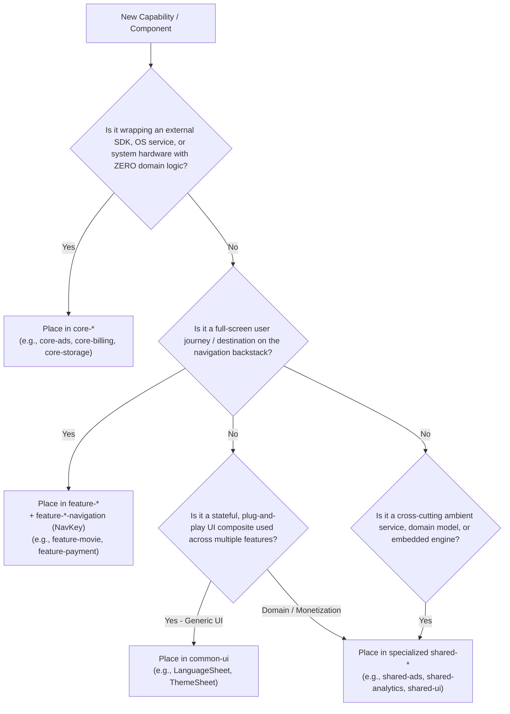
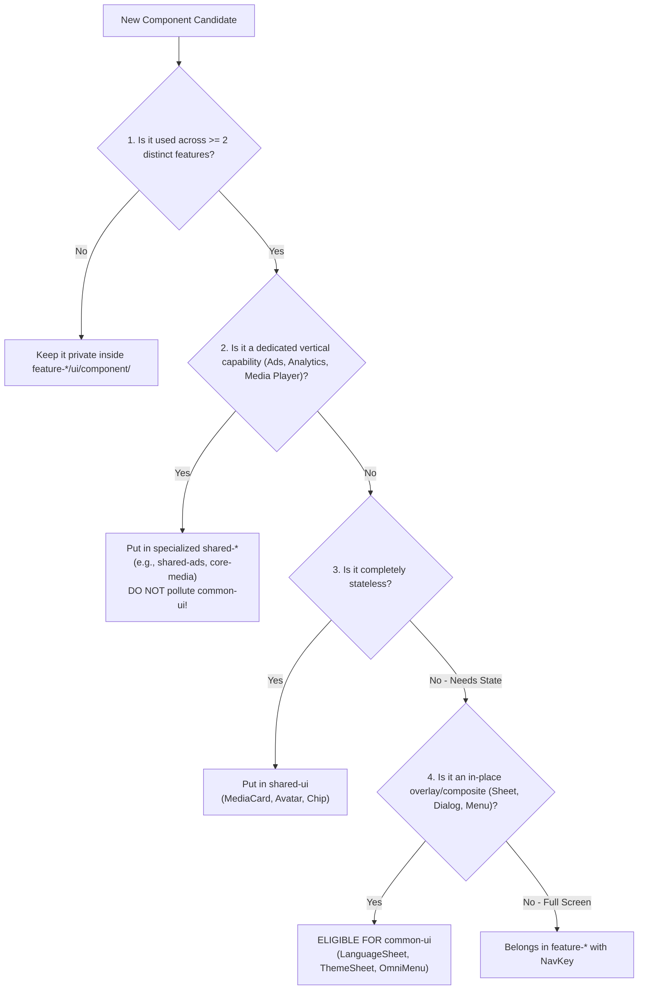

# ShowTime: Modular Architecture & Capability Taxonomy Guide

## 1. Objective & Scope

This guide defines the **Architectural Taxonomy, Module Responsibility Boundaries, and Capability Placement Decision Matrix** for the ShowTime codebase. It provides an unambiguous standard for where any new or refactored capability must reside—distinguishing strictly between:

* **Platform Infrastructure Tier (`core-*`)**
* **Application Capability & Domain Tier (`shared-*`)**
* **Stateful Plug-and-Play UI Tier (`common-ui`)**
* **Vertical Feature Slices & Navigation Contracts (`feature-*` + `feature-*-navigation`)**

---

## 2. Capability Placement Decision Matrix

When introducing a new capability, service, or component, evaluate it against this sequential decision tree:



### Detailed Evaluation Rules:

| Tier | Primary Question | Qualification Criteria | Forbidden Dependencies | Real Codebase Examples |
| :--- | :--- | :--- | :--- | :--- |
| **`core-*`** | *Is this pure platform plumbing?* | • Wraps 3rd-party SDKs (AdMob, Billing, Firebase) or Android OS primitives (Notifications, Storage, Network).<br>• **Zero ShowTime business logic**.<br>• 100% feature-agnostic. | Must **NEVER** depend on `shared-domain`, `shared-data`, or `feature-*`. | `core-ads`<br>`core-billing`<br>`core-analytics`<br>`core-notifications`<br>`core-storage` |
| **`shared-*`** | *Is this an ambient cross-cutting capability?* | • Provides app-wide business models, engines, or shared embedded UI.<br>• Applies ShowTime domain rules, persistence, or quota policies.<br>• **Is NOT a backstack navigation destination**. | Must not be bloated with feature-specific screens or vertical UI flows. | `shared-ads`<br>`shared-analytics`<br>`shared-domain`<br>`shared-ui` |
| **`common-ui`** | *Is this a stateful plug-and-play UI composite?* | • Self-contained interactive UI components that can be dropped into any screen.<br>• Manages its own internal state/viewmodel coordination.<br>• Non-domain specific (theming, language, region) or app-wide overlays. | Must **NEVER** depend on `shared-data` or feature implementation modules. | `LanguageSelectionBottomSheet`<br>`ThemeSelectionBottomSheet`<br>`RegionSelectionBottomSheet` |
| **`feature-*`** | *Is this an independent product screen / flow?* | • Owns full-screen destinations and dedicated user journeys.<br>• Reached via backstack routing using `NavKey`. | Must **NEVER** depend on other `feature-*` modules directly. | `feature-movie`<br>`feature-tv`<br>`feature-library`<br>`feature-payment` |
| **`feature-*-navigation`** | *How do other features route to this screen?* | • Exposes type-safe `NavKey` data classes and navigation arguments only.<br>• Contains zero ViewModels, zero screens, and zero business logic. | Zero business logic or UI implementations. | `feature-movie-navigation`<br>`feature-payment-navigation` |

---

## 3. Case Studies: Understanding the Architectural Twin Pattern

ShowTime enforces a decoupled **Platform (`core-*`) vs. Application Engine (`shared-*`)** twin pattern across key cross-cutting domains:

### Case Study A: Advertising & Monetization (`core-ads` vs. `shared-ads`)

#### Why is there NO `feature-ads` or `feature-ads-navigation`?
* A `feature-*-navigation` module exists **exclusively to expose a `NavKey`** for destinations on the Compose Navigation backstack (e.g. `navController.navigate(MovieDetailsNavKey)`).
* **Ads are NEVER a navigation backstack destination**:
  1. **Banner Ads**: Inline composable widgets embedded in a screen layout.
  2. **Native Ads**: Inline cards dynamically injected into scrollable media feeds.
  3. **Rewarded Ads**: External fullscreen dialogs managed by Google Play Services / AdMob SDK directly on top of the Android `Activity` window (`ad.show(activity)`). They do not participate in Compose backstack routing.
  4. **Feature Gates**: In-context modal bottom sheets or dialogs presented over the user's active screen (e.g. while adding a reminder or exporting a list).
* Consequently, creating a `feature-ads-navigation` with a dummy `NavKey` is an anti-pattern. Ads are an **ambient cross-cutting capability**, not a routed destination.

#### The Decoupled Separation:
* **`core-ads` (Platform Infrastructure Tier)**:
  - Wraps the raw Google Mobile Ads SDK.
  - Manages ad unit ID loading, AdMob initialization, activity listeners, and low-level state (`isAdLoading: StateFlow<Boolean>`).
  - Completely feature-agnostic: knows nothing about movies, TV shows, watchlists, reminders, or passes.
* **`shared-ads` (Application Monetization Engine Tier)**:
  - Houses ShowTime's ad rules: Feed ad injection (`AdInjectable`), Banner & Native components (`ShowTimeBannerAd`, `ShowTimeNativeAd`).
  - Quota and pass persistence (`RewardManager`, `PassKey`, `FeaturePassPolicy`).
  - Unified in-context gating (`ShowTimeFeatureGate`, `FeaturePassPolicy`, `FeatureGateConfig`).
  - Completely shields `shared-ui`, `shared-domain`, and `common-ui` from ad-related bloat.

---

### Case Study B: Analytics (`core-analytics` vs. `shared-analytics`)

* **`core-analytics` (Platform Infrastructure Tier)**:
  - Wraps Firebase Analytics and Crashlytics SDKs.
  - Provides generic logging abstractions: `logEvent(name: String, params: Map<String, Any>)`.
* **`shared-analytics` (Application Engine Tier)**:
  - Defines ShowTime-specific domain event names (`SharedAnalyticsEventName`), parameter keys (`SharedAnalyticsKeys`), and domain error trackers (`DefaultNetworkErrorTracker`).

---

### Case Study C: Billing & Paywall (`core-billing` vs. `feature-payment` vs. `common-ui`)

Payment illustrates when a capability spans both a full destination and an overlay:

* **`core-billing` (Platform Infrastructure Tier)**:
  - Low-level wrapper around the Google Play In-App Billing SDK (`BillingClientWrapper`, purchase acknowledgment, SKU queries).
* **`feature-payment` + `feature-payment-navigation` (Vertical Feature Tier)**:
  - Represents the **Full-Screen Paywall Destination** (`ProPaywallScreen`), reachable via drawer or profile links using `ProPaywallNavKey`.
* **`common-ui` (`ProPaywallBottomSheet`)**:
  - Provides an **in-context modal sheet** version of the paywall so users can upgrade without leaving their current screen.

---

## 4. Guidelines for Module Protection (Zero Bloat Invariant)

To maintain long-term codebase health and prevent architectural decay:

1. **Keep `shared-ui` Stateless and Thin**:
   - `shared-ui` is reserved for reusable, stateless UI building blocks (`MediaCard`, `UniversalMediaCard`, `Avatar`, `Button`, design tokens).
   - **Rule**: Never import `core-ads`, `shared-ads`, or data repositories into `shared-ui`.
2. **Keep `shared-domain` Pure Kotlin**:
   - `shared-domain` contains domain entities and repository interfaces (`Movie`, `TvShow`, `Person`, `ReminderQuotaManager`).
   - **Rule**: Zero Android framework dependencies, zero UI imports, zero ad SDK enums.
3. **Keep `common-ui` Focused on Generic Composites**:
   - `common-ui` houses stateful, plug-and-play UI blocks (theming, language, region selectors).
   - **Rule**: Do not use `common-ui` as a catch-all dumping ground for feature-specific domain logic or ad gating.
4. **Encapsulate Cross-Cutting Capabilities in Specialized `shared-*` Modules**:
   - When a capability involves domain rules, persistence, and specialized UI (like Ads & Monetization), isolate it in its own specialized module (`shared-ads`).

---

## 5. Guarding Against `common-ui` Pollution

In multi-module Android architectures, `common-ui` is often the most vulnerable module to becoming a bloated "junk drawer" or "god module." Because almost every vertical feature module (`feature-movie`, `feature-tv`, `feature-library`, `feature-account`, etc.) depends on `common-ui`, **any change in `common-ui` invalidates the Gradle build cache and triggers an expensive recompile of the entire application.**

To preserve build speed, enforce modular encapsulation, and prevent architectural decay, strict guardrails govern `common-ui`.

---

### A. The 4-Gate Admission Test

A component can ONLY be placed into `common-ui` if it satisfies **all 4 criteria**:



1. **Cross-Feature Reusability**: Actively consumed by $\ge 2$ distinct feature modules. Never preemptively add components to `common-ui` for hypothetical reuse.
2. **Domain-Agnostic / App-Wide Scope**: Represents global settings, preferences, app chrome, or universal overlays (e.g. `LanguageSelectionBottomSheet`, `ThemeSelectionBottomSheet`, `RegionSelectionBottomSheet`, `AppInfoBottomSheet`, `MediaOmniActionMenu`). Specialized capabilities (Ads $\rightarrow$ `shared-ads`, Analytics $\rightarrow$ `shared-analytics`) must NEVER be dumped into `common-ui`.
3. **Stateful Plug-and-Play**: Manages internal UI state or coordinates with domain state holders. If it is purely stateless presentation, it belongs in `shared-ui`.
4. **Overlay / Embedded Form Factor**: It is a modal bottom sheet, dialog, or floating menu that appears in-context over an existing screen—NOT a full-screen route on the navigation backstack.

---

### B. Allowed vs. Forbidden Dependencies for `common-ui`

| Allowed Dependencies (Green) | Strictly Forbidden Dependencies (Red) |
| :--- | :--- |
| ✅ **`projects.coreUi` & `projects.sharedUi`**: Design tokens, typography, spacing, atomic stateless layouts. | ❌ **`projects.sharedData`**: `common-ui` must **NEVER** import Room DAOs, SQLite entities, or network clients (Violates Dependency Inversion). |
| ✅ **`projects.sharedDomain`**: Pure Kotlin repository interfaces and models (e.g. `AppTheme`, `Language`, `TraktAuthManager`). | ❌ **`projects.feature-*`**: `common-ui` must **NEVER** depend on any feature implementation module (Prevents circular compile dependencies). |
| ✅ **`projects.coreDi` & Hilt**: `@HiltViewModel` for self-contained components. | ❌ **Direct Ad SDKs or Low-Level Platform SDKs**: AdMob, Play Services, or low-level platform APIs must not live in `common-ui`. |
| ✅ **Compose Foundation & Material 3** | ❌ **Screen-Level ViewModels**: ViewModels inside `common-ui` must be scoped strictly to the composite component (e.g., `LanguageViewModel`), not parent screens. |

---

### C. Stateful Component Patterns (Zero Host Coupling)

To allow feature screens to plug in `common-ui` components with zero boilerplate and zero coupling, use one of two patterns:

#### Pattern 1: Self-Contained Hilt Component (Zero Host Coupling)
Used when the host screen does not need to know or manage the underlying domain state:
```kotlin
// Inside common-ui:
@Composable
fun LanguageSelectionBottomSheet(
    onDismiss: () -> Unit,
    modifier: Modifier = Modifier,
    viewModel: LanguageViewModel = hiltViewModel() // Injects LanguageRepository (Domain interface)
) {
    val uiState by viewModel.uiState.collectAsStateWithLifecycle()
    
    // Stateless Dumb Layout
    LanguageSelectionContent(
        state = uiState,
        onSelectLanguage = viewModel::selectLanguage,
        onDismiss = onDismiss
    )
}

// Inside host screen (e.g. MovieDetailsScreen or SettingsScreen):
if (showLanguageSheet) {
    LanguageSelectionBottomSheet(onDismiss = { showLanguageSheet = false }) // 1 line drop-in!
}
```

#### Pattern 2: Hoisted Controller / State Pattern
Used when the host screen needs to coordinate with or supply state to the component:
```kotlin
@Composable
fun ThemeSelectionBottomSheet(
    currentTheme: AppTheme,
    isDynamicColorEnabled: Boolean,
    isProActive: Boolean,
    onThemeSelected: (AppTheme) -> Unit,
    onDynamicColorToggled: (Boolean) -> Unit,
    onUpgradeToPro: () -> Unit,
    onDismissRequest: () -> Unit,
    modifier: Modifier = Modifier
)
```

---

### D. Architectural Rules of Thumb

* **`shared-ui`** = **Dumb Visual Atoms & Molecules** (Stateless, receives UI models and emits callbacks; zero ViewModels, zero ad/data imports).
* **`common-ui`** = **Stateful App-Level Composites** (App preferences, language, theme, universal media action menus; depends only on domain interfaces).
* **`shared-<capability>`** = **Specialized Vertical Engines** (Ads, Feed Injection, Quota Gating, Analytics; encapsulates domain logic, persistence, and feature-specific UI).

---

## 6. Summary Checklist for Code Reviews

When reviewing PRs or refactoring modules, ask:

- [ ] Does `core-*` remain 100% platform-level and free of domain concepts or feature enums?
- [ ] Is `feature-*-navigation` restricted exclusively to `NavKey` definitions and serializable arguments?
- [ ] Are cross-cutting capabilities placed in `shared-*` rather than bloating `shared-ui` or `common-ui`?
- [ ] Does any new `common-ui` component satisfy the **4-Gate Admission Test**?
- [ ] Does `common-ui` remain free of `shared-data`, `feature-*`, and direct ad SDK dependencies?
- [ ] If a capability is NOT a Compose navigation backstack destination, is it correctly modeled without a superfluous `feature-*-navigation` module?
