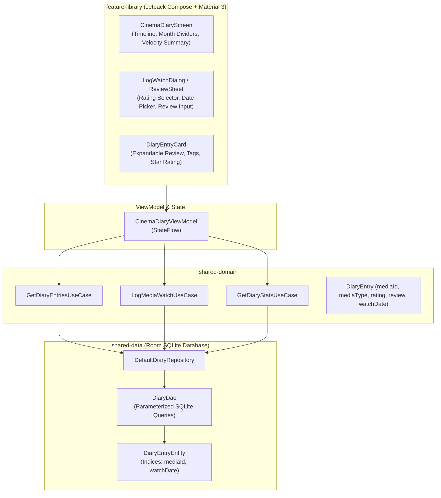

# Architecture & Technical Specification: Personal Cinema Diary & Review Log

## 1. Executive Summary

The **Personal Cinema Diary & Review Log** (`feature-library`) is a private, offline-first journal allowing movie and TV enthusiasts to log their watched titles, record star ratings, write reviews, track rewatches, and analyze their viewing velocity over time.

---

## 2. WHAT: Functional Requirements & User Experience

### 2.1 Core Capabilities
1. **Chronological Viewing Timeline**: All logged watches ordered chronologically and grouped by month and year.
2. **Precision Star Ratings**: Granular 0.5 to 5.0 star rating scale with interactive tap and drag support.
3. **Personal Written Reviews**: Full-text reviews, personal reflections, tags, and viewing location notes.
4. **Rewatch Tracking**: Flag entries as first-time watches or rewatches with automated rewatch counter increments.
5. **Viewing Velocity Metrics**: Monthly and yearly statistics displaying total movies watched, episodes binged, average rating, and watch streaks.
6. **Movie & TV Show Parity**: Full support for logging standalone films, TV seasons, and individual TV episodes.

### 2.2 Deep Linking & Navigation Flow
- **Universal URL**: `https://showtime.ssverma.in/diary`
- **Custom Scheme**: `showtime://showtime.ssverma.in/diary`
- **NavKey**: `CinemaDiaryNavKey`

---

## 3. WHY: Motivation & Design Rationale

1. **User Data Ownership**: Commercial tracking platforms (Letterboxd, Trakt) monetize user data, lock exports behind paywalls, and suffer from network outages. ShowTime keeps the diary 100% local-first and private.
2. **Reflective Cinema Journey**: Provides film lovers with a permanent visual timeline of their cinematic memories.
3. **Offline Reliability**: Users can log watches while flying or off-grid without requiring a network connection or third-party login.

---

## 4. HOW: Technical & Code Architecture

### 4.1 Architecture Diagram



### 4.2 Key Classes & Files
- **UI Screen**: [`CinemaDiaryScreen.kt`](file:///Users/ss/Projects/ShowTime/feature-library/src/main/java/com/ssverma/feature/library/ui/diary/CinemaDiaryScreen.kt)
- **ViewModel**: [`CinemaDiaryViewModel.kt`](file:///Users/ss/Projects/ShowTime/feature-library/src/main/java/com/ssverma/feature/library/ui/diary/CinemaDiaryViewModel.kt)
- **Domain Models**: `DiaryEntry.kt`, `DiaryStats.kt` in `shared-domain`
- **Repository**: `DiaryRepository.kt` in `shared-domain`, `DefaultDiaryRepository.kt` in `shared-data`
- **Room DAO & Entity**: `DiaryDao.kt`, `DiaryEntryEntity.kt` in `core-storage`

---

## 5. Security, Privacy & Open-Source Compliance

1. **Local-First Privacy**: Diary entries and reviews are stored exclusively in the app's sandboxed SQLite database (`/data/data/com.ssverma.showtime/databases/showtime.db`).
2. **Zero Telemetry or Data Scraping**: User review text and ratings are never sent to remote analytics or ad servers.
3. **SQL Injection Prevention**: All Room database operations utilize parameterized queries:
   ```kotlin
   @Query("SELECT * FROM diary_entries WHERE watch_date >= :startDate AND watch_date <= :endDate ORDER BY watch_date DESC")
   fun getEntriesForRange(startDate: Long, endDate: Long): Flow<List<DiaryEntryEntity>>
   ```
4. **Encrypted Cloud Backup (Optional)**: If the user enables Pro cloud backup, diary payloads are serialized and uploaded strictly to the user's private Firestore document (`/users/{uid}/backups/latest`) protected by Firebase Auth UID rules.
