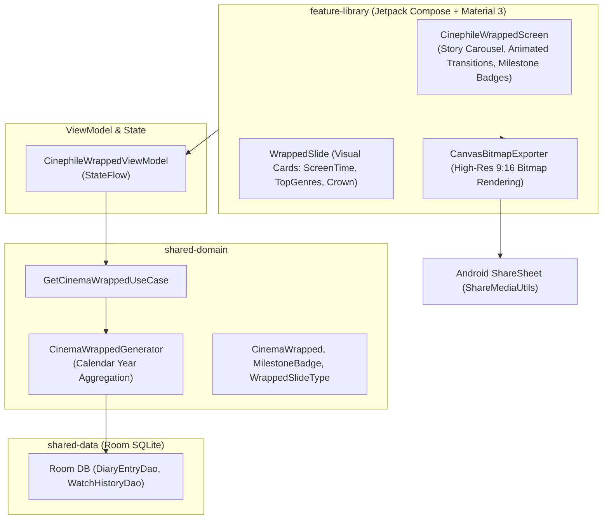

# Architecture & Technical Specification: Annual Cinema Wrapped & Milestones

## 1. Executive Summary

The **Annual Cinema Wrapped & Milestones** system (`feature-library`) generates an engaging, visual
year-in-review story of a user's movie and TV watching journey. It computes total watch duration,
top genres, directors, era distribution, and milestone badges with one-click export to social
stories.

---

## 2. WHAT: Functional Requirements & User Experience

### 2.1 Core Capabilities

1. **Interactive Story Slides**:
    - ⏱️ *Total Screen Time*: Total hours and days spent immersed in cinema and TV series.
    - 🎬 *Velocity & Counts*: Total movies watched and TV episodes completed.
    - 🍿 *Top Genres & Moods*: Ranked genre breakdown with percentage distribution.
    - 📽️ *Top Directors & Creators*: Most-watched filmmakers of the year.
    - ⏳ *Era Explorer*: Decade distribution showing vintage vs contemporary balance.
    - 🏆 *Top Rated Crown*: User's personal 5-star masterpieces of the year.
2. **Cinephile Milestone Badges**:
    - 💯 *Century Club* (Watched 100+ titles in a calendar year)
    - 🌙 *Midnight Screamer* (Logged 10+ horror films after midnight)
    - 🚀 *Sci-Fi Pioneer* (Logged 25+ science-fiction movies)
    - 🏛️ *Criterion Connoisseur* (Logged 15+ classic arthouse films)
    - 🍿 *Marathon Runner* (Binged an entire TV season in a single weekend)
3. **High-Resolution Story Export**: One-tap native sharing generating high-resolution story cards
   formatted for Instagram, WhatsApp, X, and Telegram.
4. **Historical Years Selector**: Review Wrapped stories for the current year or past logged years.

### 2.2 Deep Linking & Navigation Flow

- **Universal URL**: `https://showtime.ssverma.in/wrapped` /
  `https://showtime.ssverma.in/milestones`
- **Custom Scheme**: `showtime://showtime.ssverma.in/wrapped`
- **NavKey**: `CinephileWrappedNavKey`

---

## 3. WHY: Motivation & Design Rationale

1. **Viral Open-Source Growth**: Spotify Wrapped proved that personalized year-in-review summaries
   drive viral organic growth. Giving cinephiles a dedicated cinema equivalent brings excitement to
   the open-source ecosystem.
2. **Data-Positive Reflection**: Helps users look back on their year in storytelling, art, and
   entertainment.
3. **Gamification Without Dark Patterns**: Milestone badges celebrate genuine artistic exploration
   without predatory loot boxes or ad triggers.

---

## 4. HOW: Technical & Code Architecture

### 4.1 Architecture Diagram

### 4.2 Key Classes & Files

- **UI Screen**: [
  `CinephileWrappedScreen.kt`](file:///Users/ss/Projects/ShowTime/feature-library/src/main/java/com/ssverma/feature/library/ui/wrapped/CinephileWrappedScreen.kt)
- **ViewModel**: [
  `CinephileWrappedViewModel.kt`](file:///Users/ss/Projects/ShowTime/feature-library/src/main/java/com/ssverma/feature/library/ui/wrapped/CinephileWrappedViewModel.kt)
- **Generator**: `CinemaWrappedGenerator.kt` in `shared-domain`
- **Share Utility**: `ShareMediaUtils.kt` in `common-ui`

---

## 5. Security, Privacy & Open-Source Compliance

1. **Local-First Year Aggregation**: Wrapped computations are performed on-device by querying local
   Room SQLite timestamps (`watchDate BETWEEN :yearStart AND :yearEnd`).
2. **Sanitized Story Card Exports**: The bitmap rendering pipeline exports only title names, poster
   graphics, and aggregate numbers. No email addresses, user IDs, device fingerprints, or GPS
   metadata are embedded in the generated bitmap.
3. **No External Tracking**: Sharing relies exclusively on the standard Android `Intent.ACTION_SEND`
   system sheet without proprietary analytics SDKs.
