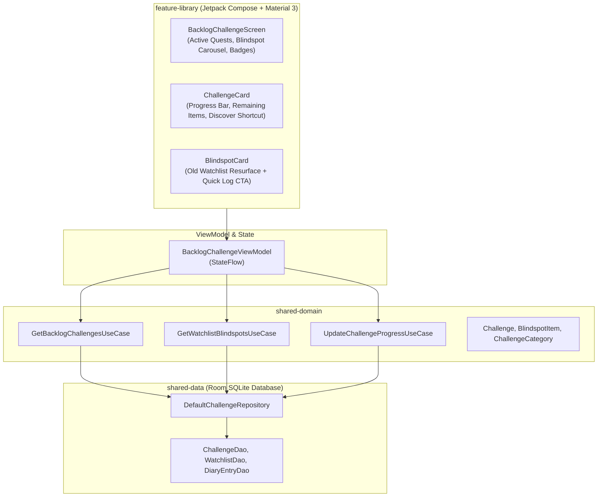

# Architecture & Technical Specification: Cinephile Backlog & Blindspot Challenges

## 1. Executive Summary

The **Cinephile Backlog & Blindspot Challenges** system (`feature-library`) helps movie and TV lovers conquer their ever-growing watchlist backlog through structured, gamified quests (*52 Films in a Year*, *Criterion Classics*, *Decades Tour*) and intelligent on-device "Blindspot" recommendations that resurface forgotten, highly-rated watchlist items.

---

## 2. WHAT: Functional Requirements & User Experience

### 2.1 Core Capabilities
1. **Curated Cinephile Quests**:
   - 🎯 *52 Films in 52 Weeks* (Weekly cinema habit challenge)
   - 🏛️ *Criterion & Arthouse Tour* (Explore 20 classic masterpiece films)
   - ⏳ *Through the Decades* (Watch 1 essential film from each decade from the 1930s to 2020s)
   - 🚀 *Sci-Fi Worldbuilder* (Complete 15 speculative science-fiction epics)
   - 🕶️ *Noir & Mystery Investigation* (Solve 10 neo-noir and murder mystery gems)
2. **Watchlist Blindspot Resurfacing**:
   - Algorithmically scans the user's local watchlist for titles added over 90 days ago that have high TMDB ratings (>7.8) or matching director preferences.
   - Prominently features these "forgotten gems" with one-tap logging or discovery shortcuts.
3. **Dynamic Progress Tracking**:
   - Animated progress bars, completion percentage, remaining targets, and estimated finish dates.
   - Milestone completion celebrations with collectible badge rewards.
4. **Discover Integration**: Tapping any quest opens the Universal Discovery Hub pre-filtered to the quest's genre and era parameters.

### 2.2 Deep Linking & Navigation Flow
- **Universal URL**: `https://showtime.ssverma.in/challenges` / `https://showtime.ssverma.in/backlog`
- **Custom Scheme**: `showtime://showtime.ssverma.in/challenges`
- **NavKey**: `BacklogChallengeNavKey`

---

## 3. WHY: Motivation & Design Rationale

1. **Watchlist Paralysis Problem**: Users continually add hundreds of movies to their watchlists but rarely know where to start watching. Challenges provide actionable direction and goal-setting.
2. **Intentional Movie Watching**: Encourages users to expand their cinematic horizons beyond trending algorithmic feeds.
3. **100% Offline & Local**: Progress is computed automatically as the user logs entries in their Diary, requiring zero manual cross-checking.

---

## 4. HOW: Technical & Code Architecture

### 4.1 Architecture Diagram

### 4.2 Key Classes & Files
- **UI Screen**: [`BacklogChallengeScreen.kt`](file:///Users/ss/Projects/ShowTime/feature-library/src/main/java/com/ssverma/feature/library/ui/backlog/BacklogChallengeScreen.kt)
- **ViewModel**: [`BacklogChallengeViewModel.kt`](file:///Users/ss/Projects/ShowTime/feature-library/src/main/java/com/ssverma/feature/library/ui/backlog/BacklogChallengeViewModel.kt)
- **Repository**: `ChallengeRepository.kt` in `shared-domain`, `DefaultChallengeRepository.kt` in `shared-data`
- **Room Entity**: `ChallengeEntity.kt`, `ChallengeDao.kt` in `core-storage`

---

## 5. Security, Privacy & Open-Source Compliance

1. **Local-First Computation**: Watchlist age and challenge progress calculations occur entirely on-device via Room SQLite queries.
2. **Zero Cloud Requirement**: Users can complete all challenges, earn badges, and manage their backlog entirely offline.
3. **No External Tracking**: No telemetry or challenge completion data is transmitted to analytics servers.
