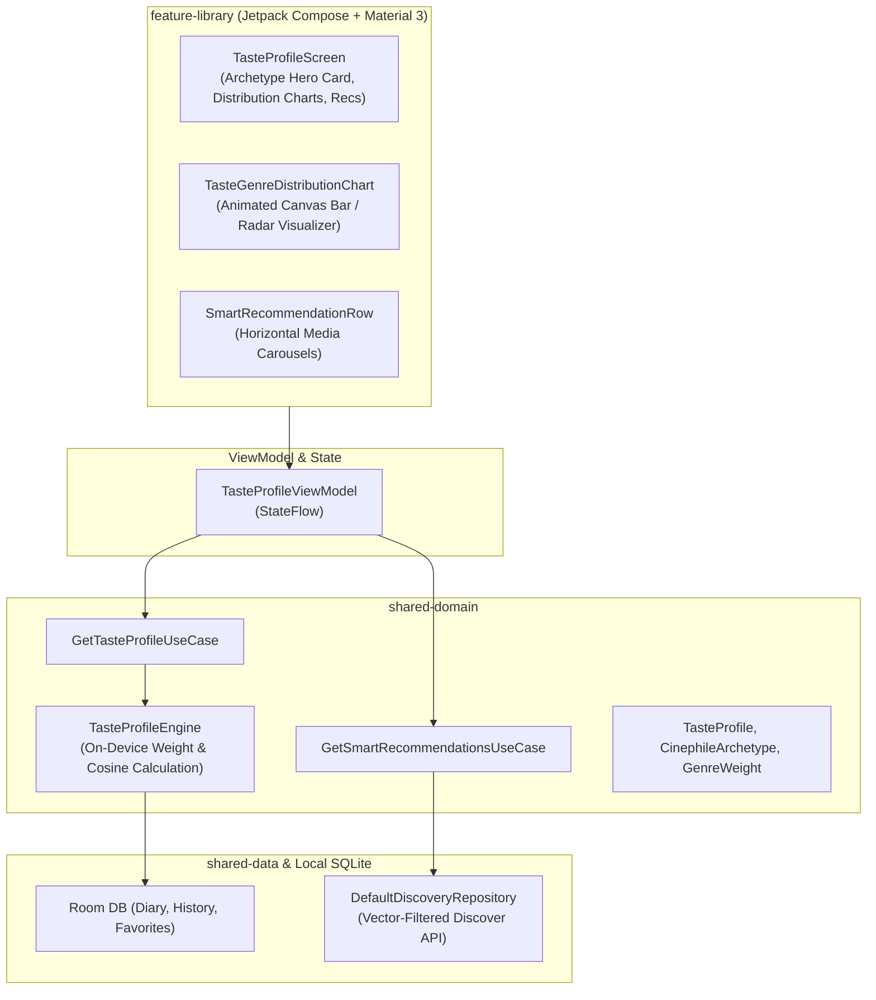

# Architecture & Technical Specification: Cinephile Taste Profile & Recommendations

## 1. Executive Summary

The **Cinephile Taste Profile & Smart Recommendations Engine** (`feature-library`) is an on-device
statistical intelligence system that analyzes a user's local watch history and ratings to compute a
personalized cinematic taste archetype, favorite genres/eras, and tailored recommendations.

---

## 2. WHAT: Functional Requirements & User Experience

### 2.1 Core Capabilities

1. **Cinephile Archetypes**: Assigns a personalized persona based on watch patterns:
    - 🎭 *The Auteur Aficionado* (High director concentration, arthouse/festival films)
    - 🕹️ *The Nostalgia Seeker* (Heavy 80s/90s cinema and retro classics)
    - 🚀 *The Blockbuster Connoisseur* (Sci-Fi, Adventure, Epic Action franchises)
    - 🔍 *The Genre Explorer* (Even distribution across diverse international genres)
    - 🛋️ *The Comfort Binger* (High TV series velocity, animation, sitcoms)
2. **Taste Breakdown Graphs**:
    - Genre Affinity Vector (percentage breakdown across Action, Drama, Sci-Fi, etc.)
    - Era Distribution (affinity across Golden Age, 70s, 80s, 90s, 2000s, 2010s, 2020s)
    - Top Directors & Cast Members
3. **Smart Algorithmic Recommendations**:
    - "Because you love [Top Genre / Director]"
    - Hidden Gems matching high-rated taste vectors
    - Full Movie & TV parity
4. **Interactive Deep Dive**: Tapping any genre or decade shortcut instantly opens the Universal
   Discovery Hub pre-filtered to that dimension.

### 2.2 Deep Linking & Navigation Flow

- **Universal URL**: `https://showtime.ssverma.in/taste`
- **Custom Scheme**: `showtime://showtime.ssverma.in/taste`
- **NavKey**: `TasteProfileNavKey`

---

## 3. WHY: Motivation & Design Rationale

1. **Privacy-Preserving Personalization**: Mainstream streaming recommendation engines rely on
   centralized behavioral telemetry, cross-app tracking, and engagement maximization algorithms.
   ShowTime provides intelligent recommendations computed 100% locally on-device.
2. **Self-Discovery & Cinephile Delight**: Users enjoy learning about their own viewing habits,
   favorite decades, and subconscious genre preferences.
3. **Actionable Discovery**: Rather than being a static dashboard, the taste profile acts as a
   springboard into content discovery via deep navigation into the Discovery Hub.

---

## 4. HOW: Technical & Code Architecture

### 4.1 Architecture Diagram

### 4.2 Key Classes & Files

- **UI Screen**: [
  `TasteProfileScreen.kt`](file:///Users/ss/Projects/ShowTime/feature-library/src/main/java/com/ssverma/feature/library/ui/taste/TasteProfileScreen.kt)
- **ViewModel**: [
  `TasteProfileViewModel.kt`](file:///Users/ss/Projects/ShowTime/feature-library/src/main/java/com/ssverma/feature/library/ui/taste/TasteProfileViewModel.kt)
- **Calculation Engine**: `TasteProfileEngine.kt` in `shared-domain`
- **Domain Models**: `TasteProfile.kt`, `CinephileArchetype.kt` in `shared-domain`

---

## 5. Security, Privacy & Open-Source Compliance

1. **100% On-Device Computation**: Zero telemetry. User taste vectors, archetypes, and ratings never
   leave the device.
2. **No Profiling Trackers**: ShowTime does not integrate with Facebook SDK, Google Analytics User
   Properties, or third-party data brokers.
3. **Anonymized Discovery Queries**: TMDB recommendation queries send only genre IDs and release
   dates (e.g. `with_genres=28,878&vote_average.gte=7.0`), never user identifiers or device
   metadata.
