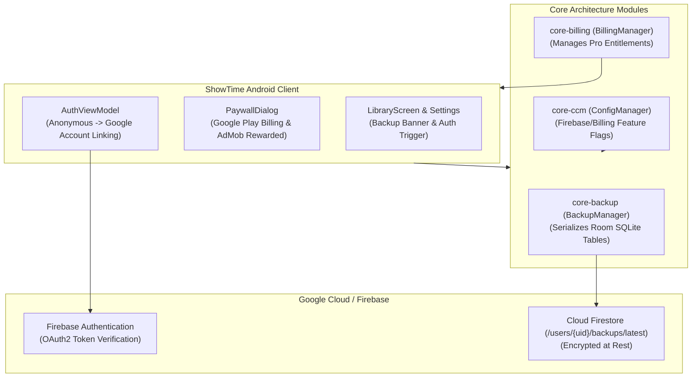

# Architecture & Technical Specification: Cloud Backup, Auth & Pro Gating

## 1. Executive Summary

The **Cloud Backup, Auth & Pro Gating** system provides secure, authenticated cloud synchronization (via Cloud Firestore & Google Sign-In) and open-source monetization (Pro subscriptions, lifetime unlocks, and rewarded ads) while maintaining ShowTime's strict local-first and privacy-first foundations.

---

## 2. WHAT: Functional Requirements & User Experience

### 2.1 Core Capabilities
1. **Anonymous Auth to Google Sign-In Linking**:
   - Every user starts with an anonymous Firebase guest session with zero login friction.
   - When the user chooses to enable Cloud Backup, they can link their account to Google Sign-In with one tap, transferring all local data without conflicts.
2. **Automated & Manual Cloud Backup**:
   - Pro users benefit from automated background cloud sync upon data changes.
   - Free users can trigger manual backups and perform one-click restores across devices.
   - Context-aware backup reminder banners in the Library if unbacked data exceeds threshold.
3. **Pro Paywall & Rewarded Video Ad Gating**:
   - Dedicated Pro Paywall UI showcasing premium features (Unlimited Custom Lists, Automated Cloud Sync, Custom App Icons).
   - Free-tier limits (e.g. up to 5 custom lists) with option to unlock additional slots via rewarded video ads or upgrading to Pro.
4. **CCM Remote Config Gating**:
   - All cloud, Trakt, and Firebase features are controlled by centralized Cloud Configuration Management (`core-ccm`) flags.

---

## 3. WHY: Motivation & Design Rationale

1. **Data Safety Across Device Migration**: Users invest significant effort curating watchlists, diaries, and custom lists; cloud backup ensures this data is never lost when switching phones.
2. **Sustainable Open-Source Model**: Gives users a choice between lifetime purchase, subscription, or watching rewarded ads to support ongoing open-source development.
3. **Graceful Fallback**: If an open-source contributor clones the repository without Firebase keys, the entire app functions normally in local-only mode.

---

## 4. HOW: Technical & Code Architecture

### 4.1 Architecture Diagram



### 4.2 Key Classes & Files
- **Backup Manager**: [`BackupManager.kt`](file:///Users/ss/Projects/ShowTime/core-backup/src/main/java/com/ssverma/core/backup/BackupManager.kt)
- **Billing Paywall**: [`PaywallDialog.kt`](file:///Users/ss/Projects/ShowTime/core-billing/src/main/java/com/ssverma/core/billing/ui/PaywallDialog.kt)
- **Auth Repository**: [`FirebaseAuthRepository.kt`](file:///Users/ss/Projects/ShowTime/feature-auth/src/main/java/com/ssverma/feature/auth/data/FirebaseAuthRepository.kt)
- **Config Manager (CCM)**: [`ConfigManager.kt`](file:///Users/ss/Projects/ShowTime/core-ccm/src/main/java/com/ssverma/core/ccm/ConfigManager.kt)

---

## 5. Security, Privacy & Open-Source Compliance

### 5.1 Cloud Firestore Security Rules
All cloud backup documents are strictly locked to the authenticated user UID:

```javascript
rules_version = '2';
service cloud.firestore {
  match /databases/{database}/documents {
    match /users/{userId}/{document=**} {
      allow read, write: if request.auth != null && request.auth.uid == userId;
    }
  }
}
```

### 5.2 Secret Isolation & Open-Source Safety
- **No API Keys in Git**: `google-services.json` and billing license keys are listed in `.gitignore`.
- **Local Properties Injection**: Open-source developers can run the app with dummy credentials. `core-ccm` automatically disables cloud services when credentials are absent, preventing runtime crashes.
- **Data Encryption**: Backups are transferred over TLS 1.3 and stored encrypted at rest within Google Cloud infrastructure.
