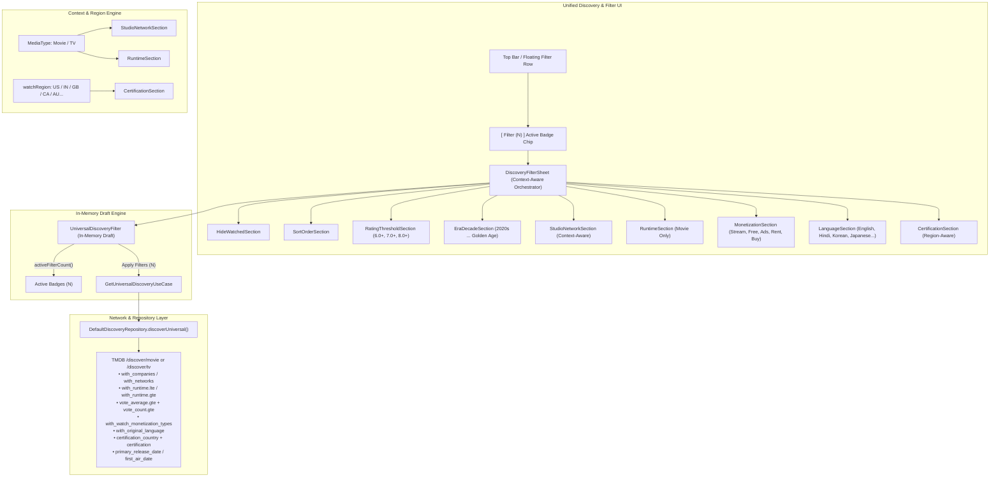

# Architecture & Technical Specification: Rich, Context-Aware Discovery & Filter Engine (ShowTime 2.0)

## 1. Executive Summary

The **ShowTime 2.0 Discovery & Filter Engine** provides a unified, highly performant, and context-aware filtering infrastructure across Universal Discovery (`feature-filter`) and Media Catalog listings (`feature-movie`, `feature-tv`).

It eliminates the historical bifurcation between rigid listing parameters and simple discover chips by introducing:
1. **Context-Aware Dynamic Adaptation**: The engine detects whether the user is browsing **Movies** or **TV Shows** and automatically morphs the filter sheet UI and parameter space (e.g. Cinephile Studios vs Top TV Networks, Movie Runtime bounds vs TV seasons).
2. **Region-Aware Age & Content Certifications**: Content rating systems dynamically adapt to the active `watchRegion` (e.g., India CBFC `U/UA/A`, USA MPAA/TV Parental Guidelines, UK BBFC, etc.).
3. **Draft State Performance & Zero-Lag Interaction**: In-memory draft filtering avoids wasteful intermediate API roundtrips while presenting real-time active filter count badges on triggers and CTAs.

---

## 2. System Architecture & Data Flow



---

## 3. Domain Model Architecture (`shared-domain`)

### 3.1 Context-Aware Enums & Types

| Model | Purpose | TMDB Query Target | Context Scope |
| :--- | :--- | :--- | :--- |
| `DiscoveryStudioHub` | Premium indie & major film studios (A24, NEON, Ghibli, Pixar, Marvel, WB, Universal, Paramount, Columbia, Blumhouse) | `with_companies` | Movie |
| `DiscoveryTvNetworkHub` | Flagship prestige television networks (HBO, Netflix, Apple TV+, AMC, FX, BBC, Disney+, Showtime, Prime Video, Paramount+, Hulu) | `with_networks` | TV |
| `DiscoveryRatingThreshold` | Quality filters (Any, 6.0+ Good, 7.0+ Great, 8.0+ Masterpiece) | `vote_average.gte` | Universal |
| `DiscoveryRuntimeRange` | Runtime bounds (Any, Short <90m, Standard 90-120m, Epic >120m) | `with_runtime.gte/lte` | Movie |
| `DiscoveryMonetizationType` | Watch accessibility (Stream, Free, Ads, Rent, Buy) | `with_watch_monetization_types` | Universal |
| `DiscoveryLanguage` | International cinema languages (English, Hindi, Korean, Japanese, Spanish, French, German, Italian) | `with_original_language` | Universal |
| `DiscoveryCertificationHelper` | Region-aware age and maturity certifications | `certification_country` + `certification` | Region-Specific |

### 3.2 Dynamic Active Filter Count Calculation

The `UniversalDiscoveryFilter` data model encapsulates a deterministic calculation method `activeFilterCount()`:

```kotlin
fun activeFilterCount(): Int {
    var count = 0
    if (vibePreset != DiscoveryVibePreset.ALL) count++
    if (decade != DiscoveryDecade.ALL_TIME) count++
    if (sortOrder != DiscoverySortOrder.POPULARITY_DESC) count++
    if (mediaType == MediaType.Movie && studioHub != null) count++
    if (mediaType == MediaType.Tv && tvNetworkHub != null) count++
    if (ratingThreshold != DiscoveryRatingThreshold.ALL || (minRating != null && minRating > 0f)) count++
    if (mediaType == MediaType.Movie && runtimeRange != DiscoveryRuntimeRange.ALL) count++
    if (monetizationTypes.isNotEmpty()) count += monetizationTypes.size
    if (language != DiscoveryLanguage.ALL) count++
    if (!certification.isNullOrBlank()) count++
    if (selectedGenreIds.isNotEmpty()) count += selectedGenreIds.size
    if (selectedProviderIds.isNotEmpty()) count += selectedProviderIds.size
    if (!hideWatched) count++
    return count
}
```

---

## 4. UI/UX Component Modularization (`feature-filter`)

To strictly adhere to the ShowTime Code Quality Directives (Hard cap of ~300-400 lines per file, single responsibility, design token purity), the filter sheet is organized as an orchestrator with dedicated component files in `com.ssverma.feature.filter.ui.discovery.component.filter`:

1. **`FilterSectionHeader.kt`**: Clean, accessible section headers with semantic typography and optional region badges / trailing clear actions.
2. **`HideWatchedSection.kt`**: Surface container card with an accessible toggle switch to exclude watched titles.
3. **`SortOrderSection.kt`**: FlowRow pill selector for popularity, vote average, release dates, and review counts.
4. **`RatingThresholdSection.kt`**: FlowRow pill selector with star vectors indicating rating thresholds (6.0+, 7.0+, 8.0+).
5. **`EraDecadeSection.kt`**: Decade pills from 2020s through the Golden Age.
6. **`StudioNetworkSection.kt`**: Dynamically switches between **Cinephile Movie Studios** and **Top TV Networks** based on the active `MediaType`.
7. **`RuntimeSection.kt`**: Movie runtime duration selector (visible when `MediaType.Movie`).
8. **`MonetizationSection.kt`**: Multi-selectable monetization chips (Stream, Free, With Ads, Rent, Buy).
9. **`LanguageSection.kt`**: Cinema language chips for international movie discovery.
10. **`CertificationSection.kt`**: Region-aware maturity rating chips (e.g. IN: `U`, `U/A 7+`, `U/A 13+`, `U/A 16+`, `A` vs US: `G`, `PG`, `PG-13`, `R`, `NC-17`, `TV-MA`).
11. **`DiscoveryFilterSheet.kt`**: Lean orchestrator coordinating header reset actions, scrollable modular sections, and pinned bottom bar with `Apply Filters (N)` active badge CTA.

---

## 5. Performance, API Efficiency & Quality Verification

1. **In-Memory Draft Pattern**: All user modifications inside the filter bottom sheet mutate a local `draftFilter` variable. Zero API calls are executed during chip selection or sheet scrolling.
2. **Single Debounced Query Execution**: When the user taps `Apply Filters (N)`, the entire unified filter object is emitted to `UniversalDiscoveryViewModel`, triggering a single, optimized TMDB API call with query parameter consolidation.
3. **Active Count Badges**: `StreamingFilterRow` and `DiscoveryFilterSheet` display dynamic badges `[ Filter (N) ]` and `Apply Filters (N)` so users immediately understand their active filter constraints.
4. **Automated Unit Tests**:
   - `UniversalDiscoveryViewModelTest`: Validates default state, rich filter applications, media type switching behavior, active filter count calculations, and subscription gating.
   - `DefaultDiscoveryRepositoryTest`: Validates mapping of all context-aware filter fields to TMDB discover endpoints.
5. **Quality Gate Verification**:
   - 100% test pass rate across 1,067 Gradle unit tests (`./gradlew testDebugUnitTest`).
   - Clean pre-commit formatting and token purity (`git add -A && ./.githooks/pre-commit`).
