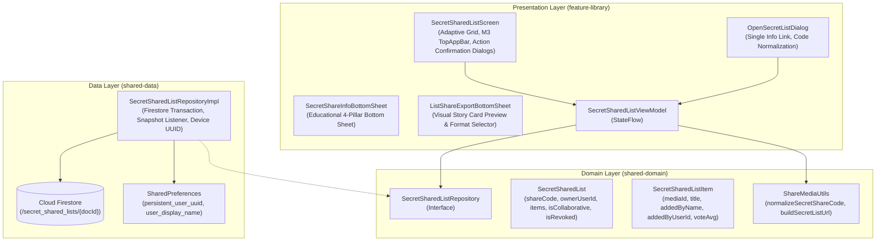

# Architecture & Technical Specification: Secret Shared Lists & Collaborative Co-Curating

## 1. Executive Summary

**Feature #10: Secret Shared Lists & Collaborative Co-Curators** (`feature-library`) enables
ShowTime cinephiles to share their private movie and TV custom collections with friends via unlisted
secret links, short share codes (e.g., `SL-4821`), or aesthetic visual story cards (9:16 Story and
1:1 Square). When Co-Curator mode is enabled, friends can search TMDB and add recommendations in
real time.

Crucially, the feature enforces **Smart Contributor Scoping**: the list creator retains universal
curation and moderation authority over all items, while guest contributors can only delete titles
that they personally contributed, preventing griefing and accidental list wipes.

---

## 2. WHAT: Functional Requirements & User Experience

### 2.1 Core Capabilities

1. **100% Unlisted & Private Sharing**:
    - Reserved for private collections (`!customList.isPublic`), supporting both user-created (
      `isCloned == false`) and cloned collections (`isCloned == true`). For cloned collections,
      original curator attribution (`sourceAuthorName`) is preserved.
    - Secret lists are never published in the public Community directory or indexed in search feeds.
    - Accessible only via a unique secret code (e.g. `SL-4821`) or deep link (
      `https://showtime.ssverma.in/l/SL-4821`).
2. **Real-Time Collaborative Co-Curation**:
    - List creator can toggle **"Allow Friends to Add Movies"** on or off.
    - When enabled, any friend who opens the secret link can search TMDB and add movie or TV show
      recommendations to the live Firestore list.
    - Real-time reactivity via Firestore snapshot listeners updates the list instantaneously for all
      open participants.
3. **Smart Contributor Scoping (Removal & Moderation Authority)**:
    - **List Creator / Owner**: Universal moderation authority. Can remove *any* title from the
      list, revoke the secret link at any time, or toggle collaborative mode.
    - **Co-Curators (Friends)**: Can add recommendations, and **can only remove items they
      personally added**. They cannot delete movies curated by the creator or by other friends.
    - **Viewers (Non-Collaborative)**: Read-only access with ability to "Add All to Watchlist" or "
      Clone to My Lists"; zero deletion or addition powers.
4. **Creator / Owner Recognition & UX Adaptation**:
    - When a creator opens their own secret list code:
        - The curator badge clearly displays `"Curated by You (Creator)"`.
        - The action bar replaces the redundant `"Clone to My Lists"` button with `"Share Link"` (
          launching the Android system share sheet with formatted list text).
        - The TopAppBar 3-dot overflow menu provides `"Revoke Secret Link"`.
5. **Aesthetic Visual Story Card Export**:
    - Renders 9:16 Instagram Story and 1:1 Square image cards on-device using Jetpack Compose
      graphics layer bitmap capture.
    - Luxury styles: Classic Velvet, Vintage 35mm, OLED Noir, and Cyberpunk Neon.
6. **Educational Info Sheet (`SecretShareInfoBottomSheet`)**:
    - Explains the 4 core pillars (100% Unlisted, Real-Time Collaboration, Visual Story Cards,
      Creator Control).
    - Accessible from the "Open Secret List" dialog, the Share Export sheet, and the TopAppBar.
7. **Action Confirmation Safeguards**:
    - All destructive or bulk actions (`Add All to Watchlist`, `Clone to My Lists`, `Remove Title`,
      `Revoke Secret Link`) are gated behind explicit Material 3 confirmation dialogs.

---

### 2.2 Deep Linking & Navigation Flow

- **Universal URL**: `https://showtime.ssverma.in/l/{shareCode}`
- **Custom Scheme**: `showtime://showtime.ssverma.in/l/{shareCode}`
- **In-App Share Code**: `SL-XXXX` (case-insensitive, normalized via
  `ShareMediaUtils.normalizeSecretShareCode`)
- **NavKey**: `SecretSharedListNavKey(shareCode: String)`

---

## 3. WHY: Motivation & Design Rationale

1. **Private vs. Public Distinction**:
    - Public Community lists (`feature-community`) are designed for public discovery, follower
      engagement, and directory search.
    - Secret Shared lists are designed for intimate social circles (couples planning movie night,
      group chats sharing recommendations, film clubs) without publishing their collection to
      strangers.
2. **Protection Against List Vandalism**:
    - In open wiki-style shared lists, any guest could delete the creator's carefully curated
      movies. Smart Contributor Scoping preserves the host's curation integrity while still granting
      collaborators the freedom to manage their own contributions.
3. **No Mandatory Account Barrier**:
    - Collaborators can view and contribute immediately without mandatory email/password sign-up,
      using ShowTime's persistent device UUID (`persistent_user_uuid`).

---

## 4. HOW: Technical & Code Architecture

### 4.1 Architecture Diagram



---

### 4.2 Modular Components & Responsibilities

| Component                        | Module            | Responsibility                                                                                                                |
|:---------------------------------|:------------------|:------------------------------------------------------------------------------------------------------------------------------|
| `SecretSharedList`               | `shared-domain`   | Domain model for unlisted shared list header, collaborative flag, revocation state, and rating statistics.                    |
| `SecretSharedListItem`           | `shared-domain`   | Media item domain model containing `mediaId`, `title`, `addedByName`, and `addedByUserId`.                                    |
| `ShareMediaUtils`                | `shared-domain`   | Normalizes codes (`4821` -> `SL-4821`, URL stripping), formats shareable text and deep link URLs.                             |
| `SecretSharedListRepository`     | `shared-domain`   | Interface for creating, observing, adding, removing, and revoking secret lists.                                               |
| `SecretSharedListRepositoryImpl` | `shared-data`     | Firestore implementation utilizing atomic transactions, real-time snapshot listeners, and persistent device UUID.             |
| `SecretSharedListViewModel`      | `feature-library` | Exposes reactive `SecretSharedListUiState`, search suggestions via TMDB, and execution of bulk/curation actions.              |
| `SecretSharedListScreen`         | `feature-library` | Main Compose UI with enter-always nested scroll, unified action buttons, Smart Contributor Scoping, and confirmation dialogs. |
| `SecretShareInfoBottomSheet`     | `feature-library` | Educational M3 bottom sheet explaining the 4 pillars of Secret Share.                                                         |

---

## 5. Smart Contributor Scoping & Permission Specification

### 5.1 Permission Matrix

| Action                               | List Creator (Owner) |            Co-Curator (Friend)             | Read-Only Viewer |
|:-------------------------------------|:--------------------:|:------------------------------------------:|:----------------:|
| **View List & Media Details**        |         Yes          |                    Yes                     |       Yes        |
| **Add All to Local Watchlist**       |         Yes          |                    Yes                     |       Yes        |
| **Clone to Custom Lists**            |  N/A (Has Original)  |                    Yes                     |       Yes        |
| **Share Link / Text Chooser**        |         Yes          |                    Yes                     |       Yes        |
| **Search & Add New Media (`+ Add`)** |         Yes          |           Yes (if collaborative)           |        No        |
| **Remove Personally Added Titles**   |         Yes          | **Yes** (`addedByUserId == currentUserId`) |        No        |
| **Remove Titles Added by Others**    | **Yes** (Moderator)  |              **No** (Blocked)              |        No        |
| **Revoke Secret Link**               | **Yes** (Exclusive)  |                     No                     |        No        |

### 5.2 UI Representation

- **Grid Item Badges**:
    - Items contributed by the current collaborator display `"Added by You"`.
    - Items contributed by other collaborators display `"Added by {name}"`.
    - Items contributed by the creator display no contributor override tag (or
      `"Curated by {owner}"`).
- **Remove `(X)` Icon Visibility**:
  ```kotlin
  val isAddedByCurrentUser = item.addedByUserId != null && item.addedByUserId == uiState.currentUserId
  val canRemove = uiState.isOwner || (list.isCollaborative && isAddedByCurrentUser)
  ```
  Only if `canRemove == true` is the delete button rendered on the card.
- **Confirmation Dialog**: When `(X)` is tapped, an explicit Material 3 confirmation dialog prompts:
  `"Remove from Shared List? Are you sure you want to remove '{title}' from this shared list? It will be removed for everyone."`

### 5.3 Backend Enforcement (Firestore Transaction)

In `SecretSharedListRepositoryImpl.removeMediaFromSharedList`:

```kotlin
val ownerUserId = snapshot.getString("ownerUserId").orEmpty()
val isCollaborative = snapshot.getBoolean("isCollaborative") ?: false
val isOwner = ownerUserId == persistentUserId

val targetItem = currentItems.firstOrNull { it.mediaId == mediaId }
if (targetItem != null) {
    val canRemove = isOwner || (isCollaborative && targetItem.addedByUserId == persistentUserId)
    if (!canRemove) {
        throw IllegalStateException("Only the list owner or the contributor who added this item can remove it")
    }
    currentItems.remove(targetItem)
    // Transaction updates itemsJson and itemCount atomically
}
```

---

## 6. Firestore Security Rules & Dev vs. Prod Isolation

### 6.1 Dev vs. Prod Collection Isolation

To prevent development/debug test lists from polluting or colliding with real end-user lists,
ShowTime routes traffic dynamically based on build configuration (
`ApplicationInfo.FLAG_DEBUGGABLE`):

- **Development / Debug Builds**: Writes to `dev_secret_shared_lists`
- **Production / End-User Builds**: Writes to `secret_shared_lists`

### 6.2 Cloud Firestore Security Rules (`firestore.rules`)

Both collections enforce identical, hardened validation rules:

```javascript
    function isValidSecretListCreate() {
      let data = request.resource.data;
      return data.keys().hasAll(['shareCode', 'title', 'ownerUserId', 'isCollaborative', 'isRevoked', 'createdAtEpochMs', 'updatedAtEpochMs', 'itemsJson'])
        && data.shareCode is string && data.shareCode.size() >= 4 && data.shareCode.size() <= 20
        && data.title is string && data.title.size() > 0 && data.title.size() <= 100
        && data.ownerUserId is string && data.ownerUserId.size() > 0 && data.ownerUserId.size() <= 128
        && data.isCollaborative is bool
        && data.isRevoked == false
        && data.itemsJson is string && data.itemsJson.size() <= 1000000;
    }

    function isValidSecretListUpdate() {
      let data = request.resource.data;
      let existing = resource.data;
      return !existing.isRevoked
        && data.ownerUserId == existing.ownerUserId
        && data.shareCode == existing.shareCode
        && data.createdAtEpochMs == existing.createdAtEpochMs
        && data.title is string && data.title.size() > 0 && data.title.size() <= 100
        && data.isCollaborative is bool
        && data.isRevoked is bool
        && data.itemsJson is string && data.itemsJson.size() <= 1000000;
    }

    // Production (End Users)
    match /secret_shared_lists/{shareCode} {
      allow read: if true;
      allow create: if isValidSecretListCreate();
      allow update: if isValidSecretListUpdate();
      allow delete: if false;
    }

    // Development & Testing (Isolated)
    match /dev_secret_shared_lists/{shareCode} {
      allow read: if true;
      allow create: if isValidSecretListCreate();
      allow update: if isValidSecretListUpdate();
      allow delete: if false;
    }
```

Key Protections:

- **Zero Client Document Deletion (`allow delete: if false`)**: Prevents accidental or malicious
  hard document deletions by client SDKs.
- **Revocation Immutability**: If a document has `isRevoked == true`, `isValidSecretListUpdate()`
  immediately rejects any further updates.
- **Owner & Code Immutability**: Attackers or guests cannot alter the original `ownerUserId`,
  `shareCode`, or `createdAtEpochMs`.
- **Payload Limits**: `itemsJson` is capped at 1MB to prevent storage exhaustion attacks.

### 6.3 Firestore Rules Validation & Deployment Runbook

For ongoing maintenance, rule modifications, or security audits, use the following Firebase CLI
commands:

1. **Compilation & Dry-Run Validation** (Verifies syntax, type checking, and compilation without
   modifying remote state):
   ```bash
   npx firebase-tools deploy --only firestore:rules --dry-run
   ```
   *Expected Output*:
   ```text
   === Deploying to 'showtime-1916'...
   i  deploying firestore
   i  cloud.firestore: checking firestore.rules for compilation errors...
   ✔  cloud.firestore: rules file firestore.rules compiled successfully
   ✔  Dry run complete!
   ```

2. **Live Production Rules Release**:
   ```bash
   npx firebase-tools deploy --only firestore:rules
   ```
   *Expected Output*:
   ```text
   === Deploying to 'showtime-1916'...
   i  deploying firestore
   i  cloud.firestore: checking firestore.rules for compilation errors...
   ✔  cloud.firestore: rules file firestore.rules compiled successfully
   i  firestore: uploading rules firestore.rules...
   ✔  firestore: released rules firestore.rules to cloud.firestore
   ✔  Deploy complete!
   ```

---

## 7. Security, Privacy & Code Quality Standards

1. **Zero Hardcoded Secrets**: All URLs, codes, and IDs are parameterized.
2. **Immediate Revocation Guarantee**: Setting `isRevoked = true` in Firestore immediately renders
   the revoked state screen for any active viewer, disabling all interactions and detaching
   listeners.
3. **Purity Compliance**:
    - Zero hardcoded strings (100% localized in `strings.xml`).
    - Zero wildcard imports (`import .*`).
    - Zero inline fully qualified class names (FQCNs).
    - Zero hardcoded hex colors (all colors resolve through `MaterialTheme.colorScheme` tokens).
