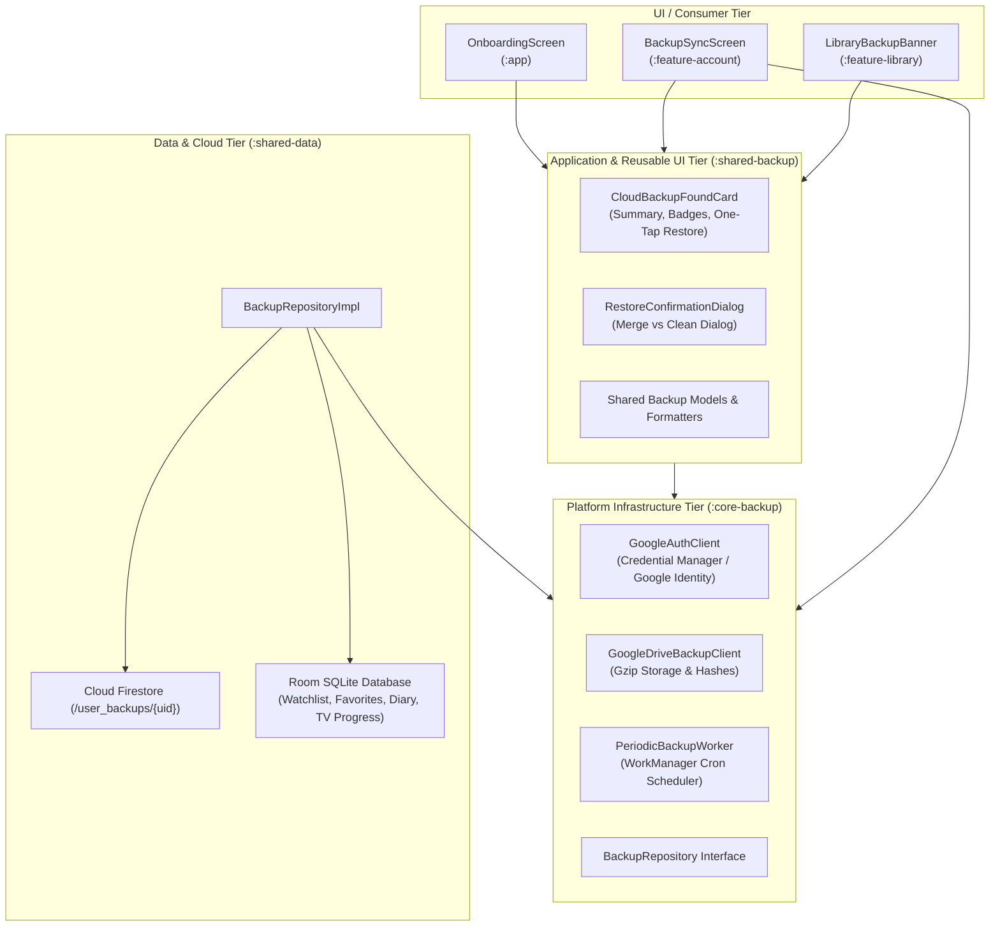
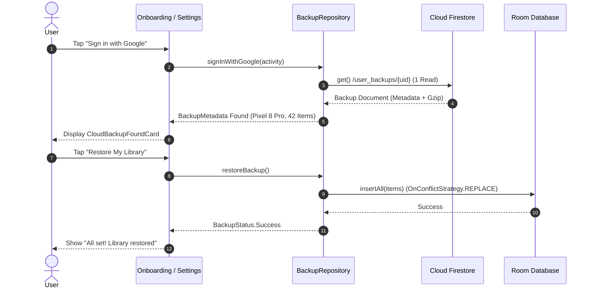

# Architecture & Technical Specification: Smart Cloud Backup & Restore

## 1. Executive Summary

The **Smart Cloud Backup & Restore** system provides an automated, non-destructive, and cost-controlled cloud persistence layer for ShowTime. It enables seamless cross-device migration, reinstall recovery, and daily synchronization across watchlists, diary entries, custom lists, and TV episode progress.

---

## 2. Architecture & The Twin Module Pattern

Following [`docs/MODULAR_ARCHITECTURE_AND_CAPABILITY_TAXONOMY.md`](../MODULAR_ARCHITECTURE_AND_CAPABILITY_TAXONOMY.md), the backup subsystem is strictly split into decoupled twin modules:

### Module Responsibilities:
1. **`core-backup` (Platform Infrastructure Tier)**:
   - Low-level Google Identity / Credential Manager integration (`GoogleAuthClient`).
   - Gzip-compressed file system client (`GoogleDriveBackupClient`).
   - Periodic WorkManager scheduler (`PeriodicBackupWorker`).
   - Repository interface (`BackupRepository`) and contributor abstraction (`BackupContributor`).
   - **Zero UI Composables**.
2. **`shared-backup` (Application Engine & Shared UI Tier)**:
   - Reusable Composables (`CloudBackupFoundCard`, `RestoreConfirmationDialog`).
   - Badge formatting, breakdown counts, and state synchronization.
   - Shields `common-ui` from backup domain bloat.

---

## 3. Firestore Spark Plan (Free Tier) Cost Guarantees

As an indie developer, the application is engineered to strictly operate within Firebase's free Spark plan limits (50,000 reads/day, 20,000 writes/day, 1GB storage).

### Cost-Protection Guardrails:
1. **Single Document per User ($N=1$)**:
   - The entire user backup is packed into a single document: `user_backups/{uid}`.
   - Even with 1,000 watched episodes and 500 diary entries, saving or reading a backup consumes **exactly 1 write or 1 read**.
2. **Gzip Compression ($>80\%$ Reduction)**:
   - Backups are Gzip-compressed before upload (`compressGzip()`).
   - Payloads typically compress to ~15–30 KB (well below the 1MB Firestore limit).
3. **SHA-256 Checksum Protection (Zero Redundant Writes)**:
   - Before uploading to Firestore, the payload is hashed via SHA-256.
   - If `payloadHash == backup_last_payload_hash`, the network upload is aborted immediately (**0 Firestore writes**).
4. **Single-Read on Sign-In**:
   - `fetchRemoteBackupMetadata()` runs only once when authentication changes or when entering the backup screen. It is never placed on continuous polling or window focus loops.

---

## 4. User Journeys & Restore UX

### Key Scenarios:
1. **First-Time Install / Migration (Onboarding Step 4)**:
   - When the user signs in with Google, `CloudBackupFoundCard` renders automatically.
   - Tapping **"Restore My Library"** restores all data in-place with a progress spinner.
   - Upon completion, the user lands on the Home Dashboard with their "Up Next" carousel and Watchlists populated!
2. **Returning User in Settings**:
   - Signing into Google in Settings → Cloud Backup signs the user in and updates the status card in-place (last backup date, origin device, item breakdown badges). It does **NOT** present an unprompted modal dialog.
   - Tapping **"Restore"** on the card opens `RestoreConfirmationDialog`.
   - If local items exist (`localItemCount > 0`), it displays the smart merge reassurance:
     > *"Your existing local items will be safely merged with [N] items from your cloud backup ([Device]). No local data will be deleted."*
   - If no local items exist (`localItemCount == 0`), it displays the clean restore prompt:
     > *"We found a backup from [Device] with [N] saved items. Would you like to restore it now?"*
3. **Non-Destructive Merge**:
   - Room DAOs use `OnConflictStrategy.REPLACE` keyed on TMDB ID.
   - Restoring a backup never deletes new local items logged as a guest.

---

## 5. Pro Plan vs. Free Plan Entitlements

| Feature | Free Tier | Pro Tier (`BillingRepository.isProActive`) |
| :--- | :--- | :--- |
| **Restore Data** | **100% Free & Unlimited** | **100% Free & Unlimited** |
| **Manual Backup** | Unlocked via Rewarded Ad pass | 1-Tap Instant Backup |
| **Automated Background Backup** | Off (Requires Pro) | Daily, Weekly, or Monthly via WorkManager |

### Single-Switch Developer Override:
- All Pro checks evaluate `BillingRepository.isProActive`.
- In debug builds, the **Developer Panel** (`DeveloperPanelBottomSheet`) provides a single switch (`DebugProOverride`):
  - `AUTO`: Evaluates real Google Play purchases.
  - `FORCE_ACTIVE`: Unlocks all Pro backup capabilities instantly.
  - `FORCE_INACTIVE`: Forces free tier gating.

---

## 6. Manual Verification & QA Playbook

Use this step-by-step checklist to validate all backup and restore flows using the debug app and the Developer Panel (🪲 on Account screen).

### Scenario 1: Clean Sign-In in Settings (No Auto-Prompt)
- **Objective**: Ensure signing into Google in Settings does not throw an intrusive, unexpected restore modal.
- **Steps**:
  1. Open ShowTime → **Account** tab → **Cloud Backup**.
  2. If already signed in, tap **Sign Out**.
  3. Tap **Sign in with Google** and choose an account that already has a cloud backup.
- **Expected Outcome**:
  - Sign-in completes smoothly.
  - **NO dialog or modal pops up unprompted**.
  - The card displays the cloud backup details (timestamp, device name, and feature breakdown counts).

### Scenario 2: Manual Backup Flow (Free Ad Gate vs. Pro Instant)
- **Objective**: Verify that free users receive the Rewarded Ad feature gate while Pro users backup instantly.
- **Steps (Free Tier)**:
  1. In **Account** tab → tap 🪲 (Developer Panel) → set Pro Override to **FORCE_INACTIVE**.
  2. In Cloud Backup, tap **Back Up Now**.
  3. Verify the Rewarded Ad feature gate bottom sheet appears ("Watch an ad to back up your library").
- **Steps (Pro Tier)**:
  1. In Developer Panel → set Pro Override to **FORCE_ACTIVE**.
  2. Tap **Back Up Now**.
  3. Verify instant backup execution with progress spinner, followed by success message.

### Scenario 3: Smart Merge with Existing Local Data
- **Objective**: Ensure existing local items are merged safely without data loss, and the smart merge dialog informs the user.
- **Steps**:
  1. Open Developer Panel 🪲 → tap **Seed Fake Library Data** (or search and favorite/watchlist movies locally).
  2. Open **Cloud Backup** screen (signed in to Google).
  3. Tap **Restore**.
- **Expected Outcome**:
  - The `RestoreConfirmationDialog` appears displaying the smart merge message:
    > *"Your existing local items will be safely merged with [N] items from your cloud backup ([Device]). No local data will be deleted."*
  - CTAs show **"Restore & Merge"** and **"Keep Local Only"**.
  - Tap **"Restore & Merge"** → progress spinner runs → success message displayed.
  - Verify your local items and cloud backup items are both present in your Library.

### Scenario 4: Onboarding Cloud Step & "Start Fresh" Confirmation
- **Objective**: Ensure the first-launch migration experience is smooth and "Start Fresh" asks for confirmation before discarding the card.
- **Steps**:
  1. In Developer Panel 🪲 → tap **Reset Onboarding** (or clear app storage and launch app).
  2. Proceed through Onboarding steps to Step 4 (**Privacy & Sync**).
  3. Tap **Continue with Google** and sign into an account with an existing backup.
  4. Notice the **Cloud Backup Found** card appears showing origin device, date, and badges.
  5. Tap **Start Fresh**:
     - A confirmation dialog appears: *"Start fresh? You can still restore your cloud backup anytime later from Settings."*
     - Tap **Cancel**: Dialog dismisses; Cloud Backup Found card remains visible.
     - Tap **Start Fresh** again → tap **Yes, Start Fresh**: Dialog dismisses; card disappears and shows signed-in / guest state.
  6. Tap **Enter ShowTime** → User successfully lands on Home screen.
