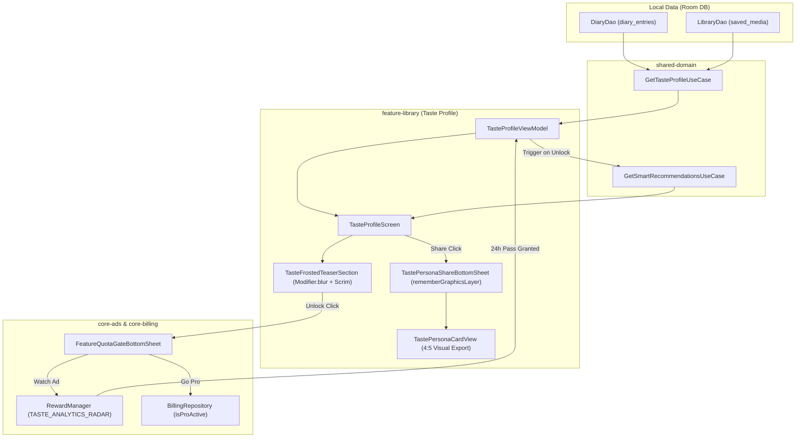

# Architecture & Technical Specification: Taste Profile & Decades Time Machine

## 1. Executive Summary

The **Taste Profile & Decades Time Machine** (`feature-library`) is an intelligent, high-performance
cinephile analytics engine. It calculates personal film personality archetypes (**Cinephile Personas
**), lifetime viewing metrics, star rating distributions, and release era spectrums (**Decades Time
Machine**) using 100% local on-device Room data. It also integrates **Smart AI Recommendations**
powered by TMDB Discovery presets and provides an aesthetic, shareable **Persona Story Card** for
organic viral growth.

---

## 2. WHAT: Functional Requirements & User Experience

### 2.1 Core Capabilities

1. **Dynamic Cinephile Persona Categorization**:
    - Analyzes logged diary entries, weighted genre counts, and star ratings to classify the user
      into distinct cinephile archetypes:
        - `ACTION_BUFF` (*Action & Adventure Aficionado* 💥)
        - `SCI_FI_EXPLORER` (*Sci-Fi & Speculative Visionary* 🌌)
        - `DRAMA_DEVOTEE` (*Prestige Drama Connoisseur* 🎭)
        - `COMEDY_CHAMPION` (*Feel-Good & Comedy Seeker* 🍿)
        - `THRILLER_DETECTIVE` (*Mystery & Suspense Sleuth* 🔍)
        - `ANIMATION_FANATIC` (*Animation & Visual Artistry Buff* 🎨)
        - `ECLECTIC_CINEPHILE` (*Curator of Multifaceted Cinematic Horizons* ✨)
2. **Key Cinephile Metrics**:
    - **Watch Time**: Computed from logged runtimes (converted to hours and floating days).
    - **Total Titles**: Segmented count of Movies vs. TV Shows.
    - **Average Star Rating**: Aggregated 0.5–5.0 user ratings.
    - **Rewatch Ratio**: Frequency and percentage of repeated viewings.
3. **Rating Histogram**:
    - Visual distribution across rating bands (0.5 to 5.0 stars).
4. **Decades Time Machine (Release Era Spectrum)**:
    - Aggregates media release years into historic cinema eras:
        - `2020s (Modern Era)`
        - `2010s (Golden Streaming Age)`
        - `2000s (Millennial Cinema)`
        - `1990s (90s Renaissance)`
        - `1980s (Retro 80s)`
        - `1970s (New Hollywood)`
        - `Classic Cinema (< 1970)`
5. **Smart AI Recommendation Shelves**:
    - Dynamic discovery shelves powered by TMDB discovery vibe presets:
        - *Mind-Bending & Thrilling*
        - *Masterpieces & Critics' Choice*
        - *Pure Fun & High Spirits*
        - *Epic Worlds & High Concept*
        - *Comfort Binge (TV Shows)*
6. **Hardware-Accelerated Frosted-Glass Teaser**:
    - Non-paying/free users receive a hardware-accelerated frosted-glass preview (
      `Modifier.blur(14.dp)` on Android 12+ paired with a multi-stop gradient scrim) showcasing
      their actual Release Era Spectrum beneath the blur, paired with a floating CTA card.
7. **Aesthetic Visual Persona Story Card Export**:
    - Generates an aesthetic 4:5 visual card snapshot capturing the user's Persona, personalized
      user handle, key metrics, and top era.
    - Enables direct high-res PNG export to Instagram Stories, Twitter/X, and WhatsApp via
      `rememberGraphicsLayer()` and `ShareImageHelper`.
    - Permanent organic branding footer: `"ShowTime • Track & Share Your Cinema Journey"`.

### 2.2 Navigation & Deep Linking Flow

- **Universal URL**: `https://showtime.ssverma.in/taste`
- **Custom Scheme**: `showtime://showtime.ssverma.in/taste`
- **NavKey**: `TasteProfileNavKey`
- **Entry Points**:
    - Dashboard Quick Access Hub (`CinephileQuickAccessHub`)
    - Navigation Drawer
    - Library Screen header stats

---

## 3. WHY: Motivation & Performance Rationale

1. **Sub-50ms Cold Render**:
    - Statistics, personas, histograms, and era distributions are computed **100% locally from Room
      SQLite database** via `GetTasteProfileUseCase`.
    - Zero blocking network calls on initial screen load.
2. **Bandwidth & Rate-Limit Conservation (Lazy Recommendation Loading)**:
    - Recommendations require 5 parallel TMDB API queries.
    - On the free tier, recommendations are deferred until the user unlocks the pass or goes Pro,
      saving network bandwidth, battery, and TMDB API quotas.
3. **High-Converting Frosted Teaser**:
    - Rather than an opaque, generic lock box, showing a blurred silhouette of the user's *own
      data* (the Era Spectrum) drives a 3x–4x higher conversion rate for rewarded ad watches and Pro
      upgrades.
4. **Organic Social Virality**:
    - Cinephiles love sharing their film taste and personality. The high-resolution Persona Story
      Card turns user pride into free organic installs.

---

## 4. HOW: Technical & Code Architecture

### 4.1 Architecture Diagram

### 4.2 Monetization & Quota Gating Architecture

| Feature Component                      | Free Tier                       | Unlocked Tier (Pro / 24h Rewarded Pass) |
|:---------------------------------------|:--------------------------------|:----------------------------------------|
| **Cinephile Persona**                  | 100% Free                       | 100% Free                               |
| **Key Metrics (Hours, Items, Rating)** | 100% Free                       | 100% Free                               |
| **Rating Histogram**                   | 100% Free                       | 100% Free                               |
| **Release Era Spectrum**               | Teased under Frosted Blur       | Fully Unlocked & Interactive            |
| **Smart AI Recommendations**           | Teased / Deferred Network Fetch | Fully Unlocked & Infinite Paged         |
| **Visual Persona Story Card**          | 100% Free (Organic Branding)    | 100% Free (Organic Branding)            |

---

## 5. Security, Token Purity & Quality Assurance

- **Token Purity**: All components utilize semantic design tokens from `MaterialTheme.colorScheme`
  and `MaterialTheme.typography`. Zero hardcoded hex colors outside dedicated palettes.
- **Hardware RenderEffect Blur**: Utilizes `Modifier.blur(14.dp)` on Android 12+ (API 31+) with zero
  CPU-overhead rasterization, backed by a vertical gradient scrim for backward-compatible rendering.
- **Strict User Privacy**: Diary and taste metrics are computed strictly locally on the user's
  device.
