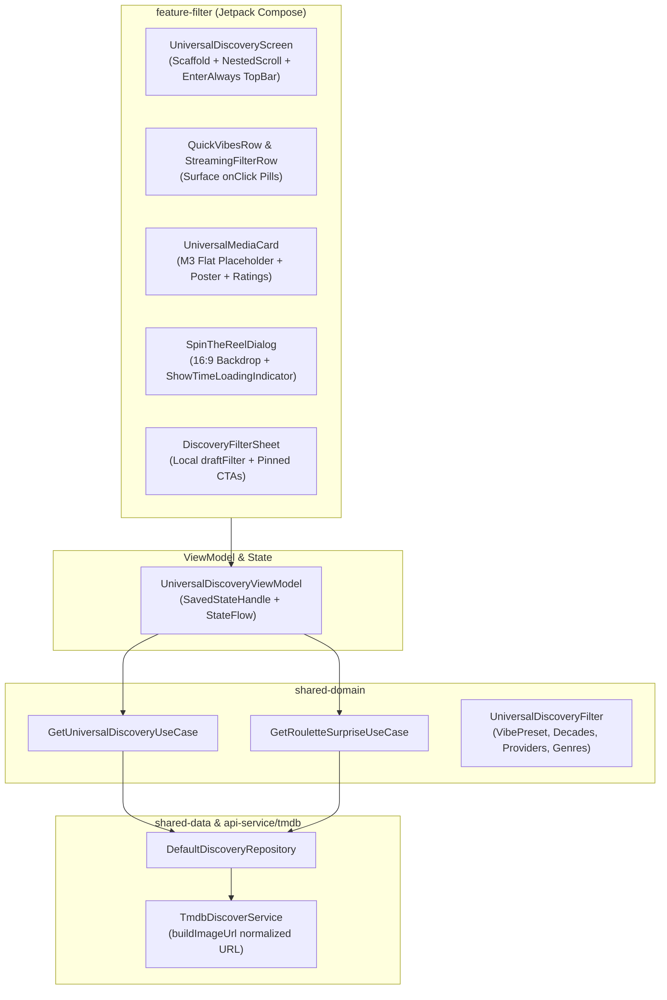

# Architecture & Technical Specification: Universal Discover & Browse Hub

## 1. Executive Summary

The **Universal Discover & Browse Hub** (`feature-filter`) is a Letterboxd-grade discovery experience for ShowTime. It gives users dynamic, multi-faceted filtering across Movies and TV Shows without relying on keyword search.

---

## 2. WHAT: Functional Requirements & User Experience

### 2.1 Core Capabilities
1. **Movie & TV Parity**: Unified segmented switcher toggling seamlessly between Movie and TV catalog discovery.
2. **Curated Mood Vibes**: Instant vibe-based filtering presets:
   - 🌟 *All Vibes* (Unfiltered popularity)
   - 🤯 *Mind-Bending* (Sci-Fi, Mystery, Psychological Thriller)
   - 🍿 *Pure Fun* (Action, Comedy, Adventure)
   - ☕ *Comfort Binge* (Animation, Family, Sitcoms)
   - 🕶️ *Dark & Gritty* (Crime, Drama, Noir)
   - 🏆 *Masterpieces* (Critically acclaimed, high ratings)
   - 🌌 *Epic Worlds* (Fantasy, Sci-Fi worldbuilding)
3. **Region-Aware Streaming Filter**: Live detection of user's watch region (e.g., US, IN, GB) with quick-selection pills for major streaming providers (Netflix, Amazon Prime, Disney+, Apple TV+, Max, Hulu).
4. **Decade & Era Filtering**: From the *Golden Age* through the *70s Cinema*, *80s Neon*, *90s Classics*, *2000s*, *2010s*, to the *2020s*.
5. **Cinephile Studio Hubs**: Curated studio filters (*A24*, *HBO*, *NEON*, *Studio Ghibli*, *Pixar*, *Marvel Studios*, *Warner Bros.*).
6. **Cinema Roulette**: Floating action button that rolls an instant personalized recommendation with a 16:9 backdrop preview card, rating badge, full-width `▶ View Details` CTA, and `Spin Again` re-roll capability.
7. **Snappy Advanced Filter Sheet**: Modal bottom sheet featuring local draft state (`draftFilter`), sticky bottom CTA bar (`Apply Filters` & `Cancel`) with surface elevation and `navigationBarsPadding()`.
8. **View Mode Switching**: Instant toggle between 2-column Grid view and detailed List view.

### 2.2 Deep Linking & Navigation Flow
- **Universal URL**: `https://showtime.ssverma.in/discover`
- **Vibe Deep Link**: `https://showtime.ssverma.in/discover/{vibe}` (e.g. `MIND_BENDING`)
- **Custom Scheme**: `showtime://showtime.ssverma.in/discover`
- **NavKey**: `UniversalDiscoveryNavKey(initialMediaType, initialVibe, initialStudioHub, initialGenreId, initialProviderId, initialDecade, initialSortOrder)`

---

## 3. WHY: Motivation & Design Rationale

1. **Eliminating Decision Fatigue**: Modern streaming catalogs cause analysis paralysis. Vibe presets and Cinema Roulette allow users to find something to watch in seconds.
2. **Context Preservation**: Navigating from Home shelves or deep links retains all initial filter arguments without discarding user context.
3. **Screen Space Optimization**: In mobile viewports, media posters are the hero content. Using `TopAppBarDefaults.enterAlwaysScrollBehavior()` smoothly collapses the top app bar on scroll down, maximizing grid real estate while keeping active filter controls sticky.
4. **Material 3 Expressive & Native Interaction**: All clickable surfaces use native component-level `onClick = {}` handlers (`Surface(onClick = ...)`, `Card(onClick = ...)`, `IconButton(onClick = ...)`) to hoist interaction sources into M3 containers for hardware-accelerated ripples and elevations.

---

## 4. HOW: Technical & Code Architecture

### 4.1 Architecture Diagram



### 4.2 Key Classes & Files
- **Screen**: [`UniversalDiscoveryScreen.kt`](file:///Users/ss/Projects/ShowTime/feature-filter/src/main/java/com/ssverma/feature/filter/ui/discovery/UniversalDiscoveryScreen.kt)
- **ViewModel**: [`UniversalDiscoveryViewModel.kt`](file:///Users/ss/Projects/ShowTime/feature-filter/src/main/java/com/ssverma/feature/filter/ui/discovery/UniversalDiscoveryViewModel.kt)
- **UI State**: [`UniversalDiscoveryUiState.kt`](file:///Users/ss/Projects/ShowTime/feature-filter/src/main/java/com/ssverma/feature/filter/ui/discovery/UniversalDiscoveryUiState.kt)
- **Filter Sheet**: [`DiscoveryFilterSheet.kt`](file:///Users/ss/Projects/ShowTime/feature-filter/src/main/java/com/ssverma/feature/filter/ui/discovery/component/DiscoveryFilterSheet.kt)
- **Media Card**: [`UniversalMediaCard.kt`](file:///Users/ss/Projects/ShowTime/feature-filter/src/main/java/com/ssverma/feature/filter/ui/discovery/component/UniversalMediaCard.kt)
- **Roulette Dialog**: [`SpinTheReelDialog.kt`](file:///Users/ss/Projects/ShowTime/feature-filter/src/main/java/com/ssverma/feature/filter/ui/discovery/component/SpinTheReelDialog.kt)
- **Repository**: [`DefaultDiscoveryRepository.kt`](file:///Users/ss/Projects/ShowTime/shared-data/src/main/java/com/ssverma/shared/data/repository/DefaultDiscoveryRepository.kt)
- **Image URL Normalizer**: [`TmdbDefaults.kt`](file:///Users/ss/Projects/ShowTime/api-service/tmdb/src/main/java/com/ssverma/api/service/tmdb/TmdbDefaults.kt)

### 4.3 Image URL Normalization
To prevent double slashes (`//`) in TMDB image paths:
```kotlin
fun buildImageUrl(imagePath: String?, baseUrl: String = TmdbDefaults.ImageUrl): String? {
    if (imagePath.isNullOrBlank()) return null
    val cleanBase = baseUrl.trimEnd('/')
    val cleanPath = imagePath.trimStart('/')
    return "$cleanBase/$cleanPath"
}
```

---

## 5. Security, Privacy & Open-Source Compliance

1. **Zero Hardcoded Secrets**: TMDB API keys are injected via `local.properties` and accessed through `BuildConfig.TMDB_API_KEY`.
2. **Input Parameter Sanitization**: Deep links and filter options strictly validate integer IDs and enum names. Unrecognized parameters safely default to `DiscoveryVibePreset.ALL` or `DiscoveryDecade.ALL_TIME`.
3. **Zero Telemetry / PII Leakage**: No user filter queries, selected streaming services, or roulette results are transmitted to external tracking servers.
4. **Open Source Build Safety**: The discovery module compiles and passes unit tests (`UniversalDiscoveryViewModelTest.kt`) without requiring network or real credentials.
