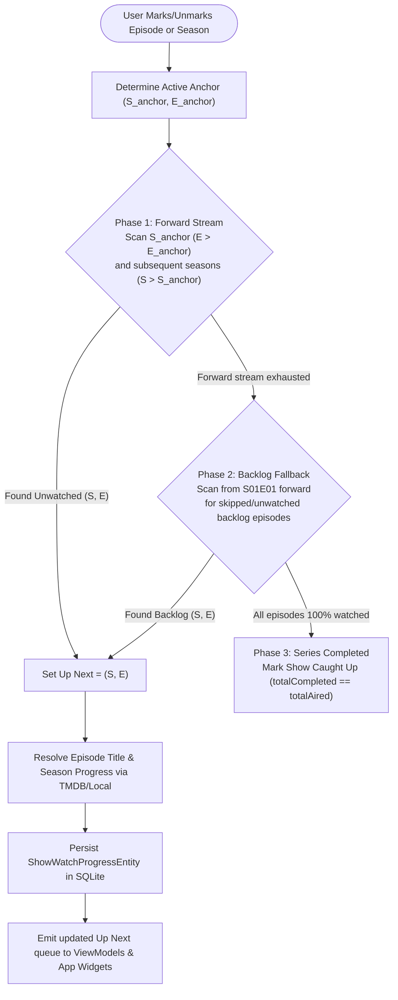

# Up Next Watch Progress & Non-Linear Continuity Architecture

## 1. Overview & Objective
The **Up Next to Watch** system is ShowTime's core television tracking engine. It provides a seamless, reactive queue on the Home Dashboard and TV Home screens, allowing cinephiles and TV enthusiasts to resume in-progress shows with one tap.

### Core Architectural Principles
- **Local-First Single Source of Truth**: The tracking engine operates 100% locally via SQLite Room DB (`episode_watch_history` and `show_watch_progress`). The entire watch progress lifecycle functions standalone in ShowTime without requiring external account linking.
- **Optional Two-Way Trakt Sync**: When Trakt integration is enabled and authenticated by the user, history is mirrored to Trakt in the background. If Trakt is disabled or offline, ShowTime operates reliably from local SQLite state.
- **Industry-Standard Continuity**: Matches UX benchmarks (Trakt, TV Time, Apple TV, Netflix, Plex) by supporting non-linear watching, mid-series starts (e.g. jumping directly into Season 2 or Season 3), out-of-order episodes, backlog recovery, and series completion celebrations.

---

## 2. The Smart Watch Front Algorithm



### Phase 1: Forward Stream (Active Viewing Session Continuation)
1. **Active Watch Anchor**:
   - When marking an episode `(S, E)`, the active anchor is `(S, E)`.
   - When unmarking an episode, the anchor defaults to the most recently watched episode by timestamp in `episode_watch_history`.
   - When batch-marking a season, the anchor is `(S, E_max)` where `E_max` is the season finale.
2. **Forward Search**:
   - First, scan within the anchor season for the next unwatched episode starting at `E_anchor + 1` up to the season finale.
   - If the remainder of the anchor season is complete, advance forward into `S_anchor + 1`, `S_anchor + 2`, etc., checking from Episode 1.
   - If the user finishes the latest season of a multi-season show with future seasons, the forward stream advances to `S_next E01`.

### Phase 2: Backlog / Skipped Episodes Fallback
- Triggered **only when the forward stream from the active anchor has reached the series finale** (or the latest released season).
- If earlier seasons or past episodes were skipped (e.g., user started directly at Season 2 and finished Season 2, leaving Season 1 unwatched):
  - Scans chronologically from `S01E01` forward across all seasons.
  - Presents the earliest unwatched backlog episode in the queue.

### Phase 3: 100% Series Completion
- When all episodes across all seasons are in `watchedSet`:
  - Sets `totalCompleted == totalAired` and `seasonCompleted == seasonTotalAired`.
  - The Up Next card renders celebratory "Caught Up / Season Completed" states and triggers the Season Completion confetti dialog.
  - The show progress entity automatically clears from the active Up Next carousel.

---

## 3. Viewing Scenarios & Expected Behaviors

| Scenario | User Action | Up Next Result | Rationale |
|---|---|---|---|
| **Standard Linear** | Watches S01E01 | **S01E02** | Continues sequentially within season |
| **Season Finale** | Watches S01E10 (10-ep season) | **S02E01** | Advances to next season episode 1 |
| **Mid-Series Start** | Watches S02E01 (S1 unwatched) | **S02E02** | Maintains active watch front in Season 2 without resetting to S01E01 |
| **Skipped Episode** | Watches S01E01, then S01E03 | **S01E04** | Keeps active binge session moving forward |
| **Backlog Fallback** | Finishes S02E10 (S1 unwatched, no S3) | **S01E01** | Falls back to skipped backlog after finishing latest season |
| **Un-marking Episode** | Unmarks S02E03 | **S02E03** | Rewinds anchor to S02E02 and targets S02E03 |
| **Un-marking Show** | Unmarks all episodes | **Removed** | Deletes show progress entry from SQLite DB |
| **Series Finale** | Finishes final episode of series | **100% Caught Up** | Triggers completion dialog and finishes queue |

---

## 4. Data Layer Architecture & Room Schema

### SQLite Room Entities

#### `episode_watch_history`
```kotlin
@Entity(
    tableName = "episode_watch_history",
    primaryKeys = ["showId", "seasonNumber", "episodeNumber"]
)
data class EpisodeWatchHistoryEntity(
    val showId: Int,
    val seasonNumber: Int,
    val episodeNumber: Int,
    val watchedAt: Long = System.currentTimeMillis()
)
```

#### `show_watch_progress`
```kotlin
@Entity(tableName = "show_watch_progress")
data class ShowWatchProgressEntity(
    @PrimaryKey
    val showId: Int,
    val showTitle: String,
    val showPosterPath: String?,
    val seasonNumber: Int,
    val episodeNumber: Int,
    val episodeTitle: String?,
    val seasonCompleted: Int = 0,
    val seasonTotalAired: Int = 0,
    val totalCompleted: Int,
    val totalAired: Int,
    val lastWatchedAt: Long = System.currentTimeMillis()
)
```

### Reactive Data Pipeline
- `ShowWatchProgressDao.getUpNextQueueFlow()`:
  ```sql
  SELECT * FROM show_watch_progress 
  WHERE totalAired == 0 OR totalCompleted < totalAired 
  ORDER BY lastWatchedAt DESC
  ```
- Emits continuous Kotlin `Flow<List<TraktUpNextEpisode>>` to `DashboardViewModel`, `HomeTvShowViewModel`, and Android App Widgets via `AppWidgetSyncNotifier`.
