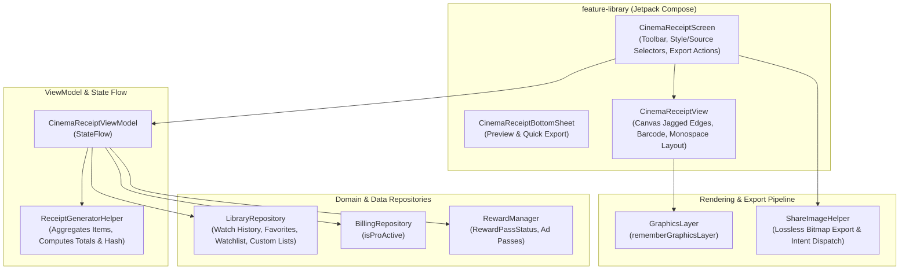
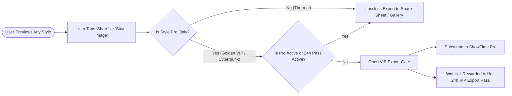

# Architecture & Technical Specification: Vintage Cinema Receipt Generator

## 1. Executive Summary

The **Vintage Cinema Receipt Generator** (`feature-library`) is a viral social sharing tool that compiles a user's movie and TV watch history, favorites, watchlist, or custom lists into a retro, aesthetic cinema receipt or ticket pass. Rendered using custom Compose canvas drawing, the receipt can be saved to local storage or shared directly to Instagram Stories, Twitter/X, and messaging apps.

---

## 2. WHAT: Functional Requirements & User Experience

### 2.1 Core Capabilities

1. **Multi-Source Receipt Generation**: Users can generate receipts from:
   - **Watch History** (all-time logged titles).
   - **This Month** (titles watched in the trailing 30 days).
   - **This Year** (titles watched in the trailing 365 days).
   - **Last 90 Days** (seasonal / summer / holiday binge).
   - **Favorites** (all favorited media).
   - **Watchlist** (curated to-watch queue).
   - **Custom Collections** (user-curated custom lists).
2. **Ticket Personalization**:
   - **Cinema / Screening Room**: Custom theater title (defaults to `"ShowTime Cinema"`, editable to e.g. *"Alex's Midnight Cinema"*).
   - **Ticket Holder / Cashier**: Pre-populated with Google User display name if signed in, or custom text.
3. **Distinct Aesthetic Visual Styles**:
   - **Classic Thermal Paper (`ReceiptStyle.THERMAL`)**: Monochromatic paper ticket with realistic jagged tear edges, vintage dot-matrix typography, dotted dividers, barcode canvas, and vintage film stamp.
   - **Golden VIP Pass (`ReceiptStyle.GOLDEN_PASS`)**: Luxury black & gold foil aesthetic with gold borders, VIP admit-one badge, and reflective styling.
   - **Cyberpunk Neon (`ReceiptStyle.CYBERPUNK`)**: Retro-futuristic dark mode theme with neon amber/cyan accents, digital font styling, and monospace grid layout.
4. **High-Resolution Vector/Bitmap Export**:
   - Captured losslessly on-device using Jetpack Compose's `rememberGraphicsLayer()` / `drawWithContent`.
   - Exported directly to the Android System Share sheet or saved to the user's Pictures gallery via `ShareImageHelper`.
5. **Branding & Organic Growth**:
   - Subtle `"ShowTime • Track & Share your Cinema Journey"` branding footer retained across all styles to drive organic viral acquisition on social media.

### 2.2 Navigation & Deep Linking Flow

- **Universal URL**: `https://showtime.ssverma.in/receipt`
- **Custom Scheme**: `showtime://showtime.ssverma.in/receipt`
- **NavKey**: `CinemaReceiptNavKey`
- **Entry Points**:
  - Library Screen header actions / action bar icon.
  - Contextual menu on Custom List detail screen.
  - Post-watch celebratory prompt.

---

## 3. WHY: Motivation & Design Rationale

1. **Organic Social Virality**: Inspired by aesthetic receipt generators (Receiptify, Album Receipts), film buffs love sharing their viewing habits on social media (Instagram Stories, TikTok, Letterboxd). High-aesthetic receipts act as organic marketing for ShowTime.
2. **Zero Cloud Dependency**: Receipts are generated and rendered 100% on-device in real-time, eliminating external server rendering costs and preserving strict user privacy.
3. **High-Value Monetization Hook**: Premium card styles (Golden VIP, Cyberpunk Neon) and watermark removal serve as attractive, tangible rewards for Pro upgrades and Rewarded Ad engagement.

---

## 4. HOW: Technical & Code Architecture

### 4.1 Architecture Diagram

### 4.2 Modular Components

| Component | Path | Responsibility |
|---|---|---|
| `ReceiptData` | `feature-library/.../domain/model/ReceiptData.kt` | Data classes (`ReceiptSnapshot`, `ReceiptItem`, `ReceiptSource`, `ReceiptStyle`). |
| `ReceiptGeneratorHelper` | `feature-library/.../domain/ReceiptGeneratorHelper.kt` | Pure domain calculation: sums runtime, formats serial numbers, builds hash barcode. |
| `CinemaReceiptViewModel` | `feature-library/.../ui/receipt/CinemaReceiptViewModel.kt` | Reactive state management, billing & rewarded ad pass integration. |
| `CinemaReceiptView` | `feature-library/.../ui/receipt/CinemaReceiptView.kt` | Custom canvas rendering (jagged edge tear, barcode, thermal paper texture). |
| `CinemaReceiptPalette` | `feature-library/.../ui/receipt/CinemaReceiptPalette.kt` | Encapsulated color definitions compliant with ShowTime design guidelines. |
| `CinemaReceiptScreen` | `feature-library/.../ui/receipt/CinemaReceiptScreen.kt` | Full-screen interactive customization and export screen. |
| `CinemaReceiptBottomSheet` | `feature-library/.../ui/receipt/CinemaReceiptBottomSheet.kt` | Modal bottom sheet for quick receipt preview and sharing. |

### 4.3 Canvas Rendering Mechanics

- **Jagged Tear Edges**: Rendered via Compose `Path` with alternating triangular teeth across the top and bottom bounds of the thermal receipt.
- **Dynamic Barcode Generator**: Built using a deterministic hash of media IDs, dynamically drawing vertical lines of varying widths using Compose `Canvas(drawRect)`.
- **Monospace Dot-Matrix Aesthetics**: Uses `FontFamily.Monospace` with letter spacing and dotted dividers for authentic thermal paper receipts.

---

## 5. Freemium & Monetization Architecture

1. **Free Tier**:
   - Full access to preview all styles (Thermal, Golden VIP, Cyberpunk Neon).
   - All sources supported (History, This Month, This Year, Last 90 Days, Favorites, Watchlist, Custom Collections).
   - Thermal receipt exports immediately.
   - Includes subtle `"ShowTime • Track & Share your Cinema Journey"` branding footer for organic viral marketing.
2. **Pro Tier**:
   - Instant 1-tap export for all premium styles (**Golden VIP Pass**, **Cyberpunk Neon**) with zero ads.
3. **Rewarded Ad Pass (Share-Action Hook)**:
   - Free users attempting to export/save a luxury VIP pass can watch 1 rewarded video ad to unlock a **24-hour VIP Export Pass** (`RewardPassType.WATERMARK_FREE_RECEIPT`).
   - Grants 24 hours of unlimited exports for all styles.

---

## 6. Quality Gate & Testing Compliance

- **Unit Test Coverage**:
  - `ReceiptGeneratorHelperTest.kt`: Validates total runtime computation, item mapping, and barcode generation.
  - `CinemaReceiptViewModelTest.kt`: Tests style selection gating, rewarded pass unlocks, source switching, and StateFlow emission.
- **Code Quality Compliance**:
  - 0 inline FQCNs.
  - 0 wildcard imports.
  - 0 hex colors outside dedicated palette files.
  - Passed `./.githooks/pre-commit` and Gradle test suites with 100% pass rate.
