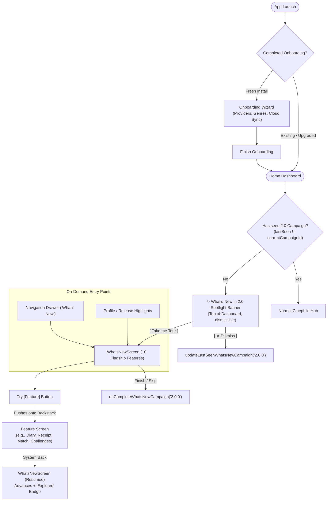

# ShowTime 2.0: What's New & Cinematic Feature Tour Architecture

## 1. Overview & Context

ShowTime 2.0 introduces foundational capabilities for cinephiles, including custom collaborative collections, universal streaming discovery, community-curated lists, Swipe Night movie matching, cinema DNA taste profiles, and daily movie challenges.

To celebrate these features without overwhelming users, ShowTime 2.0 features an **ultra-aesthetic, minimal, and resumable Feature Tour**.

---

## 2. Architecture & Discovery Entry Points



### A. Non-Intrusive Dashboard Spotlight Banner (`WhatsNewSpotlightShelf.kt`)
- Rather than violently hijacking users into full-screen modal flows on app launch, ShowTime 2.0 presents an ambient, dismissible **Spotlight Banner** at the top of the Home Dashboard (`WhatsNewSpotlightShelf.kt`).
- Greets both **fresh installs** (after completing setup onboarding) and **upgraded users** with a celebratory 2.0 banner.
- Users can tap **"Take the Tour"** to launch the full-screen interactive tour or **"✕"** to dismiss it cleanly.

### B. Resumable Backstack Navigation (`WhatsNewNavKey`)
- In 2.0, `WhatsNewNavKey` is registered as a first-class route in [`DashboardEntryProvider.kt`](file:///Users/ss/Projects/ShowTime/app/src/main/java/com/ssverma/showtime/navigation/DashboardEntryProvider.kt).
- When a user taps **"Try [Feature]"**, the destination screen is pushed directly onto the existing backstack.
- When the user presses the system Back button, the tour is preserved and automatically advances to the next spotlight feature, displaying an **"Explored"** badge.

### C. Remote Campaign Gating (`core-ccm`)
Decoupled from raw Android build codes (`versionCode`):
- `whats_new_enabled`: Remote kill-switch boolean.
- `whats_new_campaign_id`: Campaign version string (defaults to `"2.0.0"`). Bugfix releases (e.g. 2.0.1) do not re-trigger the tour.
- `whats_new_feature_filter`: Comma-separated feature IDs to dynamically show or hide specific slides without releasing an update.

---

## 3. The 10 Headline Features

| Feature ID | Title | Navigation Route | Primary Capability |
|:---|:---|:---|:---|
| `CINEMA_DIARY` | **Cinema Diary** | `CinemaDiaryNavKey` | Log watched films, custom star ratings, watch dates, and personal reviews. |
| `CINEMA_RECEIPT` | **Cinema Receipt** | `CinemaReceiptNavKey` | Stylized vintage thermal paper receipt with cinema stats and top directors. |
| `BACKLOG_CHALLENGES` | **Film Challenges** | `BacklogChallengeNavKey` | 52 Films in a Year, Oscar quests, and milestone tracking badges. |
| `HOME_SCREEN_WIDGETS` | **Home Screen Widgets** | `ProfileNavKey` | Glanceable 4×2 Up Next TV tracker & 4×3 Watchlist bookmarks with 1-tap pinning. |
| `MY_LISTS` | **My Lists & Collections** | `LibraryHomeNavKey(initialTab = CustomLists)` | Custom cinema collections, cloud-synced watchlists, and shared queues. |
| `DISCOVERY` | **Universal Discover** | `UniversalDiscoveryNavKey()` | Multi-provider streaming filters (Netflix, Prime, Disney+), era matrix, and vibes. |
| `COMMUNITY_LISTS` | **Community Lists** | `LibraryHomeNavKey(initialTab = Community)` | Discover, save, and 1-tap fork curated collections crafted by cinephiles worldwide. |
| `MOVIE_MATCH` | **Movie Match** | `MatchRoomNavKey()` | Swipe Night card deck with live party rooms or solo matching. |
| `TASTE_PROFILE` | **Taste Profile** | `TasteProfileNavKey` | Cinema DNA decoding, 5-axis genre radar, and director affinities. |
| `DAILY_GAME` | **Daily Challenge** | `CinemaGameNavKey` | Daily mystery movie guessing puzzle, streak ranks, and community debate polls. |

---

## 4. In-House Animated Compose Illustrations

Rather than relying on heavy third-party animation libraries (like Lottie) that bloat the APK and execute off-theme JSON assets, ShowTime utilizes **in-house procedural Compose Canvas and Vector art** in [`com.ssverma.showtime.ui.whatsnew.illustration`](file:///Users/ss/Projects/ShowTime/app/src/main/java/com/ssverma/showtime/ui/whatsnew/illustration/):

```
app/src/main/java/com/ssverma/showtime/ui/whatsnew/illustration/
├── MyListsIllustration.kt        # Layered glassmorphic cards, 3D tilt, floating bookmark ribbon
├── DiscoverIllustration.kt       # Canvas radiating radar pulses, rotating compass, orbital chips
├── CommunityListsIllustration.kt # Overlapping cards, curved dashed connection bridge, star shimmer
├── MovieMatchIllustration.kt     # Oscillating swipe deck, rhythmic heartbeat pulse, reaction orbs
├── TasteProfileIllustration.kt   # Canvas 5-axis geometric radar polygon, glowing vertex nodes
└── DailyGameIllustration.kt      # Clapperboard with bouncing top arm, flame streak badge, clue card
```

### High-Performance Rendering Guarantees
1. **Zero Recomposition Loops**: Continuous animations utilize `rememberInfiniteTransition()` feeding values into `Modifier.graphicsLayer { ... }` lambdas or Canvas `DrawScope`. Animations run exclusively during the GPU **Draw phase**, skipping Compose layout and recomposition.
2. **120 FPS Hardware Acceleration**: Operates smoothly on high-refresh OLED displays without frame drops.
3. **Zero APK Bloat**: 0 KB added assets; 100% reactive to Material 3 dark/light palettes.

---

## 5. Typography, Token Purity & Layout Stability

### A. Fixed Layout Bounds (Zero Jitter)
To ensure seamless horizontal swiping without vertical layout jumping:
- **Hero Illustration Box**: Strictly fixed at `210.dp`.
- **Feature Title**: `headlineSmall`, bold, single line (`maxLines = 1`).
- **Feature Tagline**: `bodyMedium`, centered, fixed `52.dp` container (`maxLines = 2`). Accommodates complete sentences across all display densities without ellipsis truncation.

### B. Strict Prohibition of Raw Emojis & ASCII Symbols
In adherence to [`docs/CODE_QUALITY_AND_SECURITY_GUIDE.md`](file:///Users/ss/Projects/ShowTime/docs/CODE_QUALITY_AND_SECURITY_GUIDE.md) Section 3.C:
- **Zero raw emojis** (`🎉`, `🔥`, `📅`, `🏷️`, `👥`) in code or string resources.
- **Zero raw ASCII art** (`★`, `✓`).
- All decorative and status indicators use official Material vector icons (`Icons.Rounded.*`) or Compose graphics.

---

## 6. Developer Runbook: Adding, Modifying, & Removing Features

This operational guide details the standard procedure when introducing or deprecating features in the tour.

### A. Adding a New Feature (5-Step Checklist)

1. **Domain Feature ID**: Ensure the feature key is registered in `CinephileFeature` (`shared-domain/.../model/feature/CinephileFeature.kt`):
   ```kotlin
   enum class CinephileFeature(val id: String) {
       // ...
       CINEMA_RECEIPT("cinema_receipt")
   }
   ```
2. **String Resources**: Add title and concise tagline in `app/src/main/res/values/strings.xml` (strictly under 12 words, zero raw emojis/ASCII):
   ```xml
   <string name="whats_new_receipt_title">Cinema Receipt</string>
   <string name="whats_new_receipt_desc">Generate and share retro thermal receipts of your watch milestones.</string>
   ```
3. **In-House Illustration**: Create `app/.../ui/whatsnew/illustration/<Feature>Illustration.kt`:
   - Enforce fixed `210.dp` root height: `Box(contentAlignment = Alignment.Center, modifier = modifier.fillMaxWidth().height(210.dp))`.
   - Use `rememberInfiniteTransition()` feeding into `graphicsLayer` lambdas or Canvas `DrawScope` (guarantees draw-phase GPU rendering with 0 recomposition loops).
   - Use semantic `MaterialTheme.colorScheme` tokens.
4. **Register in Catalog**: In [`WhatsNewCatalog.kt`](file:///Users/ss/Projects/ShowTime/app/src/main/java/com/ssverma/showtime/ui/whatsnew/WhatsNewCatalog.kt), append to `WhatsNewCatalog.allFeatures`:
   ```kotlin
   WhatsNewFeature(
       feature = CinephileFeature.CINEMA_RECEIPT,
       titleRes = R.string.whats_new_receipt_title,
       descriptionRes = R.string.whats_new_receipt_desc,
       icon = Icons.AutoMirrored.Rounded.ReceiptLong,
       destinationNavKey = CinemaReceiptNavKey()
   )
   ```
5. **Map to Feature Card**: In [`WhatsNewFeatureCard.kt`](file:///Users/ss/Projects/ShowTime/app/src/main/java/com/ssverma/showtime/ui/whatsnew/component/WhatsNewFeatureCard.kt), add the illustration branch:
   ```kotlin
   when (feature.feature) {
       // ...
       CinephileFeature.CINEMA_RECEIPT -> CinemaReceiptIllustration()
   }
   ```
   *Update `WhatsNewCatalogTest.kt` size assertion.*

### B. Removing a Feature

- **Option 1: Instant Remote Deactivation (Zero Code / Hot-Fix)**:
  - Open Firebase Remote Config Console.
  - Set `whats_new_feature_filter` to a comma-separated list omitting the target feature (e.g. `"my_lists,discovery,community_lists,movie_match,taste_profile"`).
  - ShowTime's `WhatsNewCatalog.filterActiveFeatures()` instantly drops the omitted feature on user devices in real time.
- **Option 2: Permanent Removal in Code**:
  - Delete entry from `WhatsNewCatalog.allFeatures`.
  - Remove branch from `WhatsNewFeatureCard.kt`.
  - Delete `<Feature>Illustration.kt` file.
  - Remove unused strings from `strings.xml`.
  - Update `WhatsNewCatalogTest.kt` assertions.

---

## 7. Campaign Lifecycle & App Release Bumps (e.g., 2.1.0)

When launching a new minor or major release with new features:
1. **Never reset local databases or clear user DataStore**.
2. Increment the remote campaign key in Firebase Console (or default in `DefaultAppConfigRepository.kt`):
   ```kotlin
   const val DEFAULT_WHATS_NEW_CAMPAIGN_ID = "2.1.0"
   ```
3. Users whose `lastSeenWhatsNewCampaign != "2.1.0"` will automatically see the refreshed tour once upon opening the app.
4. Minor patch releases (e.g., 2.0.1, 2.0.2) that keep `whats_new_campaign_id = "2.0.0"` will **not** re-trigger the tour for users who already completed it.

---

## 8. Verification & Quality Gate

```bash
# Automated formatting and quality gate
./scripts/format-code.sh staged && git add -A && ./.githooks/pre-commit

# Unit test verification (1039+ tasks)
./gradlew testDebugUnitTest
```

